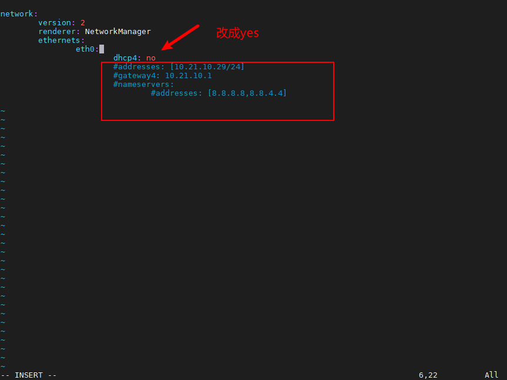

# 常见问题
## Viobot2网络配置之dhcp

其实并不推荐使用dhcp，因为如果是把设备安装在固定场景中组网的话，我们还是希望这个设备它本身的ip能够固定下来，这样至少省去了查找设备ip的麻烦。

但如果使用场景特殊，确实需要dhcp来给设备分配ip的话，也是可以的。

ssh登录设备后

```bash
sudo cp /etc/netplan/01-netcfg.yaml /etc/netplan/01-netcfg.yaml.backup#备份文件
sudo vim /etc/netplan/01-netcfg.yaml
```

把dhcp4改成yes，下面几行全部注释掉，注意缩进，然后保存退出。



## Viobot和其他主控做时间同步

网络时间同步可以使用NTP服务，配置一台作为NTP服务器，另一台作为客户端与之同步。

## RTK时间同步

Viobot2如果是有GNSS模块的版本接入天线后再使用RTK就是已经做了时间同步，RTK与GNSS同时接入天线使用，如果只需要RTK模块，则需要将RTK的PPS信号与Viobot2的主板连接。

## 系统时间异常

1. 需要网络时间同步可以使用systemd-timesyncd，默认有网络时Viobot2会自动同步网络时间；
2. 如果发现接入RTK和GNSS时系统时间来回跳变，可以尝试关闭设备的网络时间同步`sudo systemctl stop systemd-timesyncd`，只使用GPS时间。


## 不方便通过UI操作

Viobot2最快捷的使用方式是通过UI上操作的，目前基础的视觉里程计功能可以通过HTTP协议的SDK来操作，也兼容通过ros的通讯方式进行控制，HM inside的建图部分功能还需要配合UI进行使用。

## 重定位建图时一点击进度条就100%

这种情况大部分是建图的目录异常，路径不存在或者是路径下没有用于建图的数据，需要详细检查建图的路径与保存bow时的路径一致，如果检查了路径正确且算法保存的bow文件也无异常的情况可以尝试更新最新的固件再做尝试。

## 重定位触发怎么判断是否成功
重定位触发之后会发布`/baton/stereo3/odom_relo`话题，详细请看**HM建图与重定位**的**判断重定位是否触发**部分。