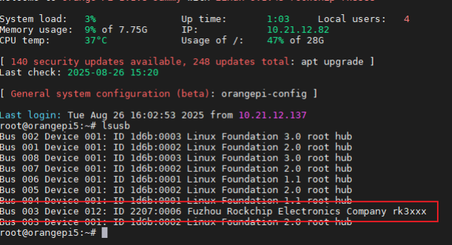
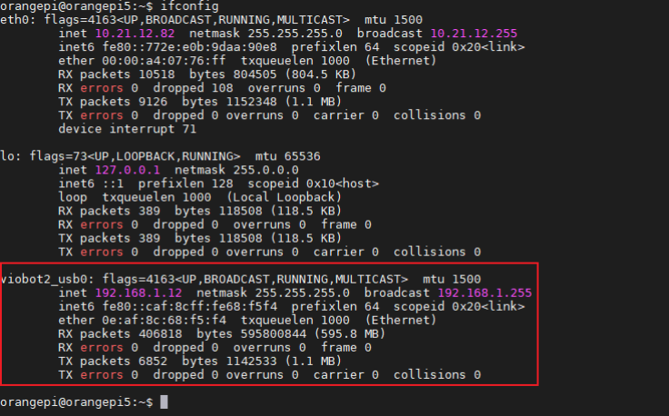

# 固定usb虚拟网卡地址

ifconfig查看到每次开机启动的网卡名称都不一样，可以通过绑定供应商id和设备id来解决：

```
lsusb
```

出现一串Bus 的字样



香橙派上：

```
sudo vim /etc/udev/rules.d/viobot2_usb_network.rules
```

写入以下内容： 
2207是供应商id，填入ATTRS{idVendor}=="2207" 
0006是产品Id，填入ATTRS{idProduct}=="0006"

```
#/etc/udev/rules.d/viobot2_usb_network.rules
SUBSYSTEM=="net", ACTION=="add", ATTRS{idVendor}=="2207", ATTRS{idProduct}=="0006",NAME="viobot2_usb0"
```

规则添加权限以及重新触发

```
sudo chmod 644 /etc/udev/rules.d/viobot2_usb_network.rules

sudo udevadm control --reload-rules && sudo service udev restart && sudo udevadm 
trigger
```

经过测试，viobot-lite版的usb虚拟网卡的供应商id和产品id是不会变化的，因此就可以使用上述 
的自定义规则把网卡的名字固定下来，这里配置成了viobot2_usb0 ，配置规则文件之后需要重启 
才能生效。
重启后再配置这个网卡的固定ip：在香橙派上操作：

```
 vim /etc/netplan/orangepi-default.yaml
```

填入以下内容配置viobot2_usb0网卡的固定ip：

```
network: 
version: 2 
renderer: NetworkManager 
ethernets: 
viobot2_usb0: 
dhcp4: no 
addresses: [192.168.1.12/24] 
gateway4: 192.168.1.1 
nameservers: 
addresses: [8.8.8.8, 1.1.1.1]
```

最后应用配置

```
sudo netplan apply
```

一般重新启动之后就能看到虚拟网卡绑定成了viobot2_usb0



把上述的过程写了一个脚本bind_and_config_viobot2usb.sh ，需要用sudo执行：

```
chmod +x bind_and_config_viobot2usb.sh 
sudo ./bind_and_config_viobot2usb.sh
```

bind_and_config_viobot2usb.sh:
``` sh
#!/bin/bash
# 检查是否为root用户（UID=0）
if [[ $EUID -ne 0 ]]; then
   echo "错误：此脚本必须使用sudo权限运行" >&2
   exit 1
fi

echo "start config viobot2_usb_netWork."

lsusb | grep rk3xxx

sudo echo 'SUBSYSTEM=="net", ACTION=="add", ATTRS{idVendor}=="2207", ATTRS{idProduct}=="0006", NAME="viobot2_usb0"' > /etc/udev/rules.d/viobot2_usb_network.rules
sudo chmod 644 /etc/udev/rules.d/viobot2_usb_network.rules
sudo udevadm control --reload-rules && sudo service udev restart && sudo udevadm trigger

sudo cp /etc/netplan/orangepi-default.yaml /etc/netplan/orangepi-default.yaml.bak
echo 'network:
  version: 2
  renderer: NetworkManager
  ethernets:
    viobot2_usb0:
      dhcp4: no
      addresses: [192.168.1.12/24]
      gateway4: 192.168.1.1
      nameservers:
        addresses: [8.8.8.8, 1.1.1.1]' > /etc/netplan/orangepi-default.yaml

sudo netplan apply

ifconfig
```
