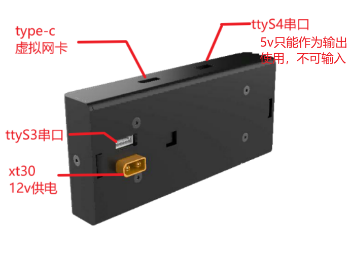
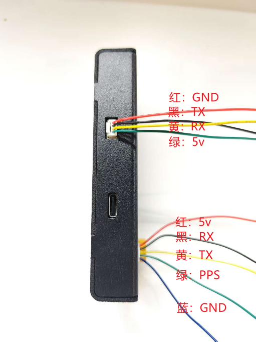
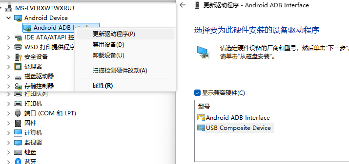
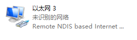
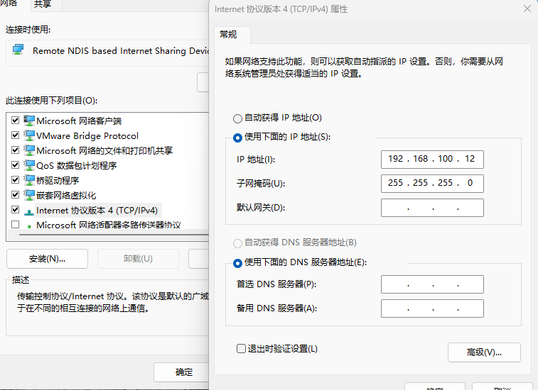
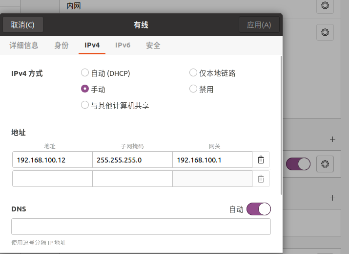
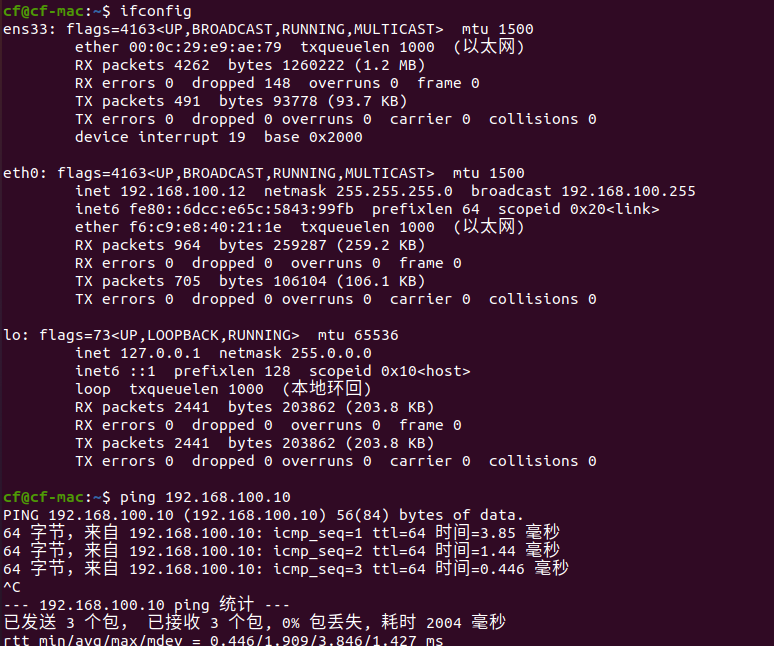
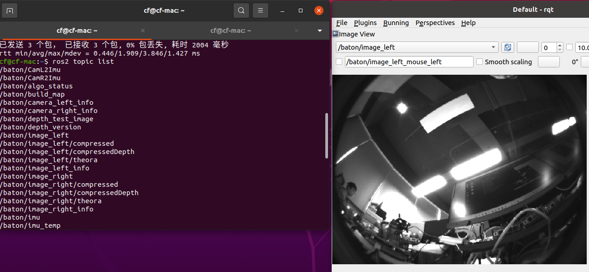
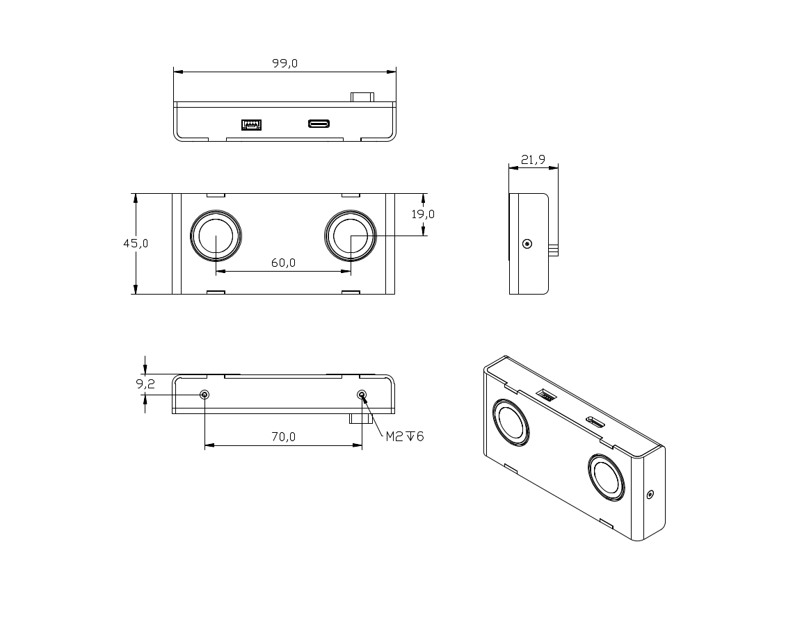

# Viobot2-Lite

## 硬件总览

**硬件配置**

- 双目鱼眼相机：164.7°  640x480

- imu: 200hz 硬件同步触发相机取图

- 算力平台：RK3588 4+32G

**viobot2 lite的外设总览如下：**

> 需要注意：
> 
> -  ttyS4目前硬件有已知的硬件缺陷： ttyS4的串口不可接入外部5v电源，只可作为输出，建议只接入GND、TX、RX三根线，如果外部有5V输入的情况下一定会导致硬件电路损坏。
> - ttyS3的5v输出具有200毫安限流，无法驱动大功率设备
> - type-c接口无法为Lite进行供电，供电需要接xt30，注意正负极

## 开机使用

现在Lite和Viobot2一样都可以支持ros1、ros2的，但是不同ros版本的ip是不一样的。

| ros版本 | ip             | 登录用户 | 登录密码 |
| ----- | -------------- | ---- | ---- |
| ros1  | 192.168.1.10   | PRR  | PRR  |
| ros2  | 192.168.100.10 | PRR  | PRR  |

### windows连接上位机使用(ros2为例)

1. 正确按照xt30母口上标注的正负极接好12v电源，通电之后可从ttyS4的接口上亮起红灯；

2. type-c数据线连接到windows电脑上，可能在windows上的网络连接上找不到虚拟网卡，需要进入到设备管理器中有一个`Android ADB`的设备需要更改驱动程序，更改驱动程序之后在网络连接这里即出现了一个Remote NDIS based Internet Sharing Device的网卡设备，lite设备的固定ip是192.168.100.10，所以在设置本机的ip是只要和lite的ip不同即可，这里设置成192.168.100.12，按照以下步骤设置好固定ip即可。

3. 设置完ip之后，电脑端能ping通lite的ip地址，之后可使用上位机连接

4. 使用上位机的使用方式和使用viobot2的方式一样。

### Linux多机通讯使用(ros2为例)

>  ros1请参考Viobot2的主从机通讯

这里演示以ubuntu20为例

1. 首先连接了ubuntu20之后首先需要配置固定ip，具体配置方式可自行搜索，目的是Ubuntu20和Lite之间的网络是互通的,以下是手动设置ip，并确保可以pin通
    
   
    

2. Lite启动之后ros2的`ROS_DOMAIN_ID`默认为0，所以默认在按照好ros2的ubuntu20的系统中就可以看到Lite中的话题列表了。

    

之后的一些使用上就和ros2的使用方式一致了，需要注意的是lite的usb虚拟网卡无法连接网络，我们在lite里面已经内置了常用的一些ros2软件包，算法的输出可通过usb接收Lite发布的话题形式，也可以自由开发一套通过串口输出位姿的程序。

## 三维尺寸

