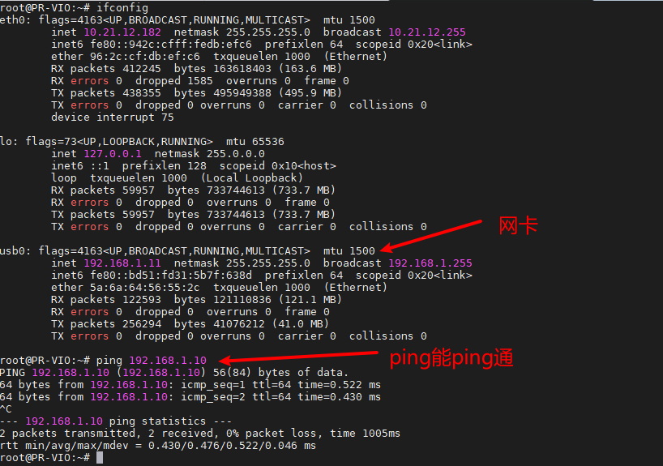

# ROS2多机通信

设备里面装好了操作系统并且已经配置好了ROS2 humble环境。上电就会自动运行程序读取传感器数据并将其打包成话题发出来。

如果使用ROS2的话题通信的话，需要你的电脑环境同样需要是ROS2的环境，配置好环境后需要设置ROS\_DOMAIN\_ID，将设备的ROS\_DOMAIN\_ID与电脑的设置成同一个值，将设备接入电脑即可。ROS\_DOMAIN\_ID默认值为0。

## 一.连接设备

将设备通过USB连接到你的电脑，设备给电脑分配好IP，查看网卡` ifconfig`如下图，我的是usb0网卡，ip为192.168.1.11，设备ip默认为192.168.1.10

## 二.配置多机通信

如果不配置
