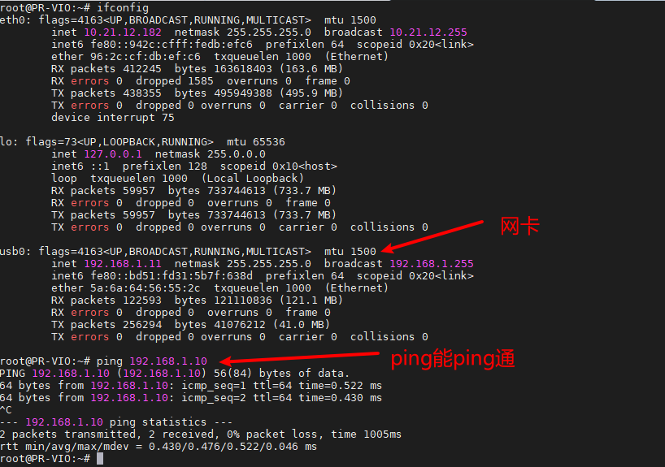

# ROS2多机通信

设备里面装好了操作系统并且已经配置好了ROS2 humble环境。上电就会自动运行程序读取传感器数据并将其打包成话题发出来。

如果使用ROS2的话题通信的话，需要你的电脑环境同样需要是ROS2的环境，配置好环境后需要设置ROS\_DOMAIN\_ID，将设备的ROS\_DOMAIN\_ID与电脑的设置成同一个值，将设备接入电脑即可。ROS\_DOMAIN\_ID默认值为0。

## 一.连接设备

将设备通过USB连接到你的电脑，设备给电脑分配好IP，查看网卡` ifconfig`如下图，我的是usb0网卡，ip为192.168.1.11，设备ip默认为192.168.1.10，如果发现每次开机、拔插mimi的网卡看到的都不同可通过《USB网卡设置章节》的`3.Linux上固定网卡名称`部分将mini的网卡名称固定。



## 二.配置多机通信

如果上位机没有配置过默认的DOMAIN_ID，接收话题消息的电脑也不需要配置，直接保持默认值0即可。

如果已经在上位机设置过，需要在用户目录对应的.bashrc文件里面将对应的`export ROS_DOMAIN_ID=176`的176改成自己设置好的数字就行（没有这一行的直在文件末尾添加就行，参考网上ROS2配置多机通信的例子）,设置完后,新开终端,就可以通过ROS2命令来查看话题了。

```Bash
ros2 topic list
```

## 三.配置ROS2 CycloneDDS

### 3.1 关闭防火墙

ROS2 DDS 默认端口范围是在7400 - 7600范围内的，所以要保证可以正常多机通讯需要确保这个范围的UDP端口是开放的，最简单的方式就是完全禁用防火墙，实际生产的环境中不建议完全禁用防火墙，按照需求开放DDS需要的端口即可。

```
sudo ufw status
# 永久关闭防火墙
sudo ufw disable
# 并禁用开机自启
sudo systemctl disable ufw
```
### 3.2 关闭其他网卡
ros2 多机时可能会受到多张网卡冲突的影响，在实验之前需要尽可能禁用掉这些网卡、尤其是同网段的网卡如mini是192.168.1.10，那么如有有一张网卡也是192.168.1.x的网段的那么将会干扰多机，有些情况可能都无法通过上位机连接mini


#### 3.3 CycloneDDS配置

此方法适用于以上默认方式无法和mini进行多机通讯，无法通讯的现象可能有很多，如没有话题列表、有话题列表但时接收不到数据，可能的原因也也很多，现可按此节的内容进行配置ros2 的CycloneDDS，基本上能解决不能通讯的问题。

> 推荐配置：
> 
> mini ros2 humble (固定) 
> 
> Ubuntu22 humble （推荐使用同版本的ros2）以下简为“主机B”

在“主机B”上安装：

```
 sudo apt install ros-$ROS_DISTRO-rmw-cyclonedds-cpp
 # 验证安装
 ls /opt/ros/$ROS_DISTRO/lib/librmw_cyclonedds_cpp.so
```

在“主机B”上执行：

需要提前修改网卡名称eth3 `NetworkInterface name="eth3" multicast="false"`和mini的IP地址`Peer address="192.168.1.10"`，eth3网卡名称需要实际通过ifconfig命令查找到mini的虚拟网卡的名称，如果这个网卡名称在每次开机之后都会改变则需要固定mini网卡的名称方法见《USB网卡设置》章节的固定网卡名称部分内容。

```shell
cat > ~/cyclone_eth3.xml << 'EOF'
<?xml version="1.0" encoding="UTF-8" ?>
<CycloneDDS xmlns="https://cdds.io/config" 
            xmlns:xsi="http://www.w3.org/2001/XMLSchema-instance"
            xsi:schemaLocation="https://cdds.io/config https://raw.githubusercontent.com/eclipse-cyclonedds/cyclonedds/master/etc/cyclonedds.xsd">
    <Domain id="any">
        <General>
            <AllowMulticast>false</AllowMulticast>
            <Interfaces>
                <!-- 这里的网卡名称eth3需要改成自己的 用ifconfig 找到连接mini设备-->
                <NetworkInterface name="eth3" multicast="false" />
            </Interfaces>
        </General>
        <Discovery>
            <ParticipantIndex>auto</ParticipantIndex>
            <Peers>
                 <!-- 这里的IP地址改成mini的ip地址-->
                <Peer address="192.168.1.10"/>
            </Peers>
        </Discovery>
    </Domain>
</CycloneDDS>
EOF
```

继续在主机B上执行

```
# 清理旧环境变量
unset ROS_LOCALHOST_ONLY

# 应用 CycloneDDSexport RMW_IMPLEMENTATION=rmw_cyclonedds_cpp
export RMW_IMPLEMENTATION=rmw_cyclonedds_cpp
# “file:”后面是三个“///”，如“file:///home/user/cyclone_eth3.xml”
export CYCLONEDDS_URI=file:///path/your/cyclone_eth3.xml

# 验证 应该输出：middleware name    : rmw_cyclonedds_cpp
ros2 doctor --report | grep -i "middleware"

# 之后应该即可输出话题数据
ros2 topic echo /baton_mini/imu
# 如果mini的话题列表中有压缩图像话题而无法通过rqt预览图像的话需要安装以下的插件
apt install ros-${ROS_DISTRO}-compressed-image-transport
```

以上的配置是仅在当前终端有效的，重启、新开终端会失效，所以需要将以上的配置添加到.bashrc里面：

添加到~/.bashrc的配置：

```shell
export ROS_DOMAIN_ID=100    #自定义的DOMAIN_ID
export RMW_IMPLEMENTATION=rmw_cyclonedds_cpp
export CYCLONEDDS_URI=file:///home/user/cyclone_eth3.xml    #前面cyclone_eth3.xml的放置路径
```

完成以上的配置之后打开的终端都可正常和mini收发数据。以上的方法在同样的humble系统上验证过，理论上在ubuntu20的ros2上也能实现，同样也是配置CycloneDDS。

参考资料：

[ROS2多机通讯 | 鱼香ROS](https://fishros.org.cn/forum/topic/2984/ros2%E5%A4%9A%E6%9C%BA%E9%80%9A%E8%AE%AF)

[ROS2.0 简单的多机通讯 | 鱼香ROS](https://fishros.org.cn/forum/topic/1561/ros2-0-%E7%AE%80%E5%8D%95%E7%9A%84%E5%A4%9A%E6%9C%BA%E9%80%9A%E8%AE%AF)
[使用Fast DDS Discovery Server作为发现协议[社区贡献] — ROS 2 Documentation: Humble 文档](http://fishros.org/doc/ros2/humble/Tutorials/Advanced/Discovery-Server/Discovery-Server.html?highlight=discovery#using-fast-dds-discovery-server-as-discovery-protocol-community-contributed)
