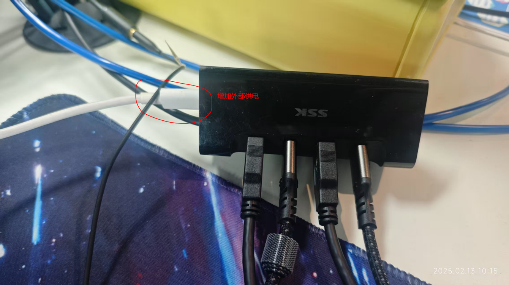
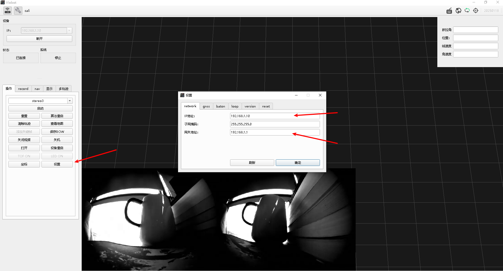
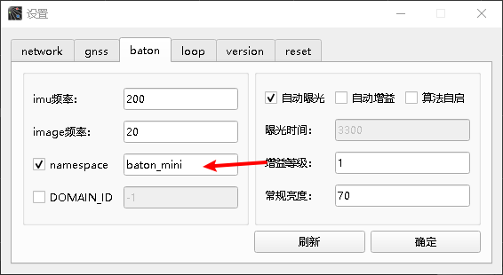
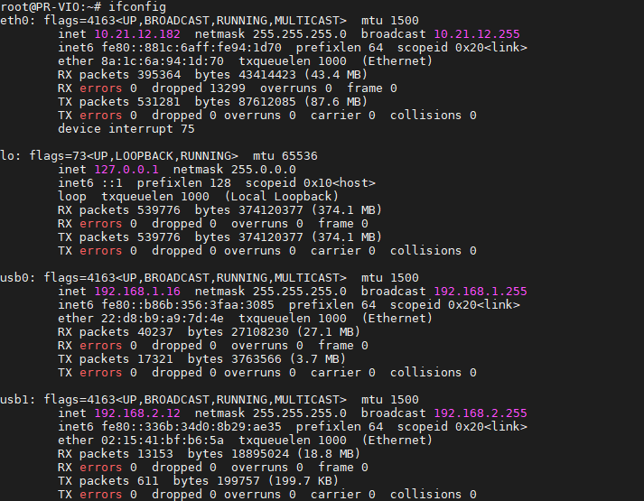
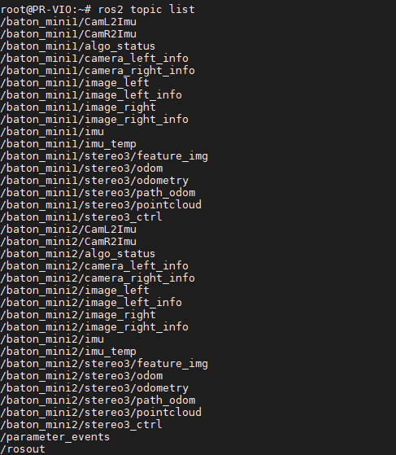
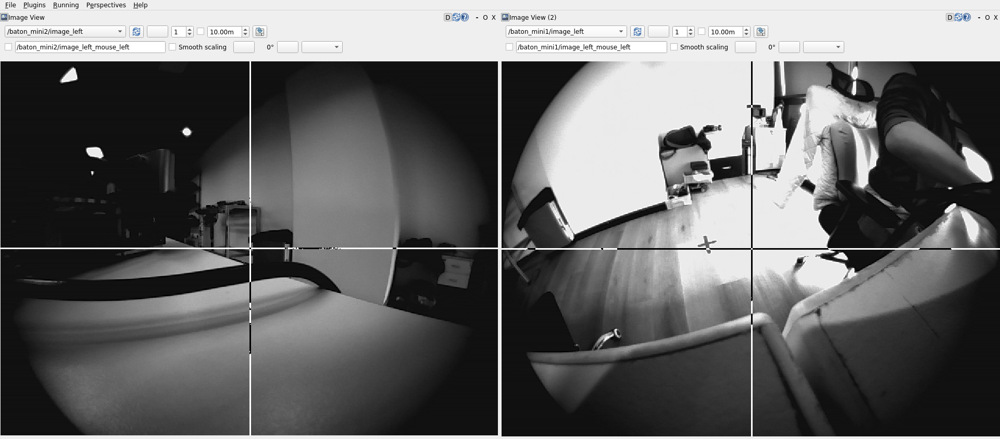

# 多设备同时接入使用

如果用户需要多个mini同时接入主机，请参考下面的教程。

## 一.确保供电正常

保证每个USB口输出稳定在5V1.5A以上，才能保证设备正常工作，如果是接的USB HUB，最好增加外部电源供电。

## 二.修改设备配置

由于设备出厂默认IP都是`192.168.1.10` 多个设备同时接入的话就会出现IP地址冲突的情况，所以我们需要先把各个设备改成不一样的IP。

### （1）使用windows上位机连接设备

这个参照开机指南，输入IP地址`192.168.1.10`再点连接即可。

### （2）设置设备IP

点击设置按键，会弹出设置页面，在`network`页面，输入想要给设备设置的IP地址和网关，如：

IP地址：`192.168.2.10`

网关地址： `192.168.2.1`

点击确定即可。

注：一般推荐设置为不同段的IP，由于设备接入电脑的时候会生成一个模拟网卡，然后使用DHCP给电脑分配IP，设备的IP是固定的，但电脑IP是随机分配的，所以在设置为同一网段的时候会出现电脑与设备同一IP的冲突情况，导致网络问题。

### （3）设置话题前缀

设备ROS2发出的话题前缀默认为`/baton_mini/`，多台设备同时接入的话，需要设置一下各自的前缀，以区分不同设备的话题。

点击设置按键，弹出设置页面，选到`baton`页面，修改namespace框里面的英文输入即可，简单区分可以`baton_mini1`、`baton_mini2`之类的。点击确定，关闭弹窗即可。

## 三.测试效果

按照上面的配置，已经配置好了两台mini设备，IP分别为`192.168.1.10`和`192.168.2.10`，namespace分别为`baton_mini1`和`baton_mini2`

### (1)查看设备接入情况

终端输入`ifconfig`可以看到usb0和usb1两张USB网卡，给到电脑分配的IP为192.168.1.16和192.168.2.12，分别对应设备1和设备2.

### （2）查看话题列表

电脑需要先配置好ros2 humble环境。

可以看到两个设备的话题都有了，可以分别接收两个设备的

### （3）rqt查看图像

可以看到两个设备的图像都是可以正常接收的

