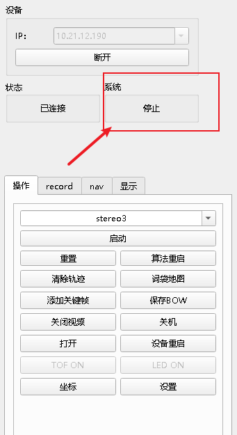
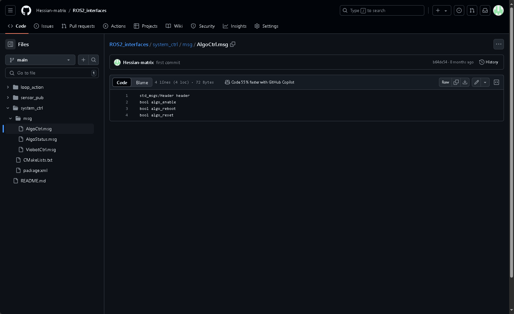
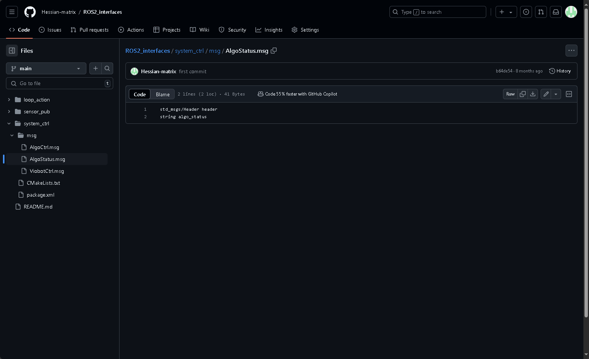

# 算法控制

### 一.上位机控制



&#x20;  状态反馈在系统反馈出会根据当前系统状态显示。

控制是在操作栏里面的一个选项三个按键。包括启动/停止、重启和重置。

### 二.ROS2控制

算法的控制我们整合成了一个ROS msg，具体的msg信息可以查看[ros2\_interface](https://github.com/Hessian-matrix/ROS2_interfaces "ros2_interface")里面的system\_ctrl包的AlgoCtrl.msg



话题名如下：

```c++
Type: system_ctrl::msg::AlgoCtrl
Topic: /baton_mini/stereo3_ctrl 
```

#### 使用命令行发送话题：

启动stereo3算法

```bash
ros2 topic pub --once /baton_mini/stereo3_ctrl system_ctrl/AlgoCtrl "{header: {stamp: {sec: 0, nanosec: 0}, frame_id: ''}, algo_enable: true, algo_reboot: false, algo_reset: false}"

```

停止stereo3算法

```bash
ros2 topic pub --once /baton_mini/stereo3_ctrl system_ctrl/AlgoCtrl "{header: {stamp: {sec: 0, nanosec: 0}, frame_id: ''}, algo_enable: false, algo_reboot: false, algo_reset: false}"

```

重启stereo3算法

```bash
ros2 topic pub --once /baton_mini/stereo3_ctrl system_ctrl/AlgoCtrl "{header: {stamp: {sec: 0, nanosec: 0}, frame_id: ''}, algo_enable: true, algo_reboot: true, algo_reset: false}"

```

重置stereo3算法

```bash
ros2 topic pub --once /baton_mini/stereo3_ctrl system_ctrl/AlgoCtrl "{header: {stamp: {sec: 0, nanosec: 0}, frame_id: ''}, algo_enable: true, algo_reboot: false, algo_reset: true}"
```

### 三.ROS状态反馈

算法的状态也是一个ROS2 msg，具体的msg信息可以查看[ros2\_interface](https://github.com/Hessian-matrix/ROS2_interfaces "ros2_interface")里面的systtem\_ctrl包的AlgoStatus.msg



直接字符串打印系统当前算法的状态。

ROS2demo里面的例子

```c++
auto sub_stereo3_ctrl = nh->create_subscription<AlgoCtrlMsg>("stereo3_ctrl", rclcpp::QoS(2), std::bind(&stereo3_ctrl_callback, std::placeholders::_1));
```

回调函数

```c++
void algo_status_callback(onst system_ctrl::msg::AlgoStatus::SharedPtr msg){
    std::cout << "algo_status: " << msg->algo_status << std::endl;
}
```
