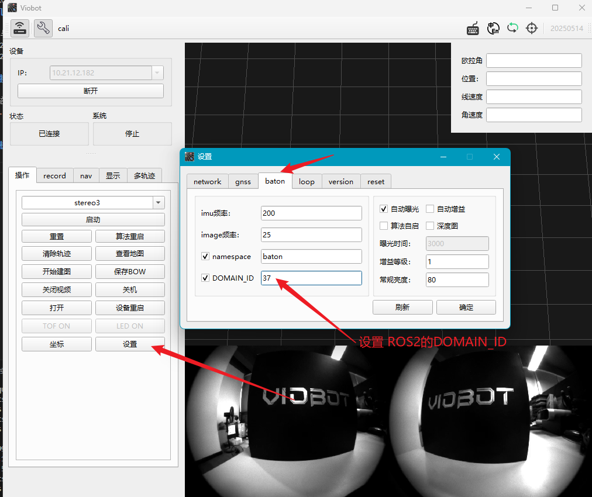
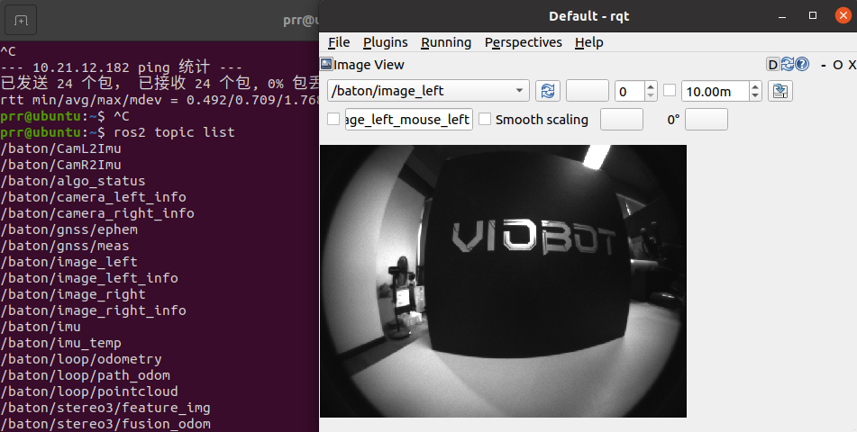

# ROS2多机通信

本页面适用与ROS2（Viobot2设备里已经预装了ros2 humble ubuntu22.04）版本，本文只演示ros2和ros2之间的多机通讯方式，这里用另一台安装了ros2 glatic的x86电脑做演示，对于需要ros1和ros2之间通讯的需要自行查阅相关资料。

## 网络连接

将x86的电脑还有Vibot2连接在同一局域网下，确保同一网段并且能够互相ping通，如这里X86电脑的ip是`10.21.12.133`,设备的ip是`10.21.12.182`。两者的ip可通过`ifconfig`查看。

## 配置多机通讯

ros2版本的Viobot2连接上位机，按照以下步骤设置ros2 `ROS_DOMAIN_ID`,这里设置尾`37`；也可以在`/home/PRR/.bashrc`文件的末尾用export设置，如：`export ROS_DOMAIN_ID=37`,注意Viobot2设置完成之后需要重启设备生效，X86电脑在~/.bashrc设置完成后需要重新source一下~/.bashrc生效。

两边都配置完成之后，在x86的终端中运行`ros2 topic list`即可看到Viobot2中的话题列表了，然后开个rqt订阅一下Viobot2相机的左目图像，能正常显示出来证明两台ros2之间成功建立了通讯。
