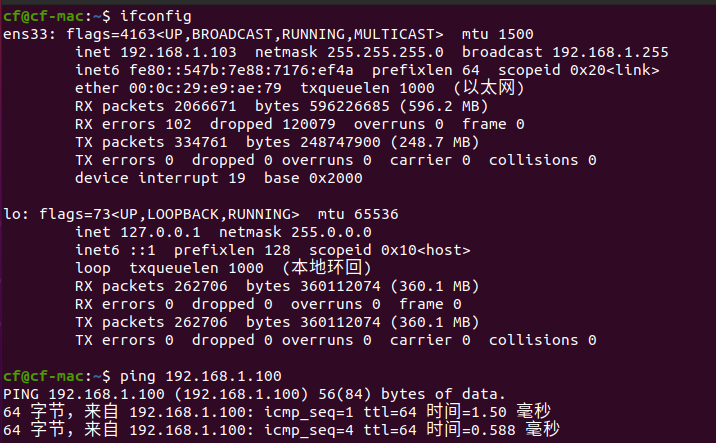
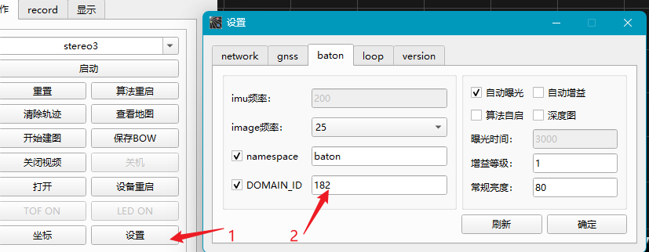
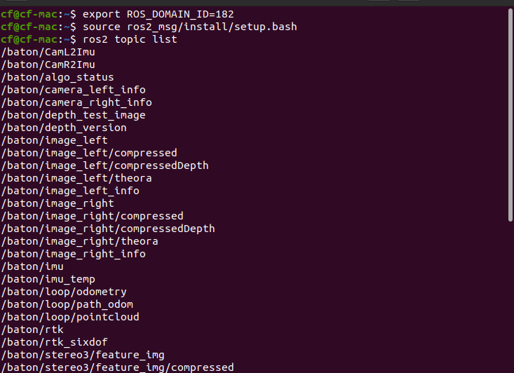
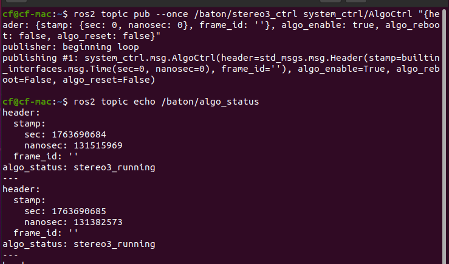

# ROS2多机通信

本页面适用与ROS2（Viobot2设备里已经预装了ros2 humble ubuntu22.04）版本，本文只演示ros2和ros2之间的多机通讯方式，这里用另一台安装了ros2 galatic的x86电脑做演示，对于需要ros1和ros2之间通讯的需要自行查阅相关资料。

## 网络连接

将x86的电脑还有Vibot2连接在同一局域网下，确保同一网段并且能够互相ping通，如这里X86电脑的ip是`10.21.12.133`,设备的ip是`10.21.12.182`。两者的ip可通过`ifconfig`查看。

## 配置多机通讯

ros2版本的Viobot2连接上位机，按照以下步骤设置ros2 `ROS_DOMAIN_ID`,这里设置为`37`，DOMAIN_ID只要符合ros2的定义范围可以（0~232）；也可以在`/home/PRR/.bashrc`文件的末尾用export设置，如：`export ROS_DOMAIN_ID=37`,注意Viobot2设置完成之后需要重启设备生效，X86电脑在~/.bashrc设置完成后需要重新source一下~/.bashrc生效。

两边都配置完成之后，在x86的终端中运行`ros2 topic list`即可看到Viobot2中的话题列表了，然后开个rqt订阅一下Viobot2相机的左目图像，能正常显示出来证明两台ros2之间成功建立了通讯。

## ROS2话题控制stereo3

### 环境介绍
1）viobot2 ros2 humble  ip:192.168.1.100
2）ubuntu20电脑 x86 galatic ip: 192.168.1.103

预先准备：需要进行ros2多机通讯的电脑上先编译[ros2_msg](https://github.com/Hessian-matrix/ROS2_interfaces.git),设置正确两者的固定IP,需要使用相同的ip网段，双方电脑可以互相ping通

之后source ros2_msg的环境, viobot2和ubuntu20电脑设置一样的ROS_DOMAIN_ID环境变量，然后在ubuntu20电脑上可以看到viobot2上的话题列表了。
1. clone[ros2_msg](https://github.com/Hessian-matrix/ROS2_interfaces.git) 编译安装；
2. ubuntu20中在~/.bashrc中添加`export ROS_DOMAIN_ID=182`，viobot2的DOMAIN_ID可在ui上设置，或者编辑`/home/PRR/.bashrc`文件：
   
3. source [your_ros2_msg_path]/install/setup.bash;
4. ros2 topic list 查看
   

### 话题控制算法启停

ubuntu20电脑发布：
开启stereo3
~~~
ros2 topic pub --once /baton/stereo3_ctrl system_ctrl/AlgoCtrl "{header: {stamp: {sec: 0, nanosec: 0}, frame_id: ''}, algo_enable: true, algo_reboot: false, algo_reset: false}"
~~~

停止stereo3
~~~
ros2 topic pub --once /baton/stereo3_ctrl system_ctrl/AlgoCtrl "{header: {stamp: {sec: 0, nanosec: 0}, frame_id: ''}, algo_enable: false, algo_reboot: false, algo_reset: false}"
~~~

重启stereo3
~~~
ros2 topic pub --once /baton/stereo3_ctrl system_ctrl/AlgoCtrl "{header: {stamp: {sec: 0, nanosec: 0}, frame_id: ''}, algo_enable: true, algo_reboot: true, algo_reset: false}"
~~~

在ubuntu20中用话题启动stereo3
