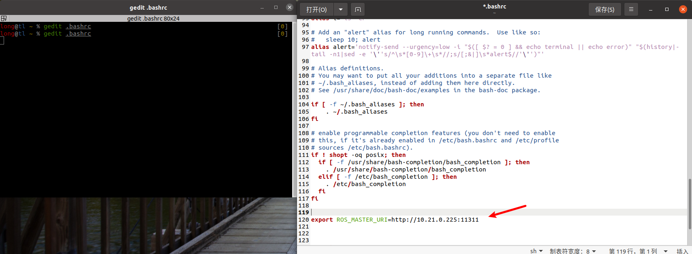

# Baton作为主机，配置从机

以虚拟机ubuntu20.04为例。

我的设备ip为10.21.0.225，ubuntu系统的ip为10.21.0.242，先确认可以ping通设备。


### 1.从机配置

虚拟机终端输入命令,输入密码，按下图修改文件，保存退出。

```bash
sudo gedit /etc/hosts
#添加一行，其中10.21.0.225是设备ip，PR-VIO是设备的名字
10.21.0.225      PR-VIO

```


然后终端再输入命令，修改文件并保存退出。

```bash
gedit .bashrc
#在最后加一行
export ROS_MASTER_URI=http://10.21.0.225:11311

```



新开终端，输入命令。（一定要新开终端！！！！！！！！！）

```bash
rostopic list
#配置好了则会列出主机的话题列表
#还可以直接输入
rostopic echo /baton/imu
#终端会打印imu的数据
```

到这里从机就配置完成了。

### 2.主机配置

如果需要使用到从机控制主机，才需要配置主机。

主机配置需要ssh进入到设备里面，

```bash
sudo vim /etc/hosts
#添加新行
从机ip 从机hostname
```


从机ip我们上面已经给出了，就是`10.21.0.242` ，然后我们在虚拟机中打开终端，获取从机hostname：

```bash
hostname #我的虚拟机名字就是tl，所以上面文档的新行输入就是10.21.0.242 tl

```


vim保存退出，双击键盘Esc键，然后打出冒号+wq回车即可。

### 3.其他问题

如果严格按照上述方法配置后仍然不能控制主机，看下面。

当主机的网络不能联网的时候会涉及到一个时间同步的问题，当设备的时间与从机的时间不同步的时候从机发的消息主机会接收不到。（原因就是：从机发出的消息来自于未来）

解决办法有两种：

1.将主机的网络配置到能够联网的网络下。设备会根据网络时间来同步自己的时间，只要主机和从机都能上网并且时区设置都是东八区，即可。

2.如果局域网限制的话，需要先将主机配置到能联网的网络下，安装一个时间同步服务器（从机也要装），再把主机网络设置回局域网内，通过时间同步服务器，把从机的时间同步到主机去。

配置ntp的时间同步服务器，将从机的系统时间跟不能联网的主机的时间同步的方法如下：

注：主从机*必须在同一局域网下*

主机：

```bash
sudo apt-get install ntp
sudo apt-get install ntpdate
ifconfig //查看ip地址

```

从机：

```bash
sudo apt-get install ntp
sudo apt-get install ntpdate
sudo ntpdate -q 主机的ip地址 #检查和电脑1的时间差
sudo ntpdate -d 主机的ip地址 #和电脑1进行时间同步

```

注释:若电脑1和电脑2时间没有同步,可能是由于电脑没有连网,这时需要和网络时间进行同步,命令为: ntpdate(会更新系统时间—即在linux系统中用date命令获取到的时间).和网络时间同步时,可能会报错: the NTP socket is in use, exiting,出现该错误的原因是系统ntpd服务器正在运行中，

通过 ps aux | grep ntpd 查看，会看到ntpd正在运行。解决方法:

```bash
service ntpd stop
ntpdate
```
