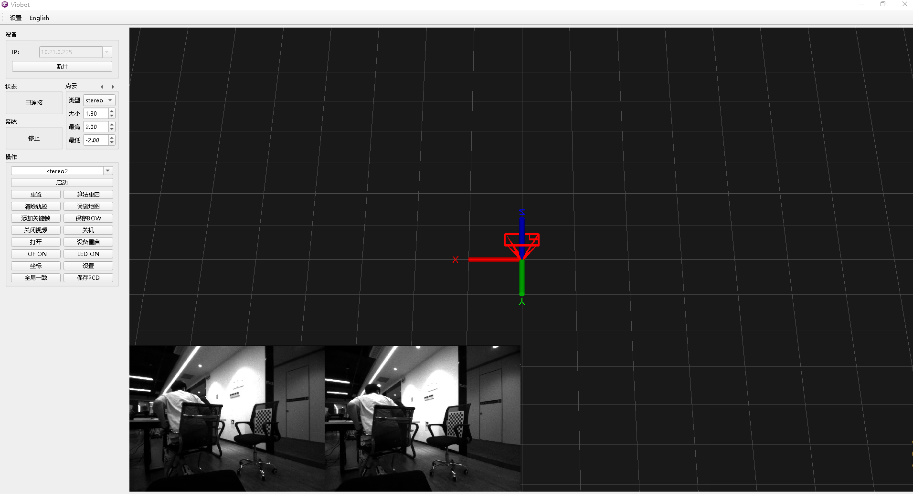
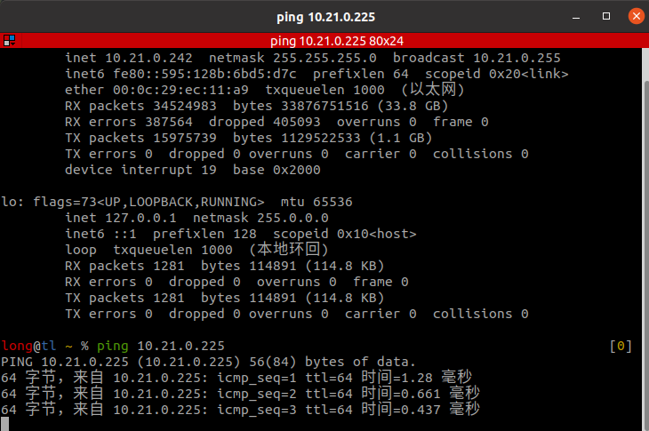
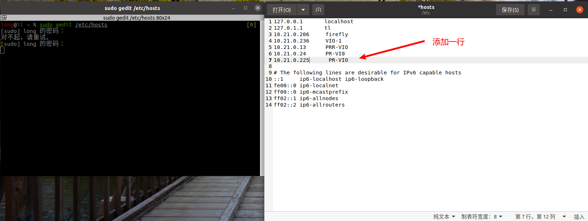
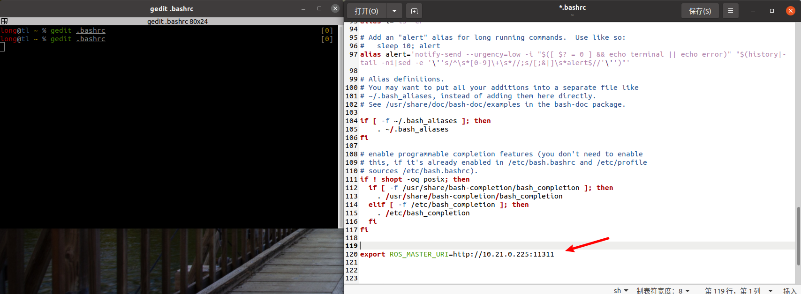
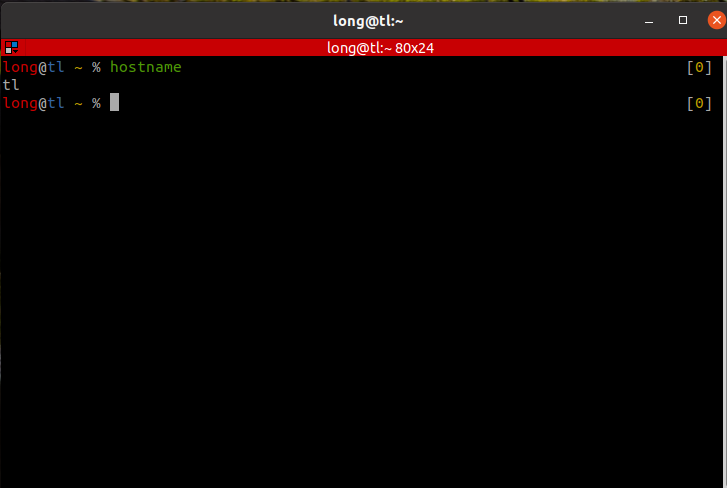

# ROS1 Master/Slave Setup (Viobot2 as Master)

This example uses an Ubuntu 20.04 virtual machine as the ROS slave.

Device IP: `10.21.0.225`  
Ubuntu (slave) IP: `10.21.0.242`  
First, make sure the slave can ping the device.





## 1. Configure the Slave

On the Ubuntu VM, run the following command, enter password, edit the file as shown, save and exit:

```bash
sudo gedit /etc/hosts
# add one line, where 10.21.0.225 is the device IP, PR-VIO is the device hostname
10.21.0.225      PR-VIO
```



Then edit `.bashrc` and append the following line:

```bash
gedit .bashrc
# add one line at the end
export ROS_MASTER_URI=http://10.21.0.225:11311
```



Open a **new terminal** (must be a new terminal) and run:

```bash
rostopic list
# if configured correctly, you should see the master's topics
# you can also run:
rostopic echo /baton/imu
# the terminal will print IMU data
```

At this point, the slave is configured.

## 2. Configure the Master (Optional)

Only configure this if you need the slave to control the master.

SSH into the device and edit:

```bash
sudo vim /etc/hosts
# add a new line:
<slave_ip> <slave_hostname>
```


The slave IP is `10.21.0.242`. On the Ubuntu VM, get the hostname:

```bash
hostname
# example: if the hostname is "tl", then add "10.21.0.242 tl" in /etc/hosts on the device
```



In vim, press `Esc` twice, then type `:wq` and press Enter to save and exit.

## 3. Troubleshooting: Time Synchronization

If you configured everything above but still cannot control the master, time synchronization can be the cause.

When the master does not have Internet access, if the device time and slave time are not synchronized, the master may not receive messages from the slave (because the slave messages appear to come from the "future").

Two solutions:

1. Put the master onto a network with Internet access so it can sync time using network time. If both master and slave can access the Internet and the time zone is set correctly, it should work.
2. If LAN policy prevents Internet access, first connect the master to a network with Internet access, set up an NTP server (install on both), then move the master back to the LAN and use the NTP server to sync the slave time to the master.

Example NTP setup (master and slave must be in the same LAN):

Master:

```bash
sudo apt-get install ntp
sudo apt-get install ntpdate
ifconfig # check IP
```

Slave:

```bash
sudo apt-get install ntp
sudo apt-get install ntpdate
sudo ntpdate -q <master_ip> # check time offset
sudo ntpdate -d <master_ip> # sync time from master
```

If `ntpdate` reports `the NTP socket is in use, exiting`, it means `ntpd` is running. You can stop it and retry:

```bash
service ntpd stop
ntpdate
```

