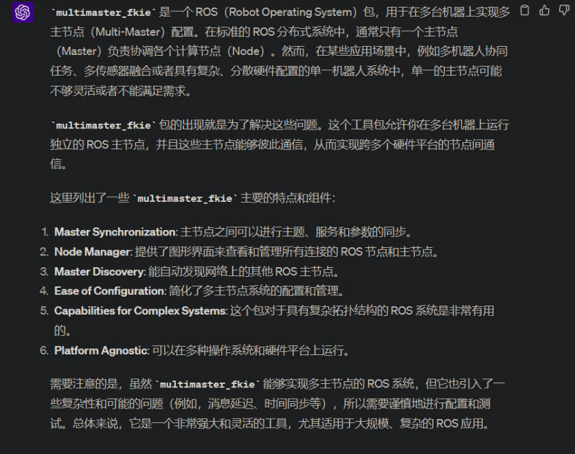
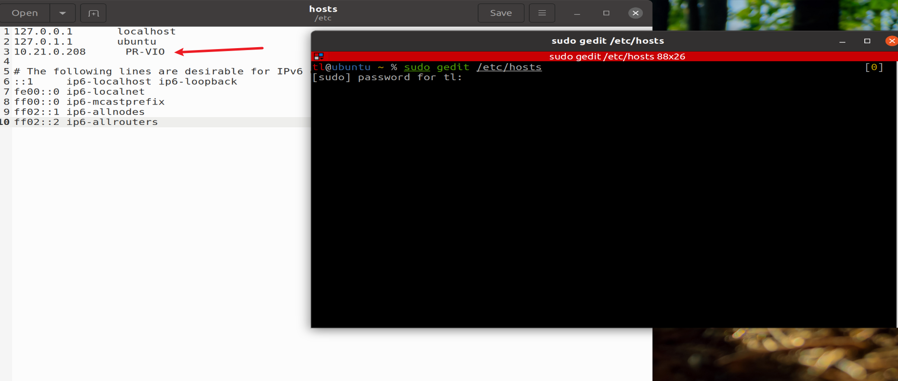
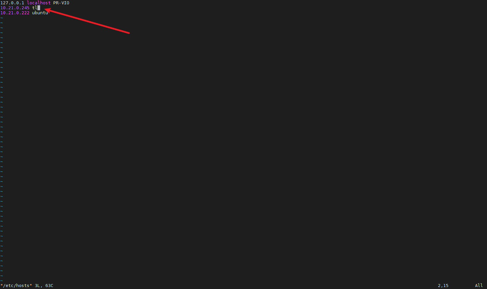
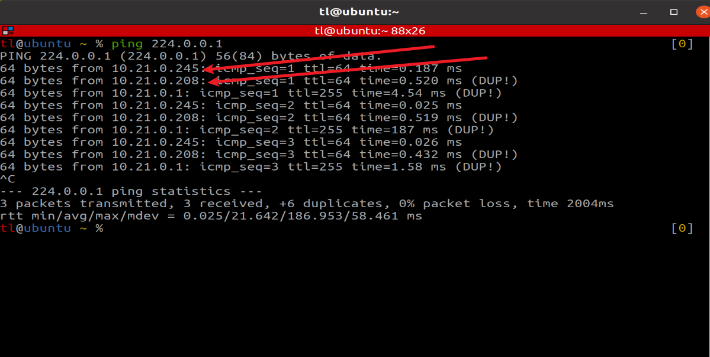
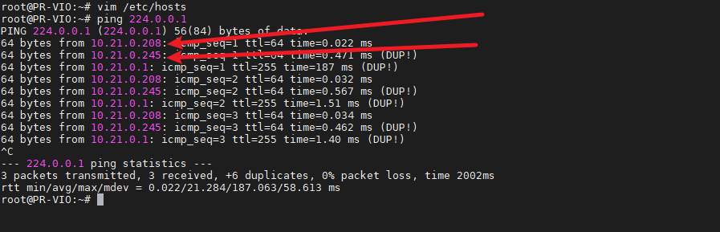

# ROS1 Multi-Master Setup (multimaster_fkie)

This section is mainly for **ROS1**.

ROS1 normally has only one master. If you set your PC as the master and Viobot2 as a slave, some Viobot2 programs may keep looking for the master and certain functions may not work properly. In practice, this approach requires your PC to be running, the ROS master to be available, and the network to be stable.

An alternative is to use `multimaster_fkie` so your PC can be configured as a slave and still use ROS locally even when Viobot2 is not connected.



This tutorial uses Ubuntu 20.04 + ROS Noetic as an example.

- Device 1 (VM) IP: `10.21.0.245`
- Device 2 (Viobot2) IP: `10.21.0.208`

## 1. Build `multimaster_fkie` on Both Devices

### (1) Build on the VM

```bash
mkdir -p mult_master/src
cd mult_master/src
git clone https://github.com/fkie/multimaster_fkie.git multimaster
# If git clone is slow, you can download the zip from GitHub and extract it on both devices.

# install deps
pip3 install grpcio
pip3 install grpcio-tools

cd ..
catkin build
# If "catkin build" is missing:
# sudo apt install python-catkin-tools
```

### (2) Build on Viobot2

Make sure Viobot2 is on a network that has Internet access.

```bash
mkdir -p mult_master/src
cd mult_master/src
git clone https://github.com/fkie/multimaster_fkie.git multimaster
# If git clone is slow, you can download the zip from GitHub and extract it on both devices.

sudo apt update
sudo apt install python3-pip
pip3 install --upgrade setuptools
pip3 install grpcio  --only-binary :all:
pip3 install grpcio-tools  --only-binary :all:

cd ..
catkin build
```

## 2. Configure Hosts

### (1) Add host entry on the VM

```bash
sudo gedit /etc/hosts
```

Add Viobot2 IP and hostname:



### (2) Add host entry on Viobot2

```bash
sudo vim /etc/hosts
```

Add VM IP and hostname:



## 3. Enable Network Options (Both Sides)

Do the following on both devices:

```bash
sudo vim /etc/sysctl.conf # Shift+G to last line, press o to insert, then add:
net.ipv4.ip_forward=1 # enable IP forwarding (allow forwarding packets like a router)
net.ipv4.icmp_echo_ignore_broadcasts=0 # allow responding to broadcast ICMP echo

# restart procps service
sudo service procps restart
```

Then test broadcast ping:

```bash
ping 224.0.0.1
```

VM:



Viobot2:



If both sides can see each other's IP, the configuration is OK.

## 4. Test Multi-Master Sync

Viobot2 already starts a master node and sensor data publishers on boot, so you usually do not need to start additional nodes for basic testing.

On the VM:

Terminal 1:

```bash
roscore
```

Terminal 2:

```bash
cd mult_master
source ./devel/setup.bash
rosrun fkie_master_discovery master_discovery
```

Terminal 3:

```bash
cd mult_master
source ./devel/setup.bash
rosrun fkie_master_sync master_sync
```

On Viobot2:

```bash
cd mult_master
source ./devel/setup.bash
rosrun fkie_master_discovery master_discovery
```

After everything is running, you should be able to see Viobot2 topics on the VM. Open a new terminal on the VM and use `rqt` to visualize.

