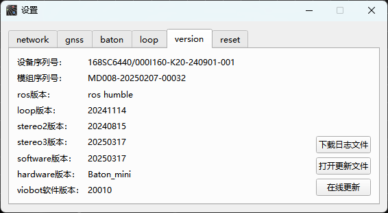
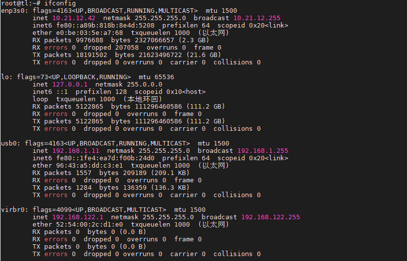
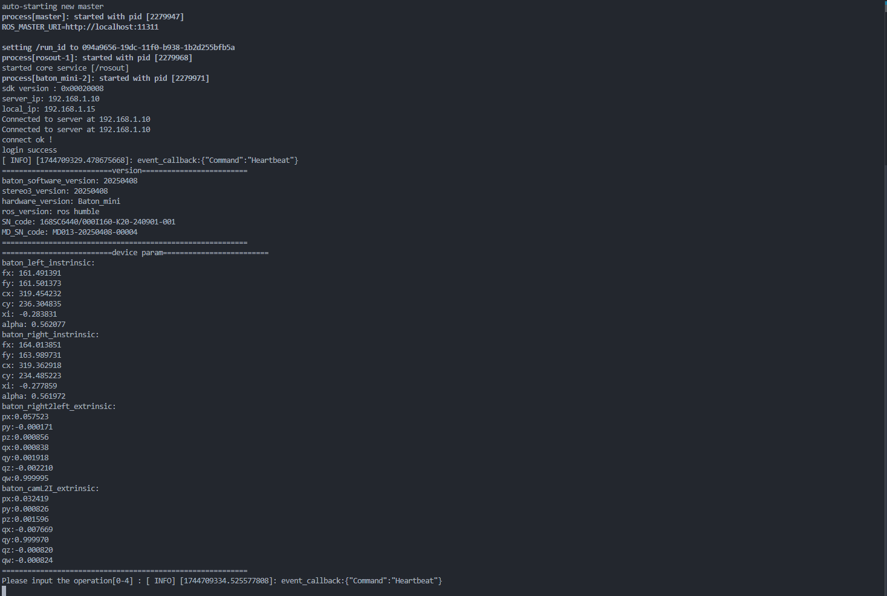

# USB_Demo

mini现在支持使用TCP获取图像以及IMU数据，使用接口控制相机算法启停和接收算法位姿结果。

需要将mini设备的固件版本同步更新至20250317，如果版本早于0317则需要去[官网](https://www.hessian-matrix.com/%e4%b8%8b%e8%bd%bd%e4%b8%ad%e5%bf%83/ "官网")下载最新的固件并按照[版本更新](https://baton-doc.readthedocs.io/en/baton_mini/%E7%89%88%E6%9C%AC%E6%9B%B4%E6%96%B0.html "版本更新")的步骤更新固件。



### 1.下载SDK demo源码到自己的电脑

```bash 
git clone https://github.com/Hessian-matrix/baton_mini_sdk_demo
```


### 2.选择编译方式

需要自行安装OpenCV环境。

#### 1)ROS

如果是使用ROS的话可以直接把代码放到工作空间里面，然后使用`ros_build.sh`脚本编译代码，编译出来就是通过USB 的TCP接收到图像和IMU数据，通过接口函数控制设备算法和接收位姿数据，最后再通过话题重新把数据发出。话题名：

`/baton_mini/imu`、`/baton_mini/odometry`、`/baton_mini/image_left`、`/baton_mini/image_right`

#### 2)非ROS

如果不使用ROS的话，可以用`build_non_ros.sh`脚本编译代码。运行代码可以在两个回调函数里面拿到IMU的数据结构体和两个cv::Mat灰色图像。

### 3.编译成功后测试代码

#### 1）ROS

查看本机IP

```bash 
ifconfig
```




可以看到usb0给我电脑分配的ip地址为192.168.1.11

配置launch文件里面的相机对应的server\_ip和本机ip。

```xml 
<launch>
    <node name="baton_mini" pkg="baton_mini" type="baton_mini" output="screen">
        <param name="server_ip" value="192.168.1.10"/>
        <param name="local_ip" value="192.168.1.11"/>
    </node>
</launch>
```


使用roslaunch启动相机接收节点。

```bash 
roslaunch baton_mini baton_mini.launch
```




#### 2）非ROS

同样是查看本机分配的IP，`ifconfig`，结果假定和上面一样`192.168.1.11`

将ip填入baton\_mini.cpp中的第24行，

```c++ 
std::string local_ip = "192.168.1.11";
```


重新运行`build_non_ros.sh`脚本编译。然后运行生成的执行文件`baton_mini`

#### 3）效果

如果连接成功，终端会输出设备的version信息以及相机参数，并进入终端接收键盘命令线程：

```c++ 
void command_thread(){
    vio_sdk_init();
    HANDLE streamHandle1 = net_vio_stream_connect(loginHandle, 1, stream_callback);
    
    get_device_version();
    get_device_param();
    // set_network("192.168.1.10");
    cout << "Please input the operation[0-4] : ";   

    imu_switch imu_status = OFF;
    int v;
    while (cin >> v){
        if (v == 0) {//logout connect
            net_vio_logout(loginHandle);
            break;
        }
        else if (v == 1){//start or stop
            if (sys_status == ready) {//The system is currently in a ready state and can be started directly
                alog_start();
            }
            else if (sys_status == stereo3_running) {//The system is currently in a running state and can be stoped
                algo_stop();
            }
        }
        else if (v == 2) {//algo restart
            if (sys_status == stereo3_running) {//The stereo3 algorithm is currently in a running state and can be restart
                algo_restart();
            }
        }
    else if(v == 3){//open or close imu receive
            if(imu_status == ON){
                imu_status = OFF;
          baton_open_imu_recv(imu_status);
            }
            else{
                imu_status = ON;
                baton_open_imu_recv(imu_status);
            }
    }
        else if(v == 4){//Select to receive image data 
            baton_open_image_recv(stereo);
        }
    }
    net_vio_sdk_exit();
    cout << "ByeBye\n";
}

```


命令接收线程里面，键盘输入0-4：

0：退出登录

1：开启算法 或者停止算法

2：算法重置

3：开启IMU数据接收

4：开启图像数据接收

如果是ROS的话会直接把接收到的数据转成话题发送出来。

如果是非ROS的话数据接口在下面的四个函数里面，用户自己拿出来用即可。

```c++ 
void odom_data_print(int length, const char* frameData) {}
voidimu_data_recv(const imu_data& imu){}
voidimage_left_data(const cv::Mat& image_){}
voidimage_right_data(const cv::Mat& image_){}

```
