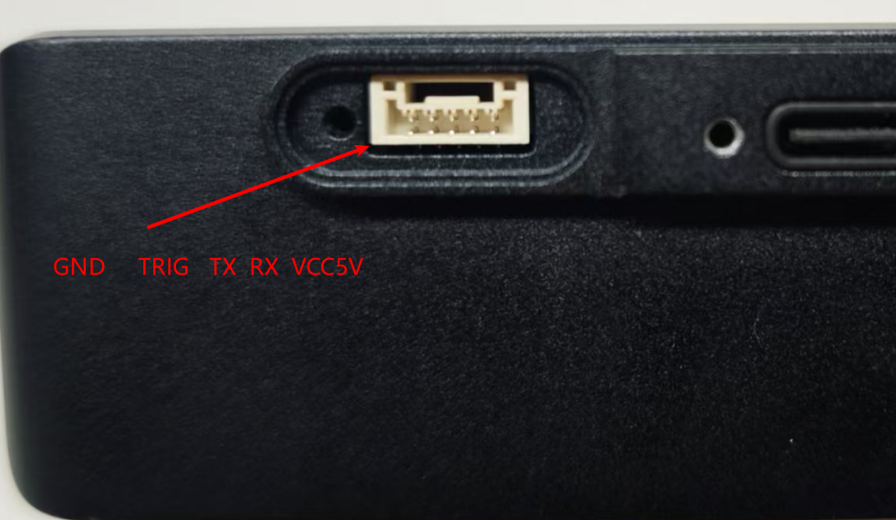

# Uart_Demo

UART的接口为GH1.0的5pin，从螺丝孔那里开始从左到右分别是GND、TRIG、TX、RX、5V。



如果是单纯串口通信的话就是接GND、TX、RX即可，需要注意的是串口电平是3.3V的如果接了5V会把串口烧掉。

Demo代码地址：[Hessian-matrix/mini_serial_demo: serial demo for baton_mini](https://github.com/Hessian-matrix/mini_serial_demo)

## 一.数据协议

串口波特率：115200

### 1.系统控制帧

单帧共34byte

| 帧头        | 控制位         | algo_type           | 保留位      | 和校验位            | 帧尾        |
| --------- | ----------- | ------------------- | -------- | --------------- | --------- |
| 0x67 0x28 | 控制系统运行状态的指令 | 切换stereo3/stereo4算法 | 保留位，保持全0 | 累加和（不包含帧头帧尾校验位） | 0x09 0x0d |
| 2byte     | 1byte       | 1byte               | 27byte   | 1byte           | 2byte     |

**控制位：**

- 0x01 启动算法程序
- 0x02 停止算法程序
- 0x03 重启算法程序

**algo_type**:

- 0x00: 选择stereo3算法、

- 0x01: 选择stereo4算法 

**校验和：** 计算校验和时从第3byte的控制位开始计算，一直累加到保留位的最后一位为止，一共要计算29bit

```c++
unsigned char check = 0;
for(int i = 2;i < 31;i++){
    check += receiveBuffer[i];
}
```

以下是启动stereo3/stereo4的完整十六进制数据，可在串口工具中以十六进制发送：

**stereo3**

- 启动：
  
  ```
  67 28 01 00 00 00 00 00 00 00 00 00 00 00 00 00 00 00 00 00 00 00 00 00 00 00 00 00 00 00 00 01 09 0D
  ```

- 停止：
  
  ```
  67 28 02 00 00 00 00 00 00 00 00 00 00 00 00 00 00 00 00 00 00 00 00 00 00 00 00 00 00 00 00 02 09 0D
  ```

- 重启：
  
  ```
  67 28 03 00 00 00 00 00 00 00 00 00 00 00 00 00 00 00 00 00 00 00 00 00 00 00 00 00 00 00 00 03 09 0D
  ```

**stereo4**

- 启动：
  
  ```
  67 28 01 01 00 00 00 00 00 00 00 00 00 00 00 00 00 00 00 00 00 00 00 00 00 00 00 00 00 00 00 02 09 0D
  ```

- 停止：
  
  ```
  67 28 02 01 00 00 00 00 00 00 00 00 00 00 00 00 00 00 00 00 00 00 00 00 00 00 00 00 00 00 00 03 09 0D
  ```

- 重启：
  
  ```
  67 28 03 01 00 00 00 00 00 00 00 00 00 00 00 00 00 00 00 00 00 00 00 00 00 00 00 00 00 00 00 04 09 0D
  ```

### 2.姿态输出帧

单帧共61byte

| 帧头        | frame_id | pose                       | 四元数                   | 线速度                    | 角速度                    | 校验和                        | 帧尾        |
| --------- |:--------:| -------------------------- | --------------------- | ---------------------- | ---------------------- | -------------------------- | --------- |
| 0x66 0x27 | int      | pose的x、y、z三维坐标输出，每个分量4byte | x、y、z、w四个分量，每个分量4byte | lx、ly、lz三个分量，每个分量4byte | ax、ay、az三个分量，每个分量4byte | 数据部分（不包含帧头帧尾校验位部分）的所有数据累加和 | 0x08 0x0a |
| 2byte     | 4byte    | 12byte                     | 16byte                | 12byte                 | 12byte                 | 1byte                      | 2byte     |

**数据位：** 数据位传输的是结构体通过内存拷贝到char数组上的方式传输，实际上就是float型数据在内存中存放的数据位，同理解析时也是通过memcpy进行内存拷贝解码。

**校验和：** 计算校验和的方式和系统控制帧的计算方式相同。

数据位的结构体示例：

```c++
struct pose_t{
    float px,py,pz,qx,qy,qz,qw;    //pose 和 四元素
};
struct speed_t{
    float lx,ly,lz,ax,ay,az;      //线速度 和 角速度
};
struct odom_t{
    pose_t pose;
    speed_t speed;
};
```

## 二.示例代码

```bash
#完整工程：
git clone https://github.com/Hessian-matrix/mini_serial_demo.git
#工程依赖ros-serial库，可以通过apt安装或者下载ros serial的源码
sudo apt install  ros-noetic-serial
git clone https://github.com/wjwwood/serial.git
```
