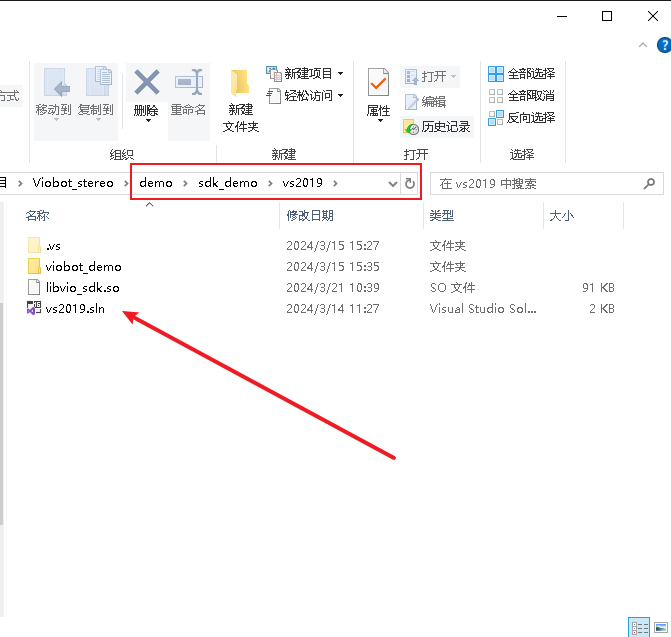
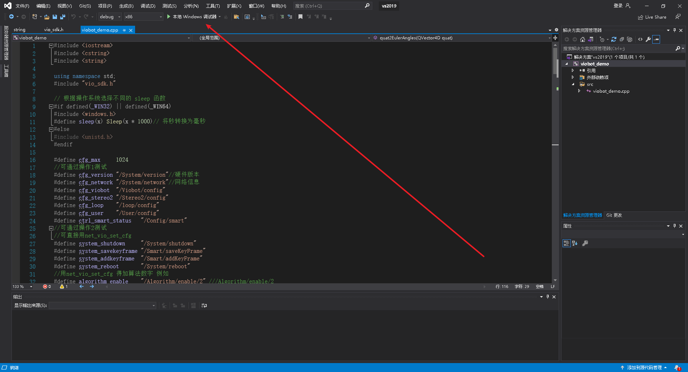
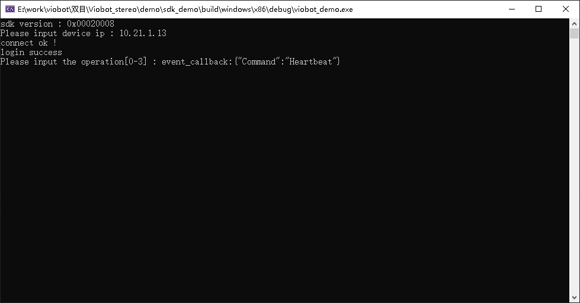
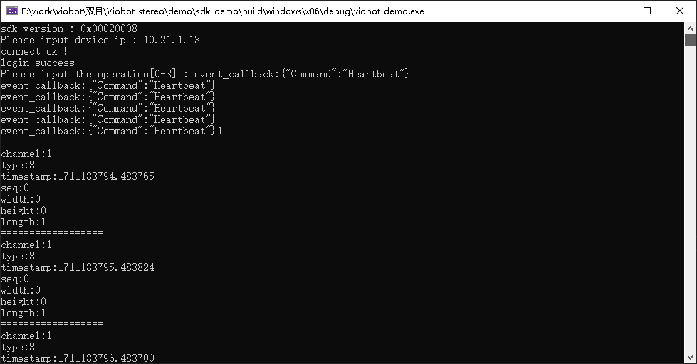
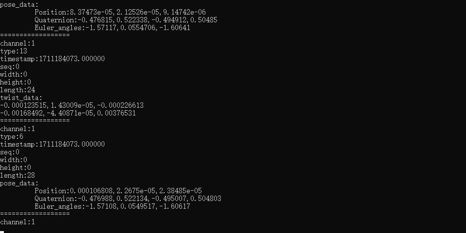
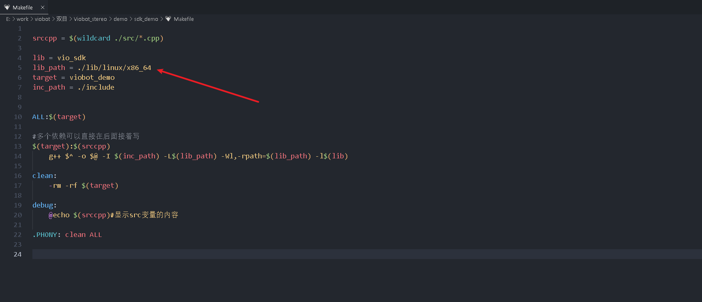
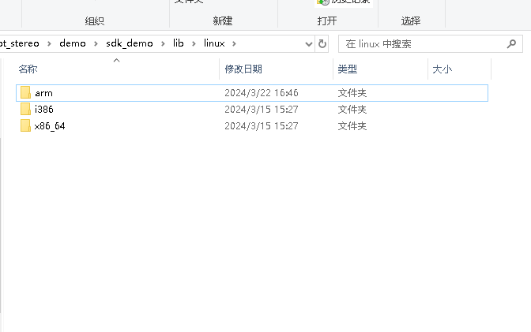
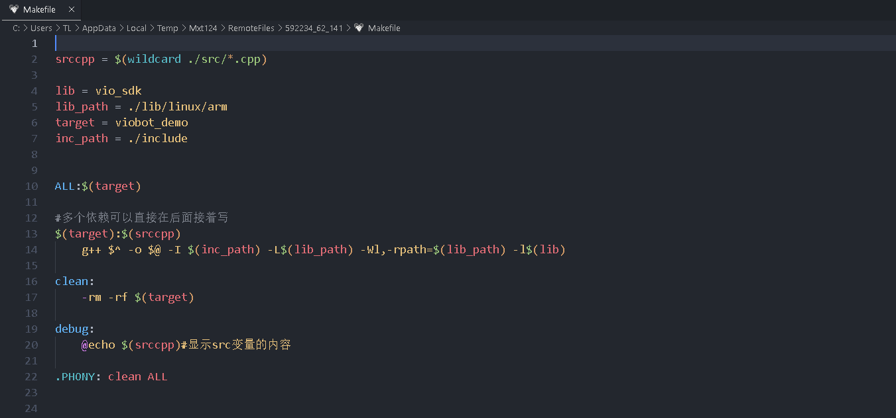
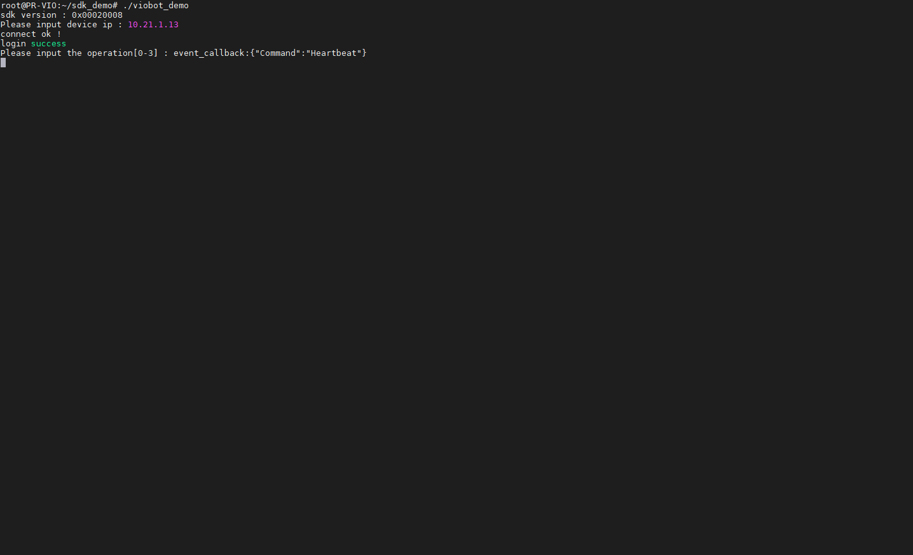
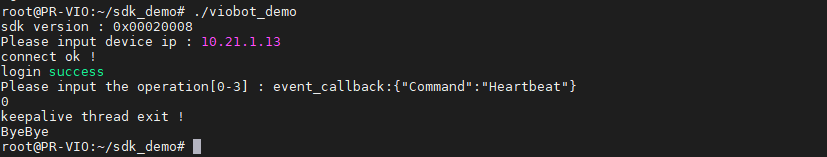

# SDK Demo

This page briefly explains how to use the SDK via HTTP and provides a basic demo.

Repo:

- [Hessian-matrix/SDK_Demo (GitHub)](https://github.com/Hessian-matrix/SDK_Demo)
- [SDK_Demo (Gitee)](https://gitee.com/hessian_matrix/SDK_Demo)

## 1. Windows

Open the project with Visual Studio 2019 and run with the local debugger.





### (1) Enter device IP and press Enter

If it prints `event_callback`, it indicates the device heartbeat is normal.



### (2) Enter `1` and press Enter to enable Stream Channel 1

You should start receiving channel 1 data. By default you will receive frame type `8` (system status), which is sent once per second.



### (3) Enter `2` and press Enter to start/stop the algorithm

When the system status is `ready`, starting the algorithm will continuously print pose and twist data from channel 1. When the system status is `stereo2_running`, stopping the algorithm will stop pose/twist outputs, so they will no longer be printed.



### (4) Enter `0` and press Enter to logout and exit

## 2. Linux

### (1) Update `lib_path` in the Makefile



The `.so` under `lib/linux` differs across platforms.



Example (running on Viobot2 itself):

Set: `lib_path = ./lib/linux/arm`



### (2) Build and Run

```bash
cd sdk_demo
make
./viobot_demo
```



#### 1. Enter device IP and press Enter

If it prints `event_callback`, it indicates the device heartbeat is normal.


#### 2. Enter `1` and press Enter to enable Stream Channel 1

You should start receiving channel 1 data. By default you will receive frame type `8` (system status), which is sent once per second.


#### 3. Enter `2` and press Enter to start/stop the algorithm

When the system status is `ready`, starting the algorithm will continuously print pose and twist data from channel 1. When the system status is `stereo2_running`, stopping the algorithm will stop pose/twist outputs, so they will no longer be printed.


#### 4. Enter `0` and press Enter to logout and exit


