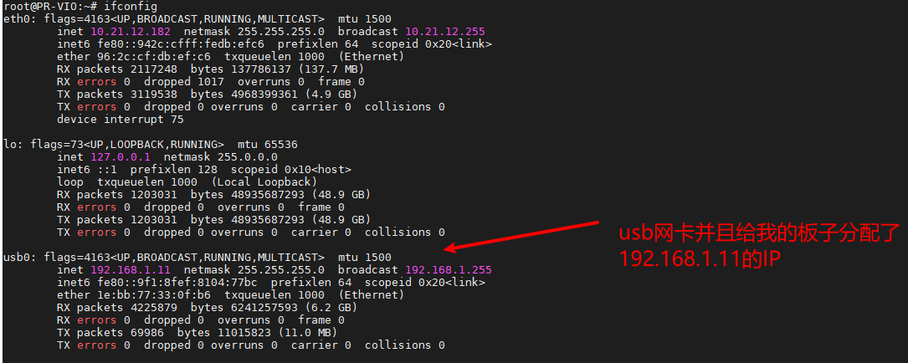
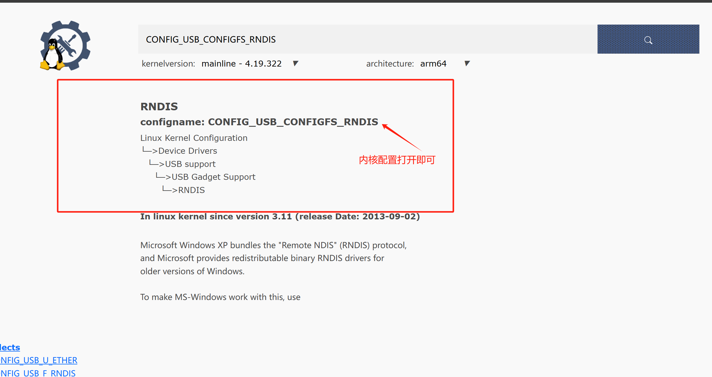
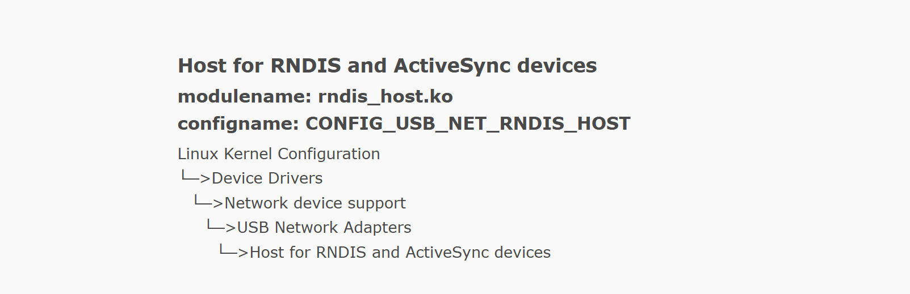
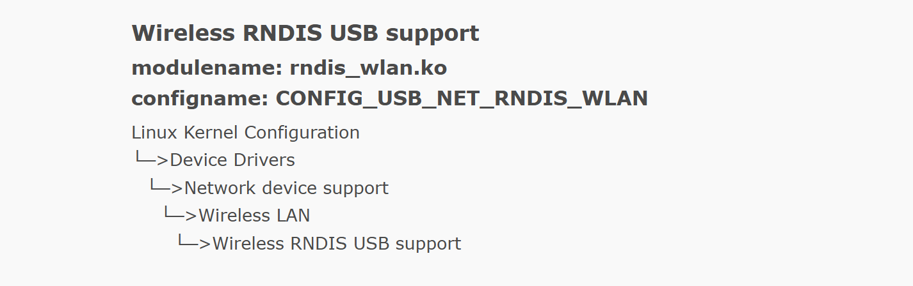

# USB网卡设置

有些嵌入式系统板没有开启这个内核功能会识别不到网卡，如果能够直接识别网卡就不需要做下面的操作。

#### 1.查看是否有识别网卡驱动

将mini通过USB连接到嵌入式板上，等待指示灯闪烁。

登录到嵌入式系统里面，在终端输入

```bash
ifconfig
```



如果显示与上图一致，则网卡正常，后面的直接跳过即可。

如果没有显示USB网卡，则需要配置一下系统内核。

#### 2.配置系统内核

内核打开这几个即可：






