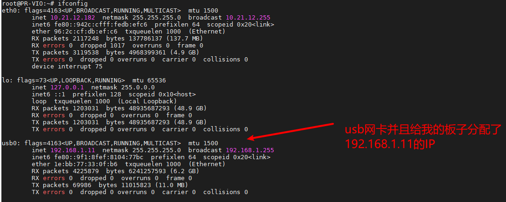
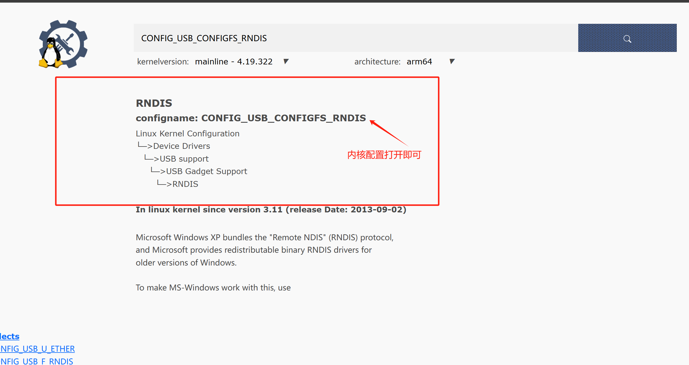
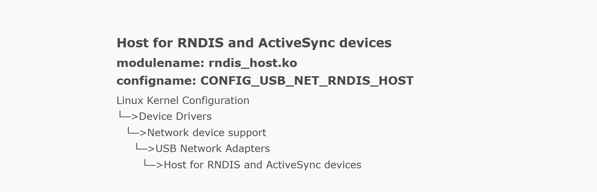
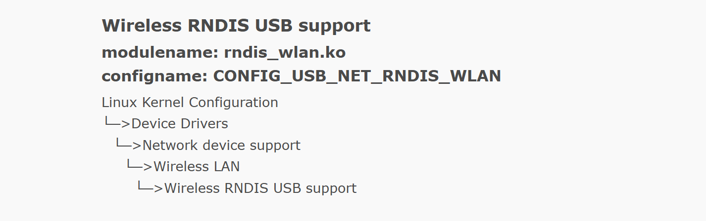

# USB网卡设置

有些嵌入式系统板没有开启这个内核功能会识别不到网卡，如果能够直接识别网卡就不需要做下面的操作。

#### 1.查看是否有识别网卡驱动

将mini通过USB连接到嵌入式板上，等待指示灯闪烁。

登录到嵌入式系统里面，在终端输入

```bash
ifconfig
```



如果显示与上图一致，则网卡正常，后面的直接跳过即可。

如果没有显示USB网卡，则需要配置一下系统内核。

#### 2.配置系统内核

内核打开这几个即可：







#### 3.Linux上固定网卡名称

mini的usb虚拟网卡在有些设备上ifconfig查看到每次开机启动的网卡名称都不一样，可以通过绑定供应商id和设备id来解决：

```
lsusb
```

出现一串Bus 的字样,找到 SpacemiT SpacemiT这一行，需要用到的其实就是usbid号：361c:00c7

```shell
~$ lsusb
Bus 004 Device 001: ID 1d6b:0003 Linux Foundation 3.0 root hub
Bus 003 Device 004: ID 0e0f:0002 VMware, Inc. Virtual USB Hub
Bus 003 Device 003: ID 0e0f:0002 VMware, Inc. Virtual USB Hub
Bus 003 Device 005: ID 361c:00c7 SpacemiT SpacemiT RNDIS Composite Device
Bus 003 Device 002: ID 0e0f:0003 VMware, Inc. Virtual Mouse
Bus 003 Device 001: ID 1d6b:0002 Linux Foundation 2.0 root hub
Bus 001 Device 001: ID 1d6b:0002 Linux Foundation 2.0 root hub
Bus 002 Device 003: ID 0e0f:0002 VMware, Inc. Virtual USB Hub
Bus 002 Device 002: ID 0e0f:0008 VMware, Inc. Virtual Bluetooth Adapter
Bus 002 Device 001: ID 1d6b:0001 Linux Foundation 1.1 root hub
```


在电脑上：

```shell
sudo vim /etc/udev/rules.d/mini_usb_network.rules
```

写入以下内容： 
2207是供应商id，填入ATTRS{idVendor}=="361c" 
0006是产品Id，填入ATTRS{idProduct}=="00c7"

```shell
#/etc/udev/rules.d/mini_usb_network.rules
SUBSYSTEM=="net", ACTION=="add", ATTRS{idVendor}=="361c", ATTRS{idProduct}=="00c7",NAME="mini_usb0"
```

规则添加权限以及重新触发

```
sudo chmod 644 /etc/udev/rules.d/mini_usb_network.rules

sudo udevadm control --reload-rules && sudo service udev restart && sudo udevadm trigger
```

经过测试，mini的usb虚拟网卡的供应商id和产品id是不会变化的，因此就可以使用上述 
的自定义规则把网卡的名字固定下来，这里配置成了mini_usb0 ，配置规则文件之后需要重启 
才能生效。
重启后再配置这个网卡的固定ip：在电脑上操作：

```
 vim /etc/netplan/01-network-manager-all.yaml
```

填入以下内容配置mini_usb0网卡的固定ip,例如，这里的mini使用的IP是192.168.2.10，所以需要将mini给电脑分配的网卡的ip设置成不冲突的192.168.2.12

```
network:
  version: 2
  renderer: NetworkManager
  ethernets:
    mini_usb0:
      dhcp4: no
      addresses: [192.168.2.12/24]
      gateway4: 192.168.2.1
      nameservers:
        addresses: [8.8.8.8, 1.1.1.1]
```

最后应用配置

```shell
sudo netplan apply
```

一般重新启动之后就能看到虚拟网卡绑定成了mini_usb0:

```shell
~$ ifconfig
mini_usb0: flags=4163<UP,BROADCAST,RUNNING,MULTICAST>  mtu 1500
        inet 192.168.2.12  netmask 255.255.255.0  broadcast 192.168.2.255
        inet6 fe80::2c39:4dff:fe04:77fd  prefixlen 64  scopeid 0x20<link>
        ether 2e:39:4d:04:77:fd  txqueuelen 1000  (以太网)
        RX packets 62  bytes 17264 (17.2 KB)
        RX errors 0  dropped 0  overruns 0  frame 0
        TX packets 92  bytes 14484 (14.4 KB)
        TX errors 0  dropped 0 overruns 0  carrier 0  collisions 0

```
