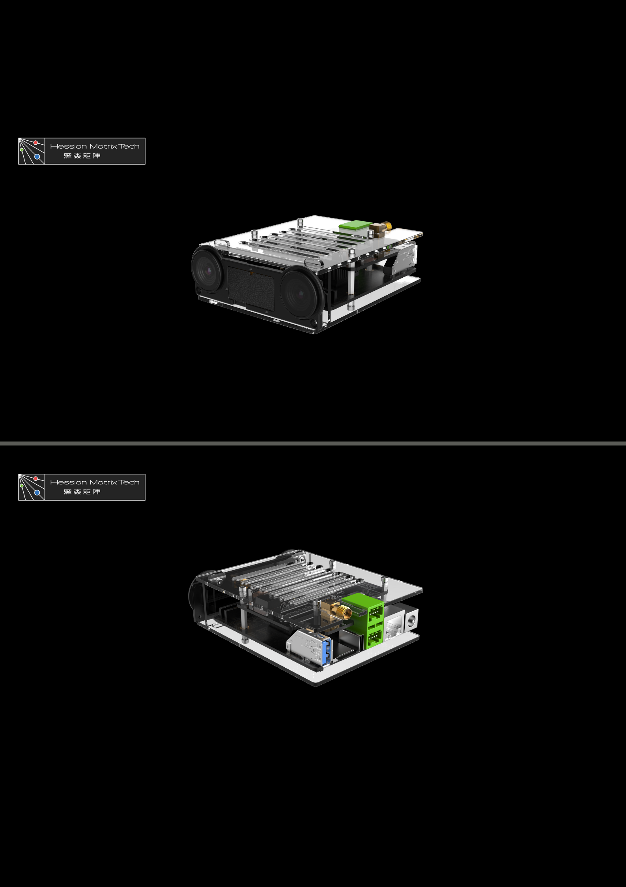
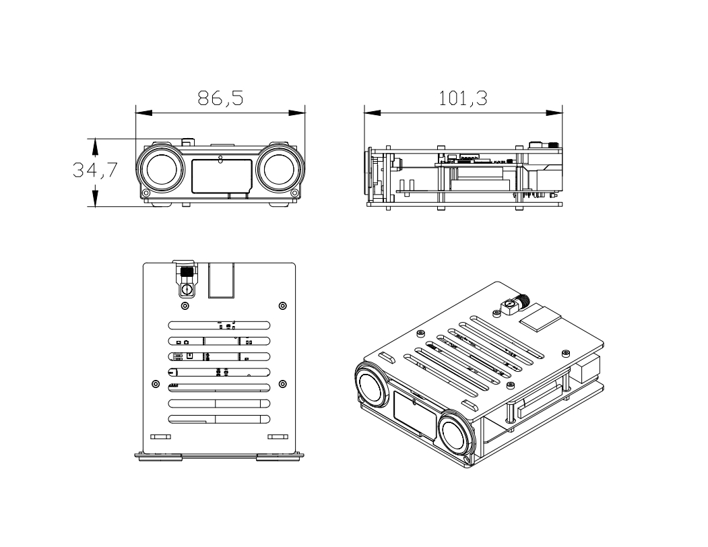

# Viobot2简介

Viobot2是一款应用于机器人的前端定位模块，通过双目摄像头和自带的imu采集环境以及自身数据，计算并输出设备自身的当前位姿。

Viobot2自带的stereo3算法采用双目直接法耦合imu的方式，计算自身位姿,自带回环功能，能够再重复作业场景自动实现重定位功能。可以通过耦合自带的GNSS模块的数据，实现更稳定的定位。

Viobot2自带系统默认为Ubuntu20.04 + ROS noetic （可选配 Ubuntu22.04 +ROS humble），可作为一个开发平台，我们的传感器读取和算法计算只用了30%CPU，还有未使用的GPU以及6TOPs的NPU，剩余的算力，用户可以自己进行开发使用。

用户购买时可选主板配置为：4GB+32GB和8GB+32GB两种内存组合。

外引了一个USBA口、一个TF座、一路CAN、一路I2C、一路UART接口出来，还有板载一个SATA口、DEBUG串口、一路普通串口、还有两个软排线座接口可以接额外的相机模块。

由于硬件接口无视频口输出，系统默认为无桌面环境，可使用命令行方式进行开发，也可后续自行参考教程安装桌面系统。用户名：`PRR`密码：`PRR`

软件包和demo下载地址：Hessian-matrix ([github.com](http://github.com "github.com")) 或者Hessian\_matrix (hessian\_matrix) - [Gitee.com](http://Gitee.com "Gitee.com")

外观总览：

产品尺寸：

