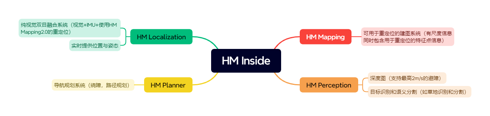

# 简介

这一次的HM Inside的商用发布，给纯视觉SLAM/VIO带来了更清晰的商用落地可能。我们也将和伙伴们完成更多的SOC芯片“平台支持。机器人边缘端传感+算力的组合将直接把所有的中低速机器人形态(轮式、足式、飞行器)从二维带向三维，从狭窄的室内带向更广阔的空间。HM Inside 一共分为四大模块：

- HM Localization：输入相机图像和陀螺仪数据输出位姿和姿态,即视觉里程计；
- HM Planner：一个给定终点B，自动生成一条从起点A到终点B的路径，即机器人导航系统；
- HM Mapping：输入大量的图片，让HM Mapping生成一张它自己能知道它在哪的地图，即SFM重定位系统；
- HM Perception：
    - 双目深度：输出的相机到图像内容中物体的距离信息的一张图像，即深度图，可用于机器人导航避障；
    - 语义分割：输出相机图像中属于同一类物体的多边形框的范围，如地面和天空的范围。

# 适用范围

目前Robobaton+HMInside的工作范围和边界是:

(1) 500平米或以内，不分室内外的大部分场景中的各类机器人三维自主导航定位与感知;

(2) HM Localization+组合导航，结合HM Perception实现中低速自由探索。

不支持:

(1) 如雪原、隧道等视觉特征/光照太差的场景、精度要求极高的严肃工业场景海拔30米向上飞行场景。

(2) 目前SFM重建在无纹理区域、走廊白墙场景容易失败。

(3) 目前重定位在平坦、开阔、近处特征少的场景重定位精度会降低，系统仍然可以依靠GNSS、RTK以及视觉定位正常工作。

(4) 目前重定位并未与GNSS、RTK的信息做耦合，之后有计划做适配，请用户敬请期待。