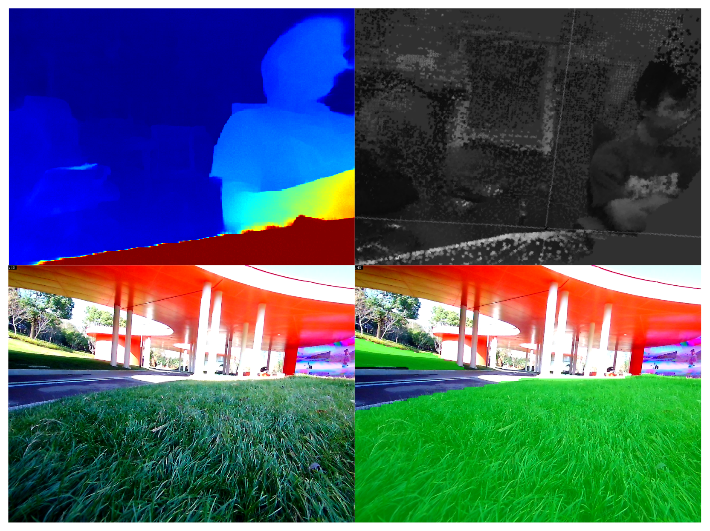

# 简介

这一次的HM Inside的商用发布，给纯视觉SLAM/VIO带来了更清晰的商用落地可能。我们也将和伙伴们完成更多的SOC平台支持。机器人边缘端传感+算力的组合将直接把所有的中低速机器人形态(轮式、足式、飞行器)从二维带向三维，从狭窄的室内带向更广阔的空间。HM Inside 一共分为四大模块：

- `HM Localization`：通过图像与IMU获得相机当前位姿和姿态，即VIO（视觉惯性里程计）；
- `HM Planner`：
    - `机器人点到点导航系统`：给定终点B，自动生成一条从起点A到终点B的路径，并发布机器人速度控制指令。
    - `机器人全覆盖导航系统`：给定一个闭合范围，自动生成一条该闭合区域的全覆盖路径，并发布机器人速度控制指令。
- `HM Mapping`：通过拍摄大量场景照片构建先验地图，可辅助HM Localization提高精度与稳定性；
- `HM Perception`：
    - `双目深度`：获得深度图，即包含了图像中每个像素的距离信息的图像，可用于机器人导航避障；
    - `语义分割`：获得相机图像中每个像素属于的物体类别。

上两张图：双目深度视差图、双目深度转点云着色图；下两张图：语义分割效果（左：原图， 右：分割以草地为类别的图像）
 

## 适用范围

目前Robobaton+HMInside的工作范围和边界是:

(1) 500平米或以内，不分室内外的大部分场景中的各类机器人三维自主导航定位与感知;

(2) HM Localization+组合导航，结合HM Perception实现中低速自由探索。

不支持:

(1) 如雪原、隧道等视觉特征/光照太差的场景、精度要求极高的严肃工业场景、海拔30米向上飞行场景。

(2) 目前SFM重建在无纹理区域、走廊白墙场景容易失败。

(3) 目前重定位在平坦、开阔、近处特征少的场景重定位精度会降低，系统仍然可以依靠GNSS、RTK以及视觉定位正常工作。

(4) 目前重定位并未与GNSS、RTK的信息做耦合，之后有计划做适配，请用户敬请期待。

> 注意：目前使用HM Inside 的功能会引起较高的散热，如需要长时间工作需要自行解决散热的问题或者等待后续发布的散热模块。