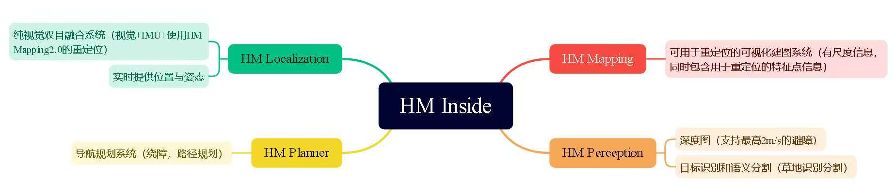

# HM Inside

## 简介
这一次的HM Inside的商用发布，给纯视觉SLAM/VIO带来了更清晰的商用落地可能。我们也将和伙伴们完成更多的SOC芯片“平台支持。机器人边缘端传感+算力的组合将直接把所有的中低速机器人形态(轮式、足式、飞行器)从二维带向三维，从狭窄的室内带向更广阔的空间。HM Inside 一共分为四大模块：

- HM Localization：就是Viobot2的SLAM定位系统；
- HM Planner：导航规划系统；
- HM Mapping:：SFM重定位系统；
- HM Perception：深度图、语义分割；

## 适用范围

目前Robobaton+HMInside的工作范围和边界是:

(1)5000平米或以内，不分室内外的大部分场景中的各类机器人三维自主导航定位与感知;

(2)HM Localization+组合导航，结合HM Perception实现中低速自由探索。

不支持:如雪原、隧道等视觉特征/光照太差的场景、精度要求极高的严肃工业场景海拔30米向上飞行场景。