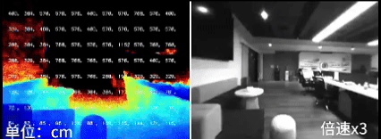

# HM双目深度
## 简介
双目深度估计（Stereo Depth）是一种基于双目立体视觉原理的被动式三维感知技术，通过模拟人类双眼的视差原理，利用两个空间位置分离的相机采集同一场景中的图像，再用深度学习通过端到端的学习直接输出深度图。广泛应用于自主小车导航、避障。

图1.viobot室内双目深度效果
 

双目深度估计是一项非常吃算力的任务，在3588上实现实时推理需要NPU进行量化加速才能呈现Viobot2所展示的效果。

## 在Viobot2上使用双目深度
使用这项功能前先将Viobot2更新到我们官网的最新版本固件和Viobot-UI上位机，以防Viobot还没有收到更新的功能，具体的更新步骤查看[版本更新](https://baton-doc.readthedocs.io/en/viobot2/%E5%9F%BA%E6%9C%AC%E5%8A%9F%E8%83%BD%E4%BB%8B%E7%BB%8D%E5%8F%8A%E4%BD%BF%E7%94%A8/%E7%89%88%E6%9C%AC%E6%9B%B4%E6%96%B0.html)章节。

更新了Viobot-UI以及Viobot2最新固件之后，用Viobot-UI连接Viobot2，点击设置，在baton一栏勾选深度图功能，然后点击确定，会提示重启生效，但是此功能是实时生效的，可以在进程发现一个“stereo_depth”的进程。

开启双目深度之后，可以用rostopic查看相关的话题：
~~~shell
/baton/depth_image      #深度图
/baton/depth_points     #深度转的点云
/baton/disparity_image  #视差图
~~~

这三个话题都是订阅其中一个算法才进行实时处理的，如果没有订阅其中的任何一个，则只是占用了内存保持在后台运行，并不会占用太多的CPU资源。
这里用另一台安装了ros-noetic的ubuntu从机订阅双目深度的三个输出话题，详细的主从机配置、ros2多机通讯的配置在此文档的[ROS主从机配置的两种方式](https://baton-doc.readthedocs.io/en/viobot2/ROS_Master/index.html)效果如下：

图2.左图：viobot室内双目原始深度图 右图：左目相机原图
 

图3.双目深度视差图
 

下面是用从机通过rviz订阅`/baton/depth_points`话题，注意这里的固定坐标系是`camera_link`,`color Transformer`选择`RGB8`,可以看到点云的着色，因为本身是使用灰度图生成的双目深度，所以点云也是灰度的。

图4.双目深度转点云
 

