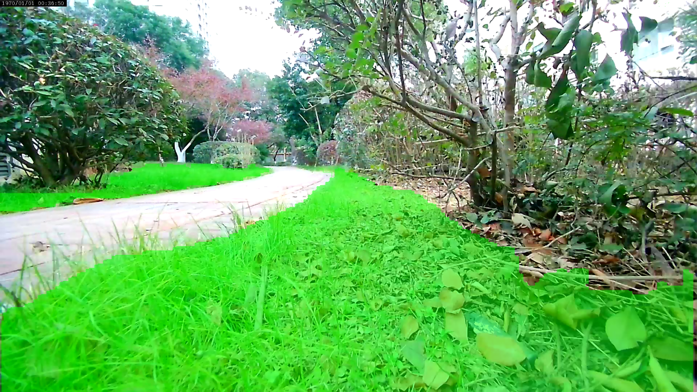
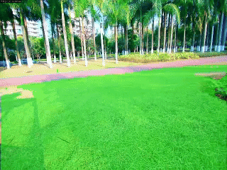

# Viobot2语义分割

语义分割是计算机视觉领域的核心技术之一，旨在为图像中的每个像素分配语义类别标签（如：人、草地、天空），从而实现**像素级**的场景理解。其核心原理是通过深度学习模型提取图像特征，并对每个像素进行分类，最终输出覆盖全图的语义分割掩膜。与目标检测不同，语义分割不区分同类物体的不同实例，仅关注像素的语义类别。目前，语义分割广泛应用与无人车驾驶、自主机器人等领域。

图1.viobot草地分割
 

语义分割是一个非常吃算力的一个计算任务，在嵌入式低功耗设备上想要低延迟、高分辨率地运行语义分割通常需要进行特定的硬件加速，如通过NPU加速处理。Viobot2也是通过这条路线实现的。

<!-- 

图2.viobot连续帧的草地分割效果
  -->