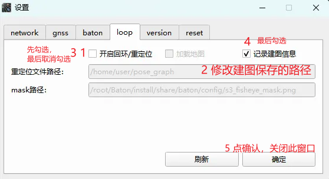
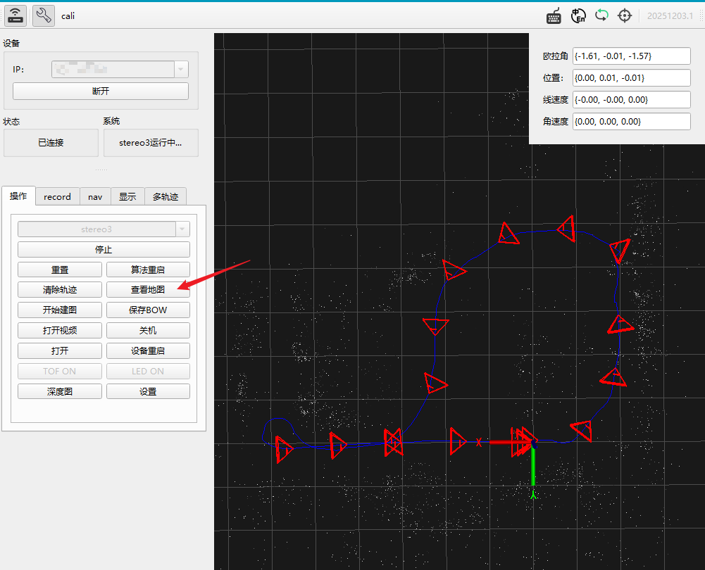
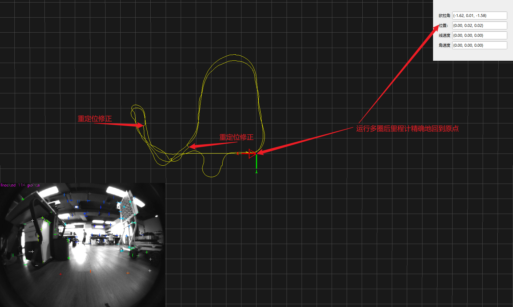

# HM建图与重定位

此文档用于演示如何用viobot2实现sfm重建功能（建图）,以及用建好的地图做全局重定位。

> - 目前Robobaton + HM inside支持在500平方米内不分室内外的大部分场景中的各类机器人三维自主导航定位与感知；
> - HM Localization + 组合导航，结合HM Perception实现中低速自由探索；

**注意：**
> - <font color='#FF0000'>目前viobot2系统版本为202511xx及之后的版本建图需要最新版本的上位机UI配合使用，如发现上位机的页面不一致需要更新到官网的最新版本之后再配合本节使用</font>
> - <font color='#FF0000'>不支持：如雪原、隧道等视觉特征/光照太差的场景、精度要求极高的严肃工业场景海拔30米向上飞行场景。</font>
> - <font color='#FF0000'>目前SFM重建在无纹理区域、走廊白墙场景容易失败。</font>
> - <font color='#FF0000'>目前重定位在平坦、开阔、近处特征少的场景重定位精度会降低，系统仍然可以依靠GNSS、RTK以及视觉定位正常工作。</font>


## 前置准备

建议使用前先在官网下载最新的viobot2固件、viobot-ui上位机，避免有些功能无法使用，附上官网更新固件的下载页面[黑森矩阵-下载中心 ](https://www.hessian-matrix.com/%e4%b8%8b%e8%bd%bd%e4%b8%ad%e5%bf%83/)

## sfm重建、sfm重定位的粗略步骤：

1. 通过viobot上位机配置viobot；

2. 启动stereo3算法，扫描场地环境；

3. 保存地图；

4. 开始建图；

5. 开启重定位；

6. 查看结果；

详细步骤如下：

## viobot设置与采集数据

viobot2建图主要流程就是配置好采集程序→开启stereo3算法采集数据→点开始建图。
viobot-ui连接viobot2，点击设置，找到loop一栏,主要配置以下两个配置： 
  - 1.1 上位机配置保存建图路径：
  连接上位机后，①打开`设置`页面，点开`loop`选项卡，②勾选`开启回环/重定位`，可以配置重定位文件路径，这个路径是在viobot2里面的路径，可通过ssh去访问，用于存放开启算法后保存下来的建图所需要文件，如果此路径没有则会自动创建，③然后将开启 `回环/重定位`勾选去掉，④再勾选`记录建图信息`，⑤点击下面的`确定`按钮，然后关闭选项卡。
  > 注意：以下是不可用的重定位文件夹的路径：
    "/root/Baton"、
    "/",这些目录可能会造成系统损坏或者无法保存，建议将建图文件保存在`/home/user/pose_graph/`下

  - 1.2 开启算法记录建图信息:
  开启stereo3算法，算法会自动将建图所需信息文件存放到所配置的路径下。开着算法带着viobot2循着需要建图的环境跑一圈，然后停止算法，文件就自动保存好了。
  
  > 注意：如有UI界面不同请将viobot2程序以及上位机UI升级到最新版本

以上设置完成后点击确定，之后再启动stereo3算法，开始移动viobot2去采集数据，注意过程中画面视角不要变化过快避免之后的重建的结果不理想。

如果不通过UI配置采集数据、运行重定位的方法：
1. **采集数据**：`record_flag: true  `：然后启动stereo3，程序将自动采集数据，停止stereo3停止数据采集之后此项自动置为false，防止下次启动算法时启动数据采集功能。
2. **启动重定位**：设置`relocalization: true`，启动stereo3时程序会读取到此配置启动重定位功能。
3. **建图保存路径**：按照以下配置`/root/Baton/install/share/baton/config/sys.yaml`,修改`pose_graph_save_path`的路径并记录下来，之后的建图的结果将保存到这里；
~~~ yaml
print_queue: false
use_imu: 2
gnss_select: 2
load_previous_pose_graph: false
add_keyframe_mode: 0
pose_graph_save_path: /home/user/pose_graph   #保存pose_graph的路径,可自行修改
gnss_T_imu:
  data:
    - 0
    - 0
    - 0
relocalization: false   #建图完后有了地图此项为true就是开启了重定位
mask_path: /root/Baton/install/share/baton/config/s3_fisheye_mask.png #画面有遮挡时设置双目mask的路径
only_sfm_data: true
record_flag: true    #需要开启建图数据记录此项为true,然后启动stereo3
zupt_acc_var: -1
zupt_gyr_var: -1
zupt_average_parallax: 0
~~~

需要建图的区域扫描完后点击**停止**stereo3，等待几秒即可保存完整数据,之后进入下一步离线建图。


## 离线建图

前面已经完成了建图的数据采集、基础配置项，建图前建议按照上一节检查一下基础配置项，之后点击“开始建图”之后出现建图的进度条，整个建图的用时视建图的环境大小而增大，进度条结束之后可以在输出路径下的HM_SFM目录下找到重建的结果了：

> Tips:此处运行建图也可不通过UI进行建图，ssh登录viobot2通过运行mapping节点进行建图，注意之前配置的路径以及保存的bow文件夹是否存在内容：
无上位机采集数据的方式首先也是配置`/root/Baton/install/share/baton/config/sys.yaml`,修改`pose_graph_save_path`的路径，或者保保持默认也可，需要建多份地图时就需要修改建图文件的存放路径


采集数据完成之后使用ros topic启动建图：
~~~ shell
# ros1:
rostopic pub -1 /baton/build_map std_msgs/Bool "data: true"

# ros2:
ros2 topic pub --once /baton/build_map std_msgs/msg/Bool "{data: true}"
~~~


> 注意：整个建图过程中对算力需求很高，viobot2的cpu在这段时间会出现cpu占用跑满的情况，是正常的现象，等建图完成之后cpu占用就会恢复正常，在此过程中注意保持viobot2供电的稳定性。

> 建图时如果出现进度条一点就跑完的需要检查一下前面保存bow的路径是否正确，以及路径下是否有bow保存的词袋文件这些，正常情况下建图是一分钟以上的。

下图是用tree来查看建图完成的目录结构

```shell
PRR@PR-VIO: cd /home/my_relocation
PRR@PR-VIO:/home/my_relocation# tree
|-- xxx.jpg
|-- ...
`-- images  # 文件夹
    |-- ...
`-- result  # 文件夹
    |-- database.db
    `-- sparse
        `-- 0
            |-- cameras.bin
            |-- images.bin
            `-- points3D.bin
```
下图是通过UI查看建图的结果，完成建图之后，不要清除轨迹，可以结合slam的轨迹以及重建的路径、关键帧相机位姿点、点云的数量来判断重建的质量：

至此，使用viobot建图的步骤都已完成，下面开始使用建图的结果来跑重定位。

## RTK融合建图

> 注意：此部分只适用于想要将sfm建图+rtk定位结果融合到一起提供更准确的建图效果的情况，一般直接使用视觉的SFM建图就能满足建图精度以及重定位效果。
> 目前此功能并未完全发布，还在稳定性测试中。

**流程：**
1. 按照手册中[《融合位姿/视觉融合RTK》](https://baton-doc.readthedocs.io/en/viobot2/%E8%9E%8D%E5%90%88%E4%BD%8D%E5%A7%BF/%E8%A7%86%E8%A7%89%E8%9E%8D%E5%90%88%E5%8D%95%E5%A4%A9%E7%BA%BFRTK.html#rtk)的步骤先将rtk的驱动、gnss配置项修改好；
2. gnss配置项、/rtk_nmea话题可发布之后，检查`/baton/rtk`是否可以发布；
3. 启动最新版上位机[roboBaton V20251031](https://www.hessian-matrix.com/wp-content/uploads/2025/11/Viobot_customer_Setup.zip),设置-loop-勾选开启回环/重定位-修改重定位文件路径-取消勾选开启回环/重定位-勾选记录建图信息
4. 勾选记录建图信息之后启动stereo3，对着建图区域运行，采集完建图区域的数据之后，上位机上停止算法；
5. 最后是上位机上点开始建图

第二步中一定要先检查rtk是否可以固定解，可以通过echo `/baton/rtk`话题来判定是否固定解：
``` shell
header:
  stamp:
    sec: 1759141703
    nanosec: 305476864
  frame_id: rtk
status:
  status: 2     #2 即为固定解，其他状态不是固定解
  service: 0
latitude: 22.81607205183333
longitude: 113.49725767266666
altitude: -1.7479999999999998
position_covariance:
- 0.054450000000000005
- 0.0
- 0.0
- 0.0
- 0.054450000000000005
- 0.0
- 0.0
- 0.0
- 0.054450000000000005
position_covariance_type: 48
```

其中第三步中的详细步骤如下：

勾选之后运行再运行stereo3，程序会自动启动一个名为`extract_sfm`的节点收集建图数据，注意：停止stereo3之后loop配置页中的**记录建图信息**会自动取消勾选。

完成建图数据采集后，程序会在第三步设置的路径中保存很多文件，其中一个文件名为`ecef_coordinates.txt`，确保其中有内容，否则RTk建图仍为视觉建图。

完成建图之后的使用方式也和重定位的内容一致。

## 运行重定位
接下来就是用前面已经建好的图运行重定位功能，首选还是在UI上的设置 loop一栏勾选**开启回环/重定位**以及**加载地图**选项再保存，然后运行stereo3算法。

不通过上位机运行重定位的方式可以修改`/root/Baton/install/share/baton/config/sys.yaml`的`relocalization`选项为true，之后在手动开启stereo3，`sys.yaml`的路径ros1和ros2的略有不同，可以进入到~/baton下查找。


之后在Viobot-UI上位机上会输出一条融合后的轨迹，可以尝试让设备多次运行到同一个地方查看轨迹的变化。以下是在室内重复多次运行的一个结果，可以看到有重定位的加入后长时间工作里程计更准确：


### 判断重定位是否触发

触发重定位之后会发布一个`geometry_msgs/PoseStamped`类型的`/baton/stereo3/odom_relo`话题,需要根据是否接收到此话题判断重定位是否成功，此话题发布的是建图坐标系下的重定位位姿。


> 注意：融合后的轨迹是发布到`/baton/stereo3/fusion_odom`里面的，此话题是融合了GNSS\RTK\relocalization的位姿作为输出，有哪些数据源输入就融合什么数据源，全都有就全都融合。


----------------------------------------------

###### 附加部分*(非必须步骤)

> 注意：这以下的内容非建图-重定位的必须步骤，并且可视化出来的地图是稀疏的，只是适合用来做重定位的，可视化的结果并不直观，如果有可视化Vibot2建好的地图的需要的可以用此附加部分去显示出来。

Viobot-ui上支持简单的查看看保存地图时已经走过的路径，可以看到重建的区域大概是什么样的,这里用一个小车在户外跑一圈的场景做演示。


  如果想要可视化建图出来的结果需要借助到Windows下的colmap软件（[点击下载colmap x64](https://github.com/colmap/colmap/releases/download/3.11.1/colmap-x64-windows-nocuda.zip)），这里用室外的一个重建完的地图做可视化的演示，效果如下：


下面来按步骤用colmap打开建图结果，首先从viobot2上下载重建完的结果：

```shell
# 1) 在viobot2上压缩建图结果文件
cd /home/my_relocation
zip -vr HM_SFM.zip HM_SFM
# 2)传输到电脑、解压
# 将HM_SFM.zip通过xhell、mobaxterm等软件传输到电脑上
# 电脑上解压HM_SFM.zip
```

下载colmap-x64之后解压会得到一下的文件，双击COLMAP.bat运行


同时弹出一个命令行和ui界面,然后按照下面的步骤打开viobot2重建完成的文件夹即可让colmap显示重建好地图：


打开文件夹之后有一个对话框，根据下图中的说明按需选择即可，一般可以选择yes，方便查看关键帧之间的约束。


上一步选择了yes之后再选择.db文件和images文件夹，之后点save就完成了打开重建结果：


可以双击关键帧的相机图标可以查看每一帧的详细信息包括提取的点数、位姿关系、以及关联的关键帧等


