# HM建图与重定位

>  此文档用于演示如何用viobt2实现sfm重建功能（建图）,以及用建好的地图做全局重定位。

## 前置准备

建议使用前先在官网下载最新的viobot2固件、viobot-ui上位机，避免有些功能无法使用，附上官网更新固件的下载页面[黑森矩阵-下载中心 ](https://www.hessian-matrix.com/%e4%b8%8b%e8%bd%bd%e4%b8%ad%e5%bf%83/)

## sfm重建、sfm重定位的粗略步骤：

1. 通过viobot上位机配置viobot；

2. 启动stereo3算法，扫描场地环境；

3. 保存地图；

4. 开始建图；

5. 开启重定位；

6. 查看结果；

详细步骤如下：

## viobot设置与采集数据

viobot-ui连接viobot2，点击设置，找到loop一栏：
- 勾选“开启回环/重定位”，重定位文件夹可以保持默认路径；
- mask路径就是当viobot镜头画面中有固定物体的遮挡时设置区域屏蔽作用的，如安装到小车上可以通过设置mask屏蔽画面中的车体部分对算法的影响，如没有画面遮挡保持为空即可；

以上设置完成后点击确定，之后再启动stereo3算法，开始移动viobot2去采集数据，注意过程中画面视角不要变化过快避免之后的重建的结果不理想。
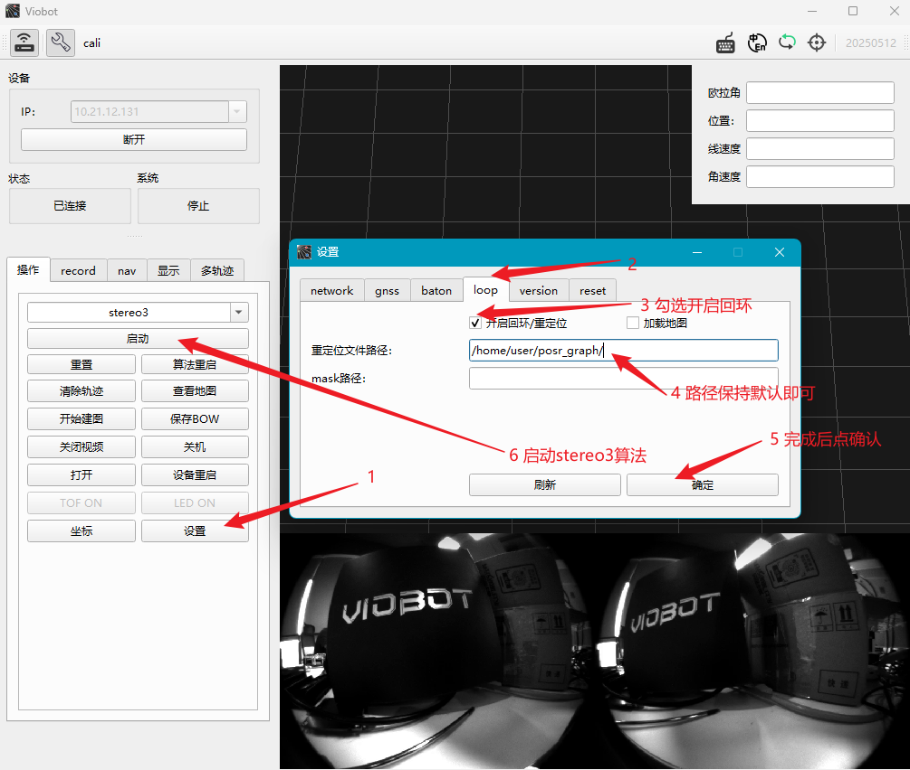

需要建图的区域扫描完后点击保存BOW,之后进入下一步离线建图。

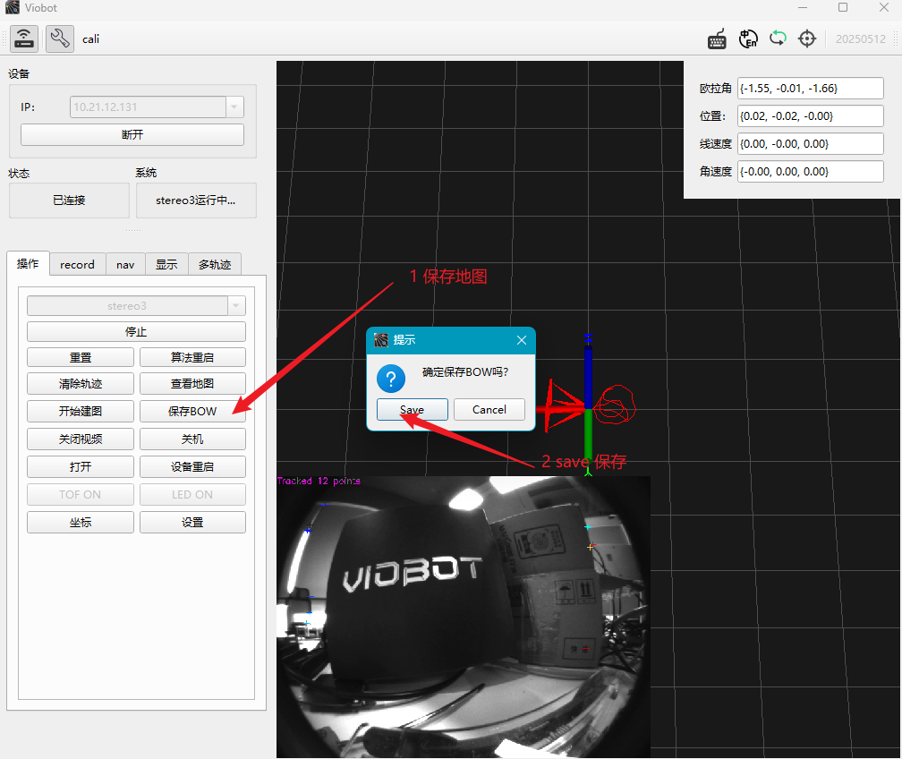


## 离线建图

前面已经完成了建图的数据采集，之后点击开始建图之后出现建图的进度条，整个建图的用时视建图的环境大小而增大，进图条结束之后可以在输出路径下的HM_SFM目录下找到重建的结果了：
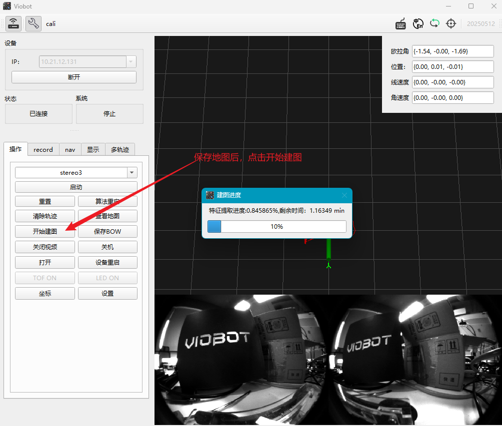

下图是用tree来查看建图完成的目录结构

```shell
root@PR-VIO: cd /home/my_relocation/HM_SFM
root@PR-VIO:/home/my_relocation/HM_SFM# tree
`-- images
    |-- ...
`-- result
    |-- database.db
    `-- sparse
        `-- 0
            |-- cameras.bin
            |-- images.bin
            `-- points3D.bin
```
至此，使用viobot建图的步骤都已完成，下面开始使用建图的结果来跑重定位。
## 运行重定位
接下来就是用前面已经建好的图运行重定位功能，首选还是在UI上的设置 loop一栏勾选加载地图选项再保存，然后运行stereo3算法。
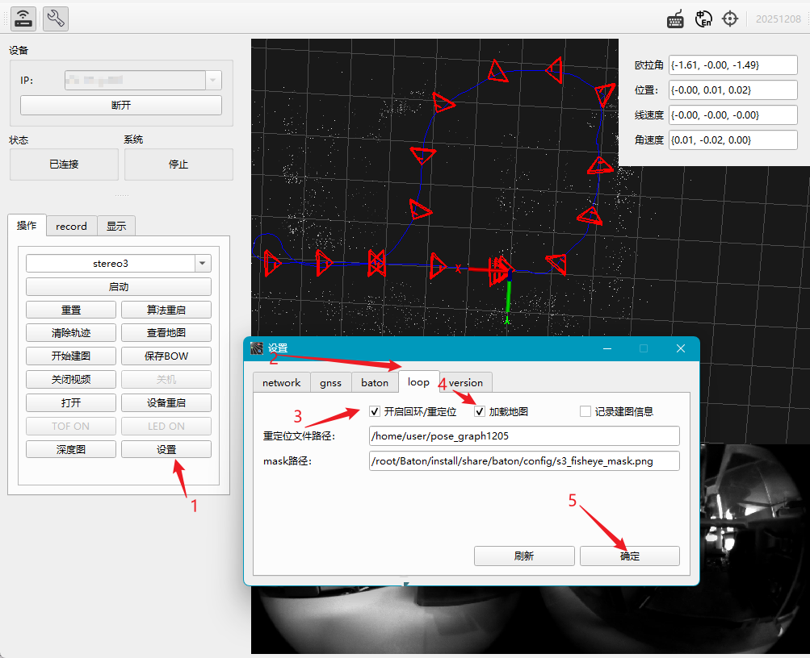

之后在UI上就可呈现两种颜色的轨迹（里程计和重定位）


----------------------------------------------

###### 附加部分*(可选)
Viobot-ui上支持简单的查看看保存地图时已经走过的路径，可以看到重建的区域大概是什么样的,这里用一个小车在户外跑一圈的场景做演示。
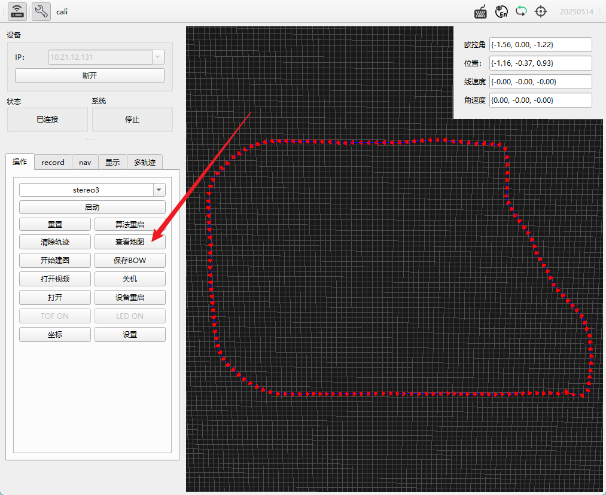


  如果想要可视化建图出来的结果需要借助到Windows下的colmap软件（[点击下载colmap x64](https://github.com/colmap/colmap/releases/download/3.11.1/colmap-x64-windows-nocuda.zip)），这里用室外的一个重建完的地图做可视化的演示，效果如下：
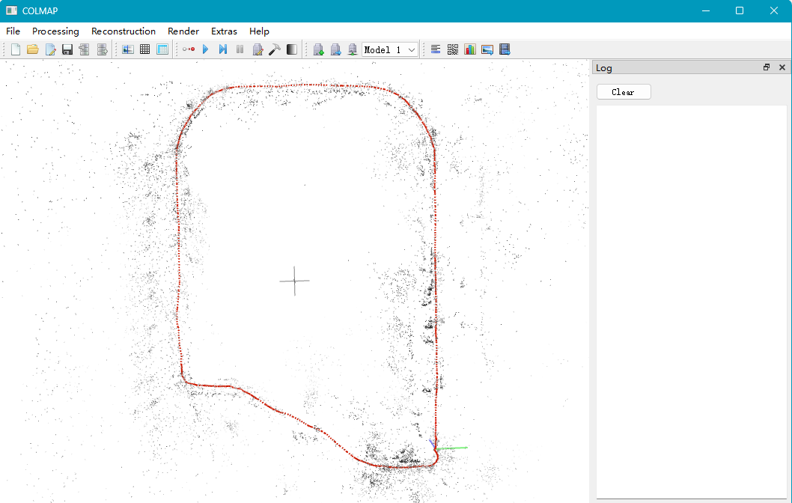


下面来按步骤用colmap打开建图结果，首先从viobot2上下载重建完的结果：

```shell
# 1) 在viobot2上压缩建图结果文件
cd /home/my_relocation
zip -vr HM_SFM.zip HM_SFM
# 2)传输到电脑、解压
# 将HM_SFM.zip通过xhell、mobaxterm等软件传输到电脑上
# 电脑上解压HM_SFM.zip
```

下载colmap-x64之后解压会得到一下的文件，双击COLMAP.bat运行
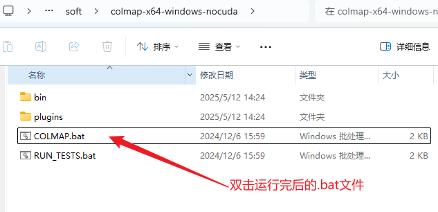


同时弹出一个命令行和ui界面,然后按照下面的步骤打开viobot2重建完成的文件夹即可让colmap显示重建好地图：

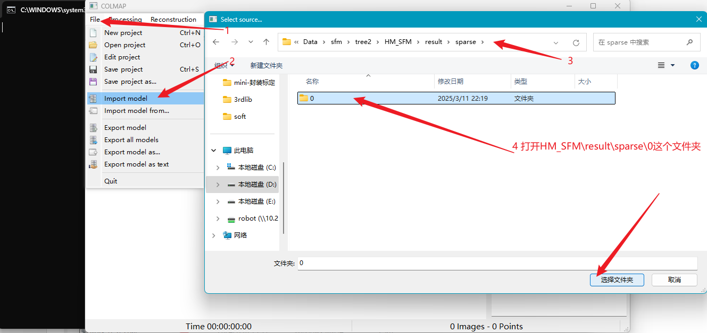

打开文件夹之后有一个对话框，根据下图中的说明按需选择即可，一般可以选择yes，方便查看关键帧之间的约束。
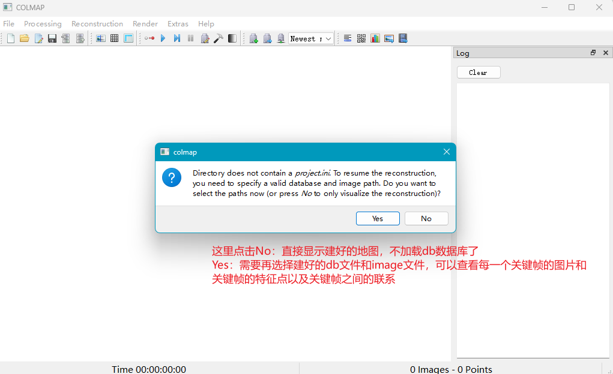


上一步选择了yes之后再选择.db文件和images文件夹，之后点save就完成了打开重建结果：

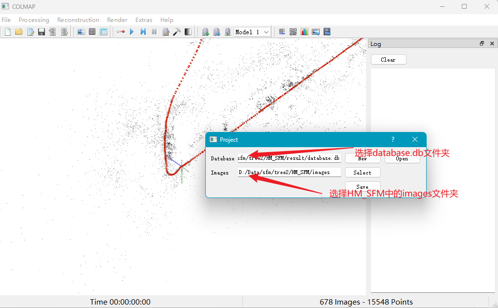

可以双击关键帧的相机图标可以查看每一帧的详细信息包括提取的点数、位姿关系、以及关联的关键帧等

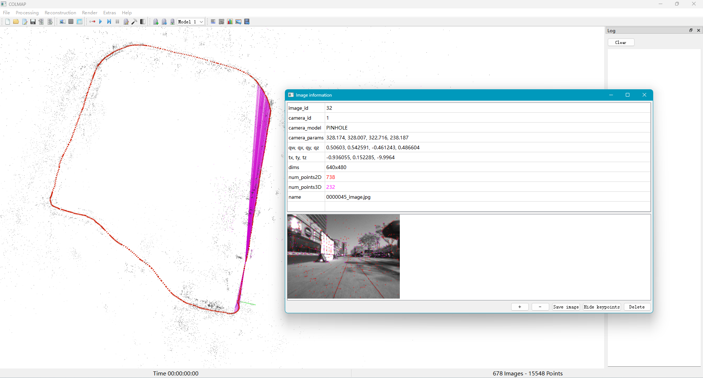


