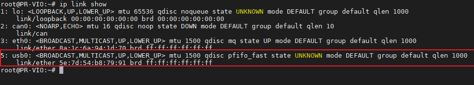
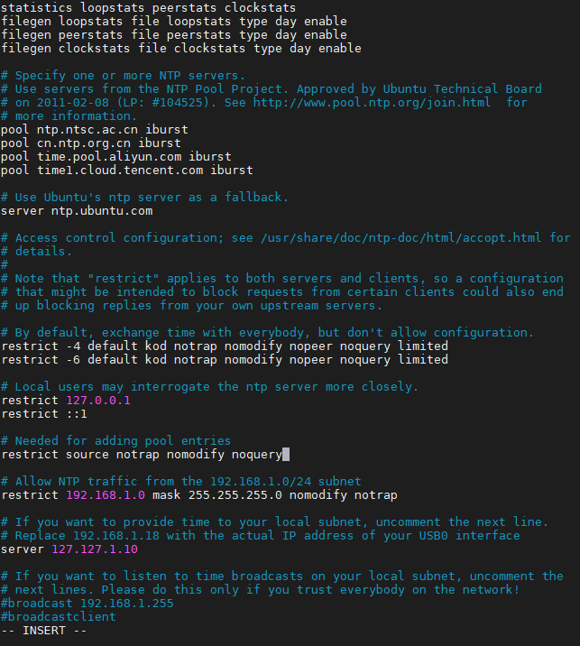
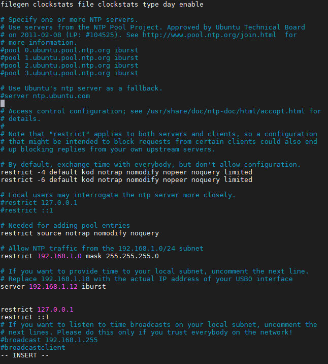

## 配置设备间的NTP时间同步

在本节中我们将介绍如何在两台Linux的设备之间通过局域网或者互联网的方式进行时间同步；适合在无法访问互联网的情况下局域网的多台设备时间同步，或者设备无法直接访问互联网，但是局域网中有设备可以访问互联网，可以将该设备配置为NTP服务器给局域网中的其他设备提供时间同步服务；接下来本节将按照以下步骤操作配置时间同步：

- 局域网NTP客户端通过USB网卡连接NTP服务器并设置固定IP（客户端与服务器单线连接，模拟客户端无法上网的情况）

- 在ubuntu计算机中安装配置NTP服务器（假设NTP服务器可访问互联网获得网络时间）

- 配置NTP 客户端与服务器时间同步

## 联网配置

这里的情形是一台ubuntu系统的ntp客户端baton mini通过usb接入了viobot2，这个设备已经使用了固定ip：192.168.1.10进行上网，故而在服务器viobot2上配置usb网卡，viobot2能通过usb网络连接到客户端设备。

1. 查看网卡名称：`ip link show`，这里我的是usb0：



2. 编辑netplan配置文件​
   
   ```
   sudo vim /etc/netplan/01-network-manager-all.yaml
   ```
   
   填入下面的配置信息，如果有多张网卡，只要在ethernets下新加一项即可：
   
   ```yaml
   network:
     version: 2
     renderer: NetworkManager
     ethernets:
       usb0:  # 替换为你的USB网卡名称，我这里是usb0
         dhcp4: no
         addresses: [192.168.1.12/24]    #这里是
         gateway4: 192.168.1.1
         nameservers:
           addresses: [8.8.8.8, 1.1.1.1]
   ```

3. 应用配置
   
   ```
   sudo netplan apply
   ```

4. 查看ip配置是否生效,可以看到viobot2的usb网卡已经是我们配置的ip地址了。
   
   ```
   ifconfig
   ```
   
   

## 安装NTP服务器

```
sudo apt update
sudo apt install ntp

sntp --version    #验证安装是否成功
```

编辑ntp配置文件

```
sudo vim /etc/ntp.conf
```

因为这里的服务器是可以通过互联网进行时间同步的，所以可以不用改这里的pool，在这里是改成了国内的ntp同步池，

```
pool ntp.ntsc.ac.cn iburst
pool cn.ntp.org.cn iburst
pool time.pool.aliyun.com iburst
pool time1.cloud.tencent.com iburst
```

或者使用内部的NTP服务地址：

```
server 192.168.100.100 iburst #假设你的ntp服务地址是192.168.100.100
```

允许客户端访问：

添加一行 `restrict`规则，允许你的局域网网段查询时间。

```
restrict 192.168.1.0 mask 255.255.255.0 nomodify notrap
```

以及配置本地的时钟源，以防无法访问外部服务器，就使用本地硬件时钟作为时间源：

```
server 127.127.1.0
```

完整的配置如下：



重启ntp并设置开机自启：

```
sudo systemctl restart ntp
sudo systemctl enable ntp
```

验证服务器状态：

```
ntpq -p
```

例如我这里带`*`号的是当前作为同步的时钟源，带`+`号的是合格的候选源，`-`号被丢弃的源


## 客户端安装NTP

```
sudo apt update
sudo apt install ntp

sntp --version    #验证安装是否成功
```

编辑 NTP 配置文件​

```
sudo vim/etc/ntp.conf
```

因为这里是完全作为无网的设备使用，核心要修改的地方就是pool以及server，注释掉所有默认的 pool或 server行，再加上自己的sever,这里的`192.168.1.12`就是前面服务器usb网卡的地址，client的ip是`192.168.1.10`；

```
server 192.168.1.12 iburst
```




保存文件并重启ntp服务：

```
sudo systemctl restart ntp
```

验证同步,可以看到client已经使用我们自己的ntp服务器进行时间同步了，可以用date命令来大致的看两边的时间是否是同步的：

```
ntpq -p
```


本节主要就是演示了viobot2作为ntp服务器去给局域网中无法连接互联网的baton mini设备去做时间同步，做好了时间同步能减少很多问题的出现，像ros的多机通讯话题通讯异常，多传感器时间不同步导致的问题这些，使用ntp进行时间同步是传统的方案，也可以使用更现代的chrony来做。


