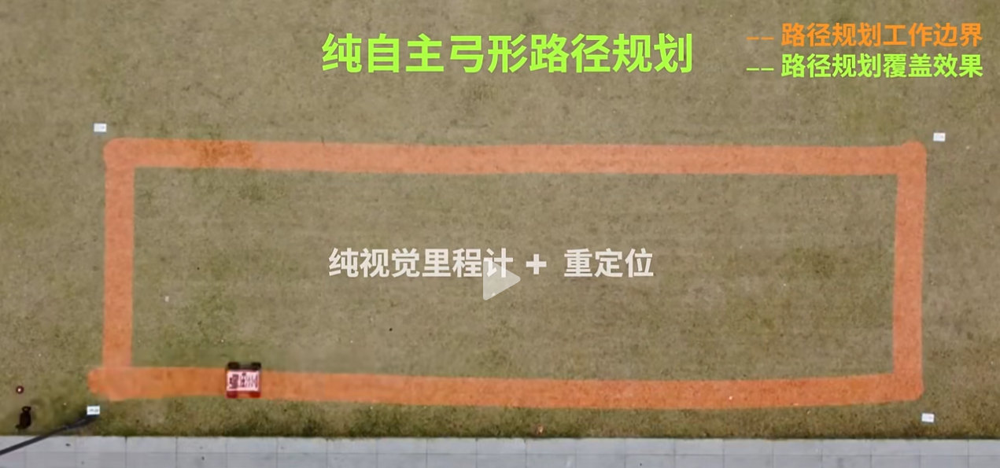
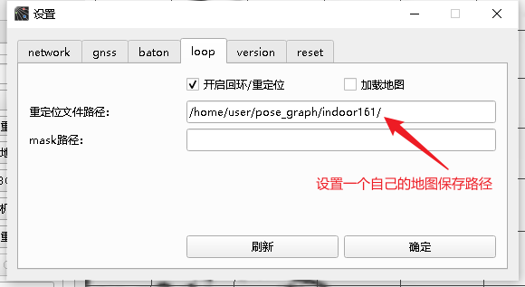
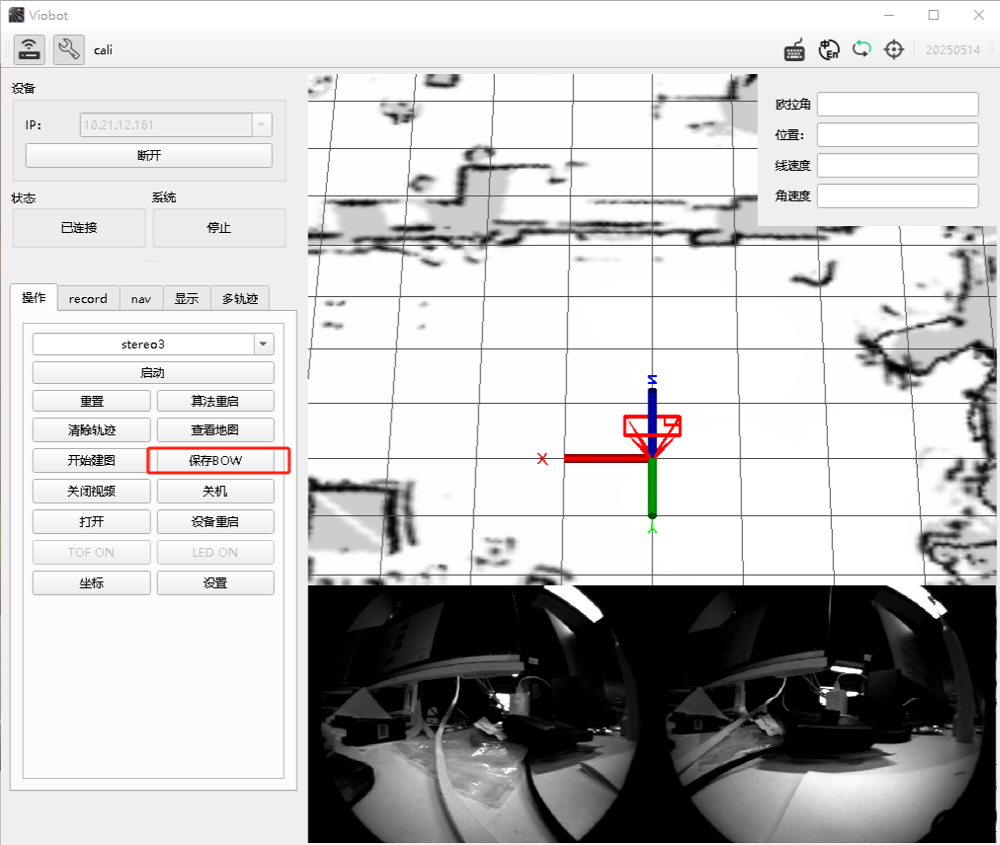
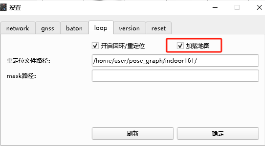
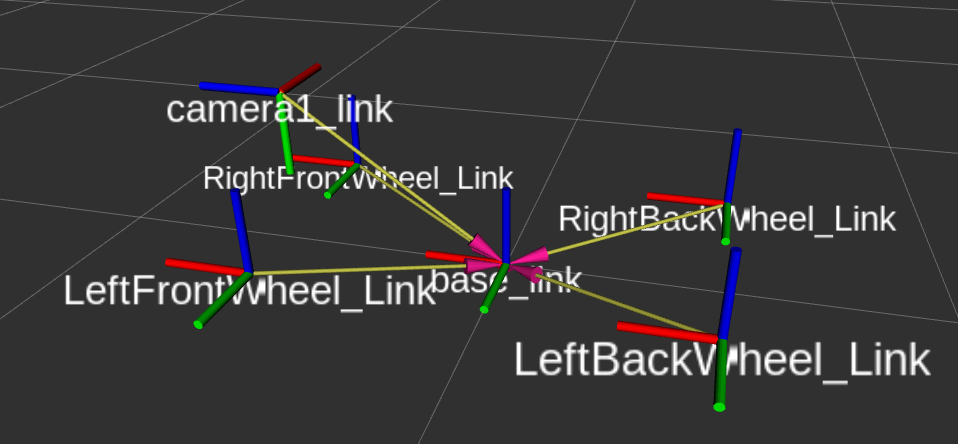
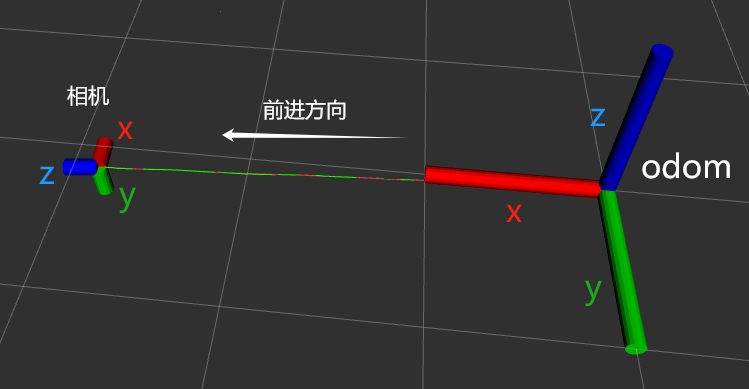

# HM Planner

## Coverage Path Planning

### Overview

Viobot2 provides a built-in coverage planning algorithm (boustrophedon-style coverage path). It is based on pure-vision odometry and relocalization, and can be used directly in coverage scenarios such as robot vacuum cleaners and lawn mowers.


<center style="font-size:14px;color:#C0C0C0;">Figure 1</center>

### Workflow

1. Connect Viobot2 with Viobot-UI. In the **Loop** page, set the map save path. Enable **Loop/Relocalization**.
2. Start the algorithm and drive around the boundary of the working area once to form a closed loop. Click **Save BoW**.


<center style="font-size:14px;color:#C0C0C0;">Set map save path in Loop page</center>

As in Figure 1, run stereo3 along the boundary to form a closed trajectory, then save the map:


<center style="font-size:14px;color:#C0C0C0;">Click Save BoW to save the map</center>

3. Stop stereo3. In `Settings -> Loop`, enable **Load map**.


<center style="font-size:14px;color:#C0C0C0;">Load map</center>

4. Start stereo3 again. (Note: if you have already finished the boundary loop and enabled **Load map**, you can just start stereo3 normally.)
5. Run the planner from command line (choose based on your ROS version):

ROS1:

```text
rosrun hm_planner planner_coverage_v1
```

ROS2:

```text
ros2 run hm_planner planner_coverage_v1
```

In RViz, subscribe to `/baton/planner/global_path` to visualize the planned coverage path. The planner publishes `/cmd_vel` for base control; by subscribing to `/cmd_vel` and driving your base controller, you can execute coverage tasks.

### Planner Parameters

Config paths:

- ROS1: `/root/Baton/install/share/hm_planner/config/config.yaml`
- ROS2: `/root/Baton/install/hm_planner/share/hm_planner/config/config.yaml`

Common parameters:

```yaml
lineSpacing: coverage spacing
max_linear_speed: max linear speed
max_angular_speed: max angular speed

t_camera_vehicle_x: x component of camera extrinsic (vehicle center -> camera)
t_camera_vehicle_y: y component of camera extrinsic (vehicle center -> camera)
t_camera_vehicle_z: z component of camera extrinsic (vehicle center -> camera)
```

Coordinate frames:



Relationship between camera frame and odom frame:



