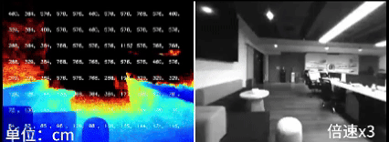
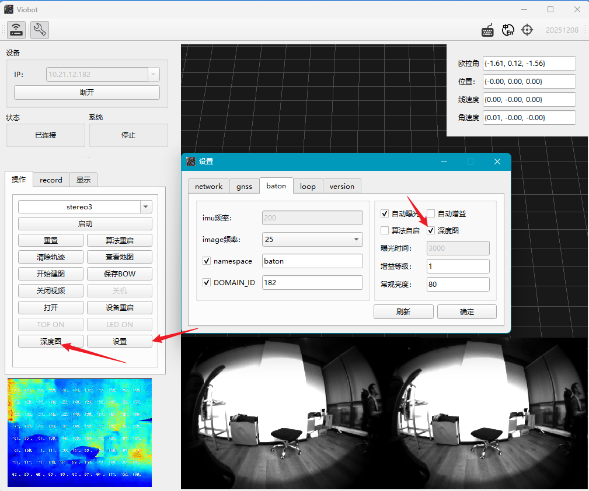
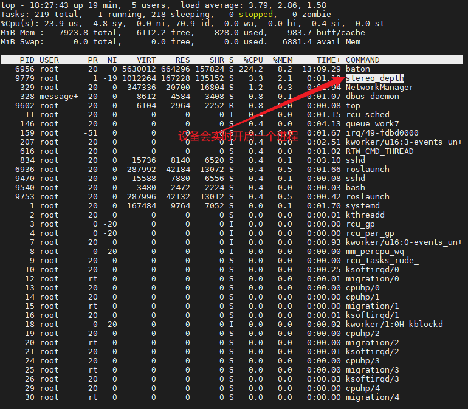
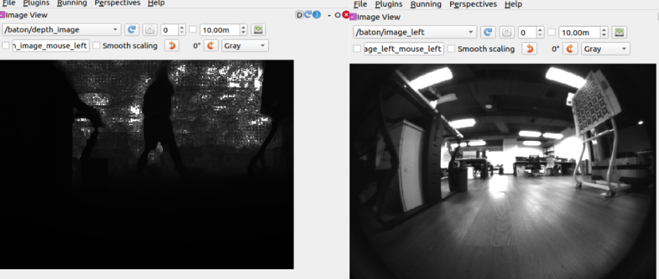
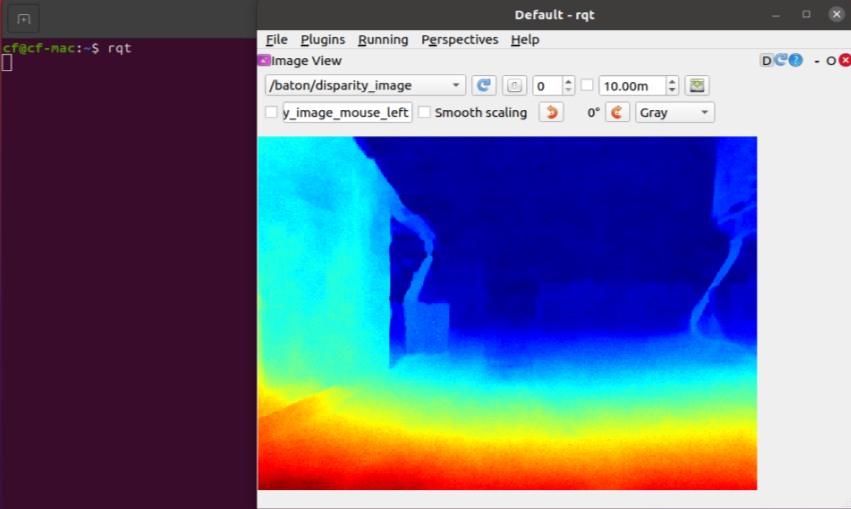
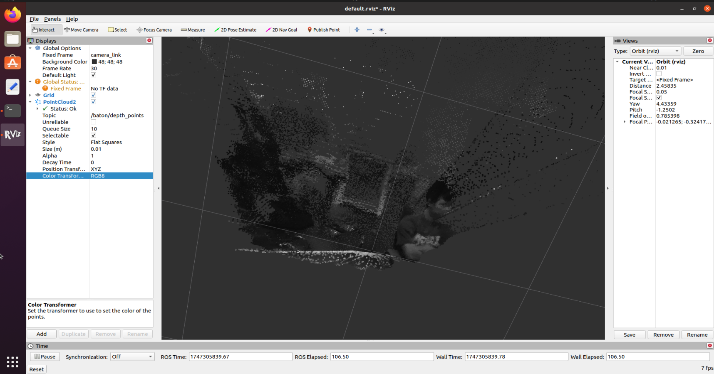

# HM Stereo Depth

## Overview

Stereo depth estimation (Stereo Depth) is a passive 3D perception technique based on stereo vision. Similar to human binocular disparity, it uses two spatially separated cameras to capture the same scene, and then (in this implementation) uses deep learning to output a depth map end-to-end. It is widely used for autonomous robot navigation and obstacle avoidance.


<!-- <center style="font-size:14px;color:#C0C0C0;">Figure 1. Viobot2 indoor stereo depth result</center> -->

Stereo depth is compute-intensive. On RK3588, real-time inference typically requires quantization and NPU acceleration to achieve the performance shown on Viobot2.

## Use Stereo Depth on Viobot2

Before using this feature, update Viobot2 firmware and Viobot-UI to the latest versions from the official website, in case your device has not received the feature yet. For update steps, see [Update Firmware / Versions](../基本功能介绍及使用/release_notes.md).

After updating, connect Viobot2 with Viobot-UI, click **Settings**, and in the **Baton** tab enable **Depth image**, then click **OK**. The UI may indicate a reboot is required, but this feature takes effect immediately. You should be able to find a process named `stereo_depth`.





After enabling stereo depth, you can check related ROS topics:

```shell
/baton/depth_image      # depth image
/baton/depth_points     # point cloud converted from depth
/baton/disparity_image  # disparity image
```

These topics are processed on-demand: the algorithm runs real-time processing only when at least one of them is subscribed. If none is subscribed, it stays in the background (mainly memory usage) and does not consume much CPU.

Example: subscribe to the three output topics from another Ubuntu ROS Noetic machine (as a ROS slave). For ROS master/slave setup and ROS2 multi-machine setup, see the **ROS Multi-machine Communication** section. Results:


<center style="font-size:14px;color:#C0C0C0;">Figure 2. Left: raw depth image; Right: left camera image</center>


<center style="font-size:14px;color:#C0C0C0;">Figure 3. Disparity image</center>

Below is an RViz example subscribing to `/baton/depth_points`. Set **Fixed Frame** to `camera_link`, and set **Color Transformer** to `RGB8` to visualize colored points. Since stereo depth is computed from grayscale images, the point cloud is grayscale as well.


<center style="font-size:14px;color:#C0C0C0;">Figure 4. Point cloud from stereo depth</center>
