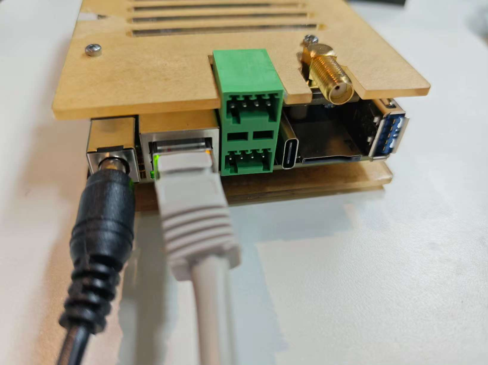
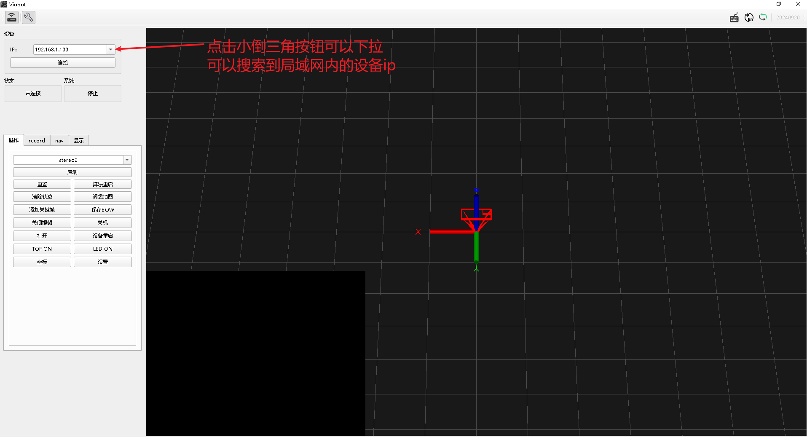
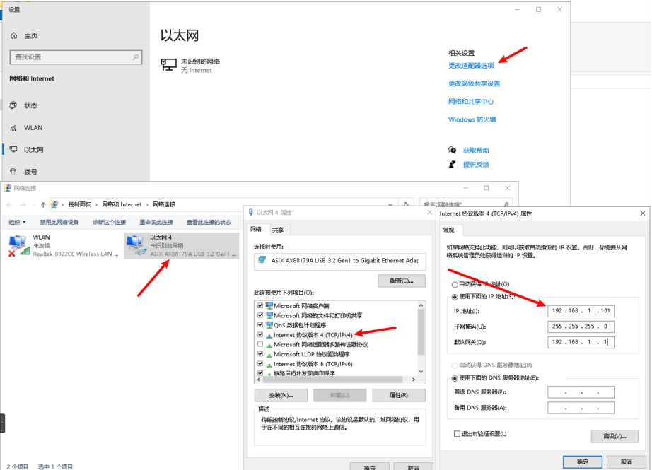
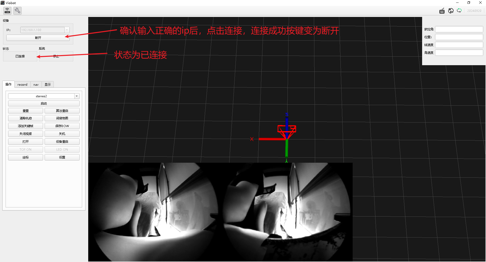
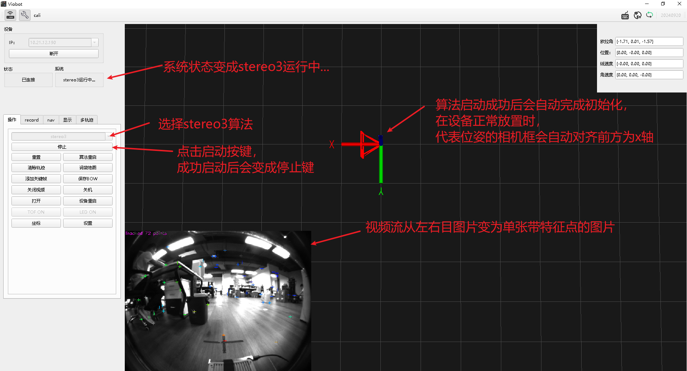
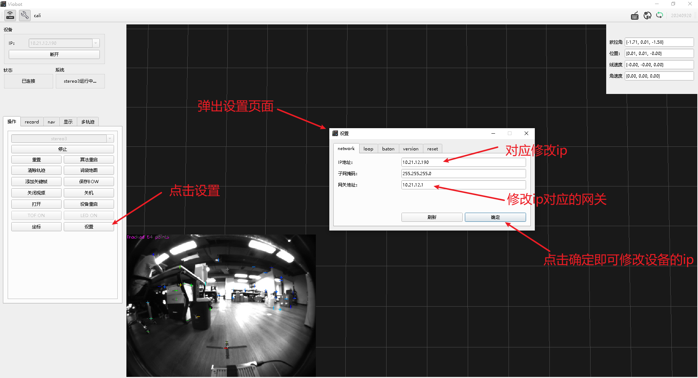

# Getting Started

Download **Viobot-UI** (RoboBaton client) from Hessian Matrix official website: [Downloads](https://www.hessian-matrix.com/%e4%b8%8b%e8%bd%bd%e4%b8%ad%e5%bf%83/)

## 1. Power On

Connect the power cable and Ethernet cable. The simplest setup is to connect the Ethernet cable directly to your PC.

Use the included **12V 1.5A** power supply.



## 2. Configure Network

When the device is directly connected to your PC, the client can automatically discover the device IP. This is useful if you set an incorrect IP or forget the updated IP.



Note: discovery only finds the device. If your PC IP subnet differs from the device subnet, you still cannot connect. Configure your PC IP as follows.

The default device IP is `192.168.1.100`. Set your PC IP to `192.168.1.101`.



After setting the IP, open a terminal and `ping 192.168.1.100`. If it replies, the network is configured.

## 3. Connect to the Device

After ping succeeds, click **Connect**.



After connecting, the status bar changes to **Connected**. The video stream at the bottom-left will refresh. Move the device to confirm the video stream is normal and smooth.

## 4. SSH Login

```
Username: root
Password: PRR
```

## 5. Start a Quick Test

After connecting and confirming the video stream works, you can start an algorithm test. On the operation page, select **stereo3** in the algorithm selector and click **Start**. After a normal start, the system status becomes **"stereo3 running..."** and the Start button becomes Stop.



Then move the device and check whether its behavior is normal (pose, point colors on the image). If all tests are normal, you can proceed with your own application (e.g., integration on your robot).

## 6. Change Device IP

In real deployments you may not directly connect the device to your PC, or your network may already have another host using `192.168.1.100`. In those cases, you need to change the device IP.



IP changes take effect after reboot. The client provides a **Reboot Device** button to reboot the system.

If you set a wrong IP or forget the IP you set, follow step 2: the client can automatically discover devices in the LAN and display their IPs.

## 7. Device Coordinate Frame Definition

After **stereo3** starts, stereo initialization is performed automatically. The algorithm outputs:

- Translation axes: **X forward**, **Z up**, **Y left**
- Rotation axes: **Z forward**, **X right**, **Y down**
- The camera origin is on the **left** camera
- The point cloud frame is consistent with the camera frame

