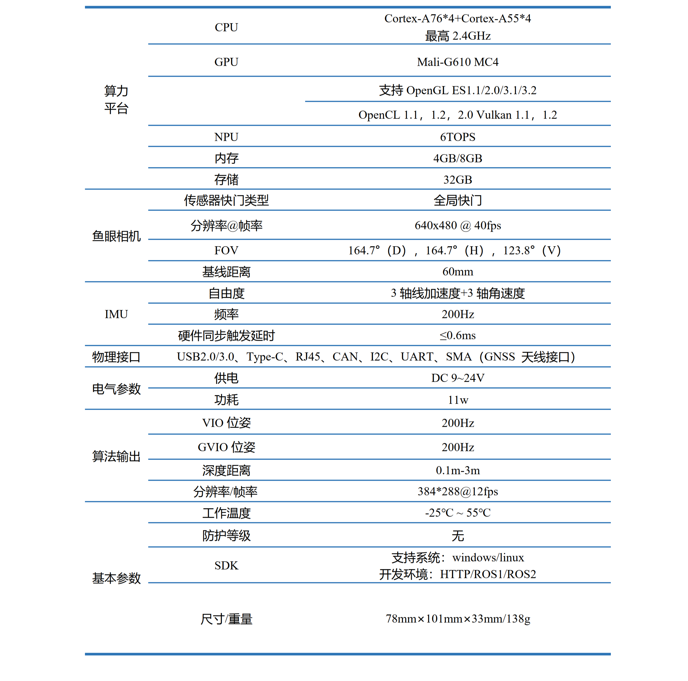
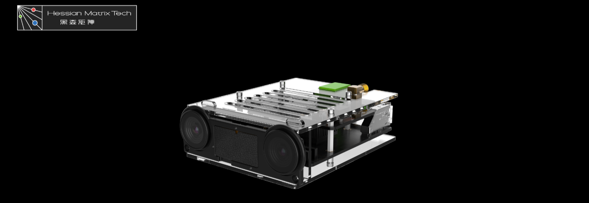
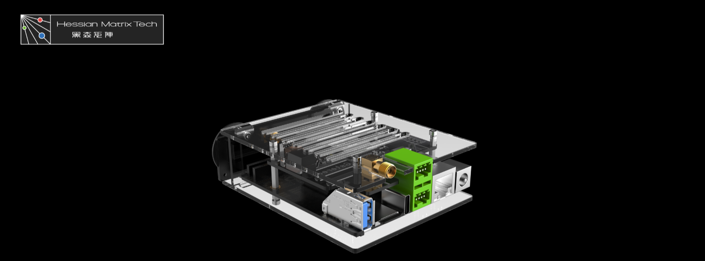
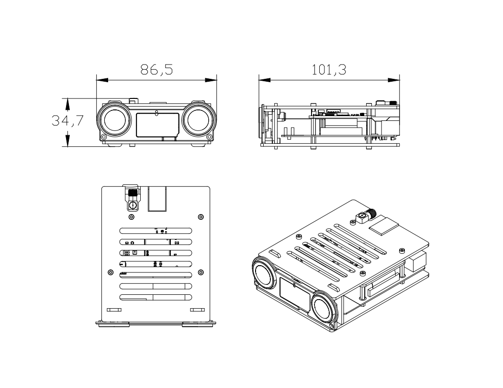
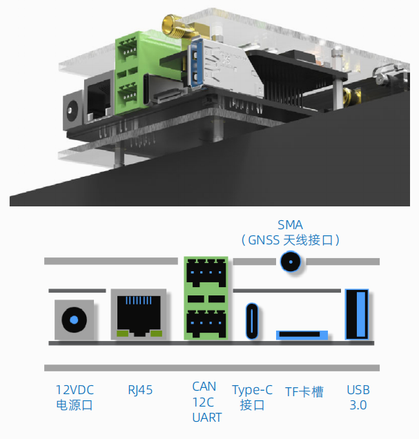

# Viobot2 Overview

## 1. Product Overview

Viobot2 is a front-end localization module for robots. With a stereo camera and the onboard IMU, it captures the environment and motion data, and estimates/outputs the current pose of the device.

The built-in **stereo3** algorithm tightly couples a stereo direct method with IMU to estimate the pose. It supports loop closure and can automatically perform **relocalization** in repeated-operation scenarios. By fusing data from the optional **GNSS** module, localization becomes more stable.

The default OS is **Ubuntu 20.04 + ROS Noetic** (optional: **Ubuntu 22.04 + ROS Humble**). As a development platform, sensor I/O and algorithm computation use about **30% CPU**. The remaining compute resources (including GPU and a **6 TOPS NPU**) can be used for your own applications.

Two mainboard configurations are available at purchase: **4GB+32GB** and **8GB+32GB**. The performance is the same.

Exposed interfaces include: **1x USB-A**, **1x TF slot**, **1x CAN**, **1x I2C**, **1x UART**. On-board interfaces include: **1x SATA**, **debug UART**, an additional general-purpose UART, and **two FPC connectors** for extra camera modules.

Since there is no video output port, the system ships without a desktop environment. You can develop via command line, or install a desktop environment later (e.g., XFCE/KDE/GNOME).

We recommend headless operation. You can use MobaXterm, Xshell, etc. to SSH into Viobot2. See: [Getting Started](getting_started.md).

Software packages and demos:

- GitHub: Hessian-matrix
- Gitee: Hessian_matrix

## 2. Specifications

## 3. Appearance Overview

## 4. Dimensions

## 5. Hardware Interface Overview

