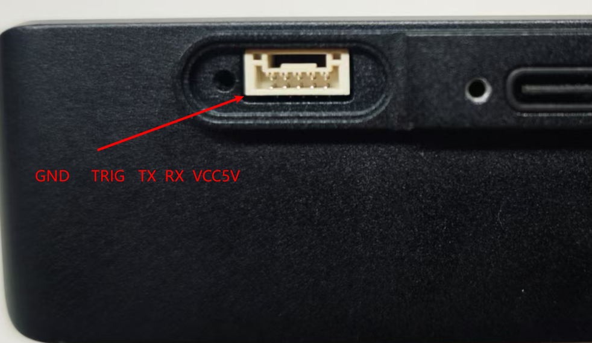

# 串口通信

UART的接口为GH1.0的5pin，从螺丝孔那里开始从左到右分别是GND、TRIG、TX、RX、5V。



如果是单纯串口通信的话就是接GND、TX、RX即可，需要注意的是串口电平是3.3V的如果接了5V会把串口烧掉。

## 一.数据协议

串口波特率：115200

### 1.系统控制帧

单帧共34byte

| 帧头      | 控制位                 | 保留位 | 和校验位                       | 帧尾      |
| --------- | ---------------------- | ------ | ------------------------------ | --------- |
| 0x67 0x28 | 控制系统运行状态的指令 |        | 累加和（不包含帧头帧尾校验位） | 0x09 0x0d |
| 2byte     | 1byte                  | 28byte | 1byte                          | 2byte     |

**控制位：**

- 0x01 启动算法程序
- 0x02 停止算法程序
- 0x03 重启算法程序

**校验和：** 计算校验和时从帧头开始计算，一直累加到保留位的最后一位为止，一共要计算29bit

```c++
char check = 0;
for(int i = 2;i < 31;i++){
    check += receiveBuffer[i];
}
```

### 2.姿态输出帧

单帧共61byte

| 帧头      | frame_id | pose                                    | 四元数                           | 加速度                           | 角速度                           | 校验和                                               | 帧尾      |
| --------- | :------: | --------------------------------------- | -------------------------------- | -------------------------------- | -------------------------------- | ---------------------------------------------------- | --------- |
| 0x66 0x27 |   int    | pose的x、y、z三维坐标输出，每个分量4bit | x、y、z、w四个分量，每个分量4bit | lx、ly、lz三个分量，每个分量4bit | ax、ay、az三个分量，每个分量4bit | 数据部分（不包含帧头帧尾校验位部分）的所有数据累加和 | 0x08 0x0a |
| 2byte     |  4byte   | 12byte                                  | 16byte                           | 12byte                           | 12byte                           | 1byte                                                | 2byte     |

**数据位：** 数据位传输的是结构体通过内存拷贝到char数组上的方式传输，实际上就是float型数据在内存中存放的数据位，同理解析时也是通过memcpy进行内存拷贝解码。

**校验和：** 计算校验和的方式和系统控制帧的计算方式相同。

数据位的结构体示例：

```c++
struct pose_t{
    float px,py,pz,qx,qy,qz,qw;    //pose 和 四元素
};
struct speed_t{
    float lx,ly,lz,ax,ay,az;      //线性加速度 和 角速度
};
struct odom_t{
    pose_t pose;
    speed_t speed;
};
```

## 二.示例代码

```bash
#完整工程：
git clone https://github.com/Hessian-matrix/mini_serial_demo.git
#工程依赖ros-serial库，可以通过apt安装或者下载ros serial的源码
sudo apt install  ros-noetic-serial
git clone https://github.com/wjwwood/serial.git
```

### 1.发送指令代码

```c++
enum algo_state{
    algo_enable = 0x01,     //启动
    algo_disable = 0x02,    //停止
    algo_restart = 0x03,    //重置
    algo_none   = 0x00,
};

/// @brief 发送控制指令
/// @param t algo_state 控制指令
void send_command(const algo_state t){   
    memset(send_buffer,0,LSEND_LEN);
    send_buffer[0] = 0x67;
    send_buffer[1] = 0x28;
    send_buffer[2] = t;
    char check_sum = 0;
    for(int i = 2;i < LS_CHECK;i++){
        check_sum += send_buffer[i];
    }
    send_buffer[LS_CHECK] = check_sum;
    send_buffer[LSEND_LEN - 2] = 0x09;
    send_buffer[LSEND_LEN - 1] = 0x0d;
    serial_port.write(send_buffer,LSEND_LEN);    //已发送
    // std::cout << "send is" << std::endl;
    // for(int i = 0;i < LSEND_LEN;i++) {
    //     printf("0x%02x ",send_buffer[i]);
    // }
}
```

### 2.解析串口数据

```c++
//解析数据包
void unpack_uart(odom_t& odom,int& frame_id){
    // std::cout << "receive:" << std::endl;
    // for(int i = 0;i < LREV_LEN;i++)  {
    //     printf("0x%02x ",receive_buffer[i]);
    // }
    // std::cout << std::endl;

    if(receive_buffer[0] == RHEAD_1 && receive_buffer[1] == RHEAD_2 && receive_buffer[LREV_LEN - 2] == RTILE_1 && receive_buffer[LREV_LEN - 1] == RTILE_2 ){
        char check=0;
        //61-3
        for(int i = 2;i < LR_CHECK;i++){
            check += receive_buffer[i];
        }
        if(check == receive_buffer[LR_CHECK]){
            // std::cout<<"======unpack ok======"<<std::endl;
            memcpy(&frame_id,receive_buffer + 2,sizeof(frame_id));
            memcpy(&odom.pose,receive_buffer + 6,sizeof(odom.pose));
            memcpy(&odom.speed,receive_buffer + 6 + sizeof(odom.pose),sizeof(odom.speed));
            // printf("frame_id = %d\n",frame_id);
            // //px,py,pz,qx,qy,qz,qw;
            // printf("pose [%f,%f,%f,%f,%f,%f,%f]\n",odom.pose.px,odom.pose.py,odom.pose.pz,odom.pose.qx,odom.pose.qy,odom.pose.qz,odom.pose.qw);
            // //lx,ly,lz,ax,ay,az;
            // printf("speed [%f,%f,%f,%f,%f,%f]\n",odom.speed.lx,odom.speed.ly,odom.speed.lz,odom.speed.ax,odom.speed.ay,odom.speed.az);
        }
        else{
            std::cout<<"check err"<<std::endl;
            printf("want is %x,but receive:%x\n",check,receive_buffer[LR_CHECK]);
        }
    }
    else{
        std::cout<<"pack format err"<<std::endl;
    }
}
```

### 3.主线程接收键盘指令，发送串口命令控制baton_mini算法

```c++
int v;
ros::Rate r(10);
while(ros::ok()){
    ROS_INFO("please input command:");
    std::cin >> v;
    if(v == 1){
        ROS_INFO("algo_enable");
        send_command(algo_enable);
    }
    else if(v == 2){
        ROS_INFO("algo_disable");
        send_command(algo_disable);
    }
    else if(v == 3){
        ROS_INFO("algo_reset");
        send_command(algo_restart);
    }
    else if(v == 4){
        ROS_INFO("exit");
        break;
    }
    r.sleep();
    ros::spinOnce(); 
}
```

### 4.子线程接收串口数据，解析并发布新的odometry话题

```c++
//串口接收线程
void serial_receive_thread(){
    odom_t mini_odom;
    int frame_id = 0,last_frame_id = 0;
    while(1){
        serial_port.read(&receive_buffer[0],1);
        if(receive_buffer[0] == RHEAD_1){
            serial_port.read(receive_buffer + 1,LREV_LEN - 1);
            unpack_uart(mini_odom,frame_id);
            //拿到了里程计后的操作
            if(frame_id > last_frame_id){
                publish_odom(mini_odom);
                last_frame_id = frame_id; //用于判断里程计是否持续更新，可不要  
            }
        }
    }
}
```

