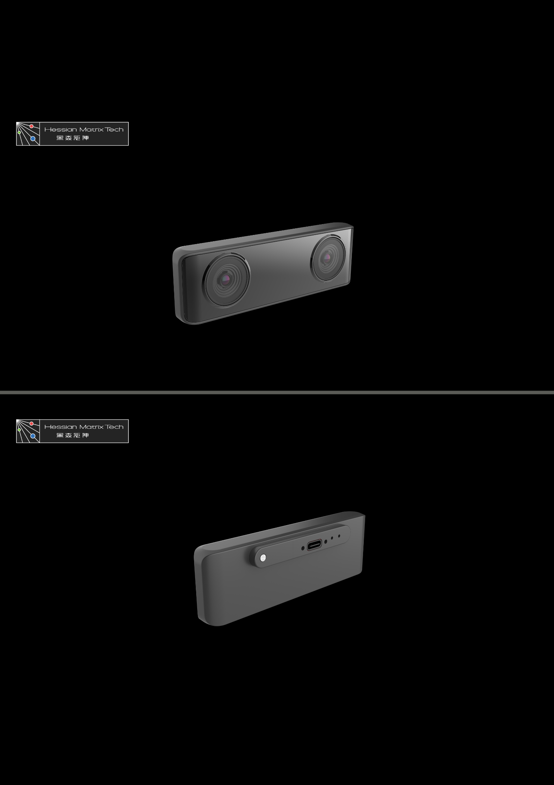
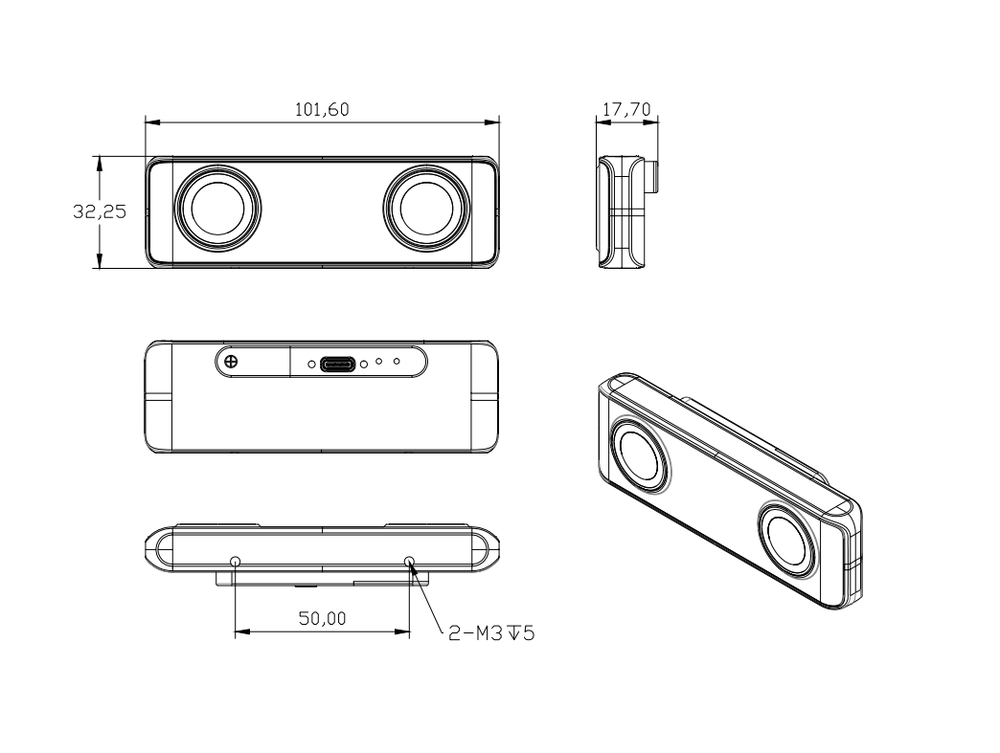

# 产品简介

RobotBaton mini是一款应用于机器人的前端定位模块，通过双目鱼眼摄像头和高频imu传感器，使用内置的stereo3算法实时计算自身位姿。

mini通信采用USB2.0网口收发ROS2 topic，（ROS2上面官方的foxy支持有问题，推荐使用humble），用户可在自己电脑上使用ROS2环境接收传感器数据（包含相机原始图像和imu原始数据）和算法输出数据（里程计）以及控制算法启停。也可以通过配套上位机配合测试使用。

外引了一个UART可以作为里程计输出和算法控制接口。可输出外部同步触发信号。

注：系统封闭不开放。用户购买时可选蓝色和黑色外壳。

#### 外观总览：

#### 产品尺寸：

