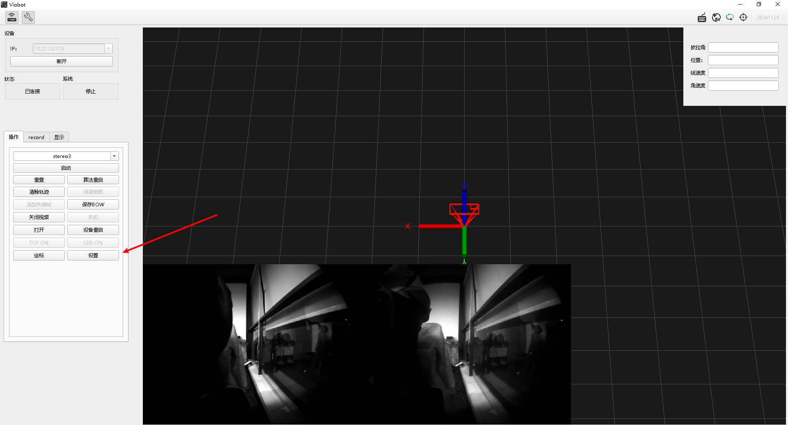
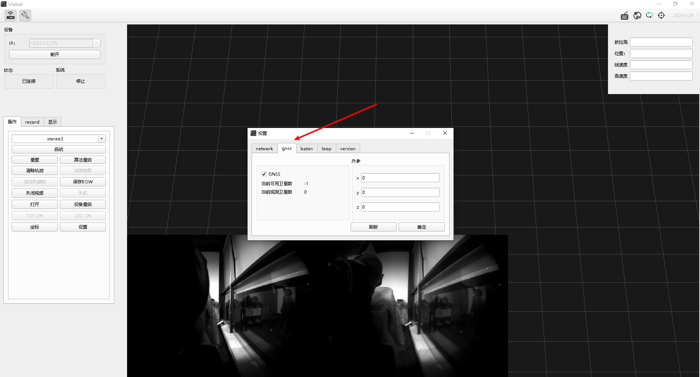
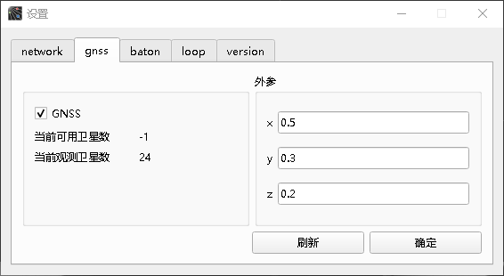
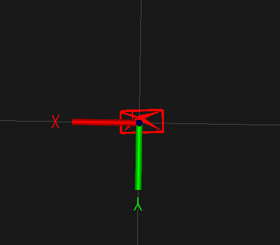
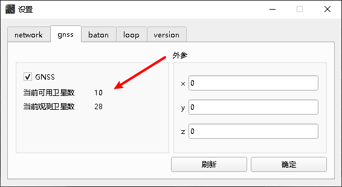

# GNSS模块使用

### 一.开启GNSS模块数据接收

正确连接好设备后，点击上位机的设置按键。

选择gnss选项卡

如果GNSS前面的勾选是已经选上了，即已经开启了GNSS模块的数据接收，一般在室内是搜不到卫星信号的，所以显示的当前观测卫星数为0；

如果GNSS勾选没有勾选，则勾上再点击确认，为了确保模块正常工作，这时候程序会重启一遍，连接会短暂断开一下，请耐心等待自动重连。

### 二.确认当前模块工作状态

我们需要把GNSS模块的天线接上，然后把天线主体放置在能够搜到卫星的位置，尽量不要贴近金属物件或者电磁干扰大的地方。设置页面会刷新当前搜索到的卫星数，显示为当前观测卫星数。如果显示为0，则有可能是天线与模块连接有问题，请确认两者的连接状态。

注：未开启算法时，由于还没有使用卫星来计算位姿，所以当前可用卫星数会是-1。为了避免信号干扰，天线与主板的距离需要大于10cm。

### 三.配置天线外参

设置页面上有外参配置的输入框，根据我们当前天线放置位置与相机模组之间的距离来设置。可以通过手工测量来赋值，单位为M。以相机模组朝前作为参考，X的正方向为相机模组的左方，Y的正方向为相机模组下方，Z的正方向为相机模组的正后方。如下图：

输入好外参后，点击确定即可设置成功。

### 四.算法测试

设置好外参后，开启stereo3算法，算法就进入到GVIO模式了。设置页面下的当前可用卫星数会实时更新，当可用卫星数大于12时，GNSS数据良好，会用于与VIO融合，使得输出更加精准和鲁棒。

我们在使用的过程中也需要注意一下当前运行的场景的可观测卫星数和当前可用卫星数，确保GVIO的良好运行，卫星数不够时，GVIO会退回到VIO模式计算，不影响正常使用。
