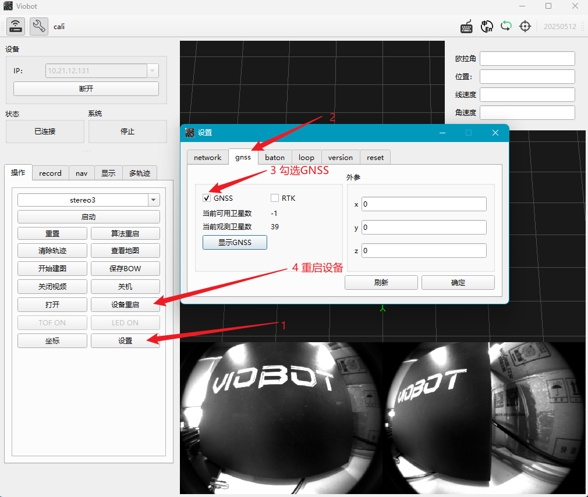
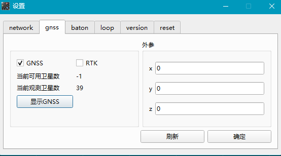
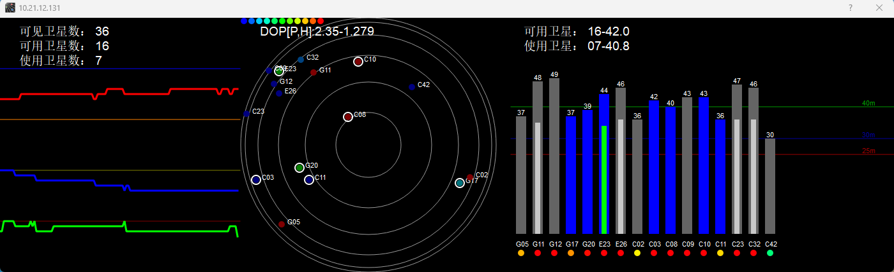
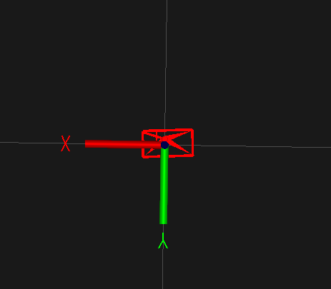
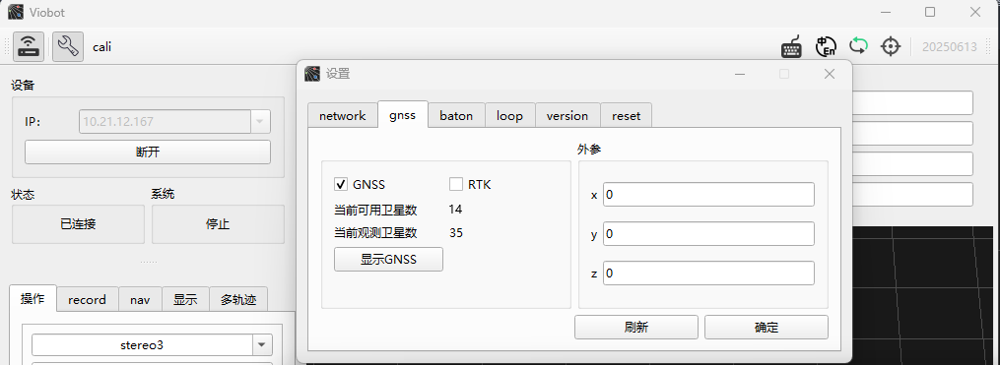

# GNSS模块使用

预先到[hessian-matrix官网](https://www.hessian-matrix.com/%e4%b8%8b%e8%bd%bd%e4%b8%ad%e5%bf%83/)把最新的客户端和更新包都下下来，更新一遍。

### 一.开启GNSS模块数据接收

正确连接好设备后，点击上位机的设置按键,选择gnss选项卡：

如果GNSS前面的勾选是已经选上了，即已经开启了GNSS模块的数据接收，一般在室内是搜不到卫星信号的，所以显示的当前观测卫星数为0；

如果GNSS勾选没有勾选，则勾上再点击确认，为了确保模块正常工作，需要手动重启一下设备，以重新加载模块驱动。

### 二.确认当前模块工作状态

我们需要把GNSS模块的天线接上，然后把天线主体放置在能够搜到卫星的位置，尽量不要贴近金属物件或者电磁干扰大的地方。设置页面会刷新当前搜索到的卫星数，显示为当前观测卫星数。如果显示为0，则有可能是天线与模块连接有问题，请确认两者的连接状态。

点击上图中的“显示GNSS”按钮之后会显示卫星质量更详细的的信息：
左侧的折线图绘制的是可见卫星数、可用卫星数、使用卫星数的折线图；

中间的是卫星的天顶图，将可用卫星的方位角和高度角将其画在以观测位置为中心的天顶图上；

右侧的是每一颗可用卫星(灰白色)和使用卫星(蓝色)的信噪比的柱状图；

注：未开启算法时，由于还没有使用卫星来计算位姿，所以当前可用卫星数会是-1，信噪比为-1。为了避免信号干扰，天线与主板的距离需要大于20cm。在室外场景，信噪比需要>35。

### 三.配置天线外参

设置页面上有外参配置的输入框，根据我们当前天线放置位置与相机模组之间的距离来设置。可以通过手工测量来赋值，单位为M。以相机模组朝前作为参考，X的正方向为相机模组的左方，Y的正方向为相机模组下方，Z的正方向为相机模组的正后方。如下图：

输入好外参后，点击确定即可设置成功。

### 四.算法测试

设置好外参后，开启stereo3算法，算法就进入到GVIO模式了。设置页面下的当前可用卫星数会实时更新，当可用卫星数大于12时，GNSS数据良好，会用于与VIO融合，使得输出更加精准和鲁棒。

我们在使用的过程中也需要注意一下当前运行的场景的可观测卫星数和当前可用卫星数，确保GVIO的良好运行，卫星数不够时，GVIO会退回到VIO模式计算，不影响VIO模式的正常使用。

### 五.GNSS数据输出

按照正确的步骤配置好启用GNSS后，可在话题列表中找到GNSS相关的话题信息,ros1版本和ros2版本的消息类型略有区别，这里以ros1的话题为例。其中的话题消息可在我们的[Hessian-matrix ROS_interfaces](https://github.com/Hessian-matrix/ROS_interfaces.git)仓库中下载。
~~~
/baton/gnss/ephem       Type: gnss_comm/GnssEphemMsg
/baton/gnss/meas        Type: gnss_comm/GnssMeasMsg
~~~

### 六.Stereo3算法GVIO模式数据处理

GNSS没有原始NMEA输出（经纬高直出），输出的是GNSS原始观测量，Stereo3算法是紧耦合GNSS的原始观测量与VIO的视觉惯导信息得到全局系下累积误差更小的位姿。
如果想获取原始的经纬高输出可以参考[gnss_comm](https://github.com/HKUST-Aerial-Robotics/gnss_comm.git)的解析方法，以及发布的GNSS话题msg。