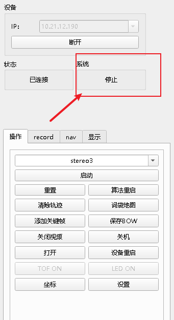
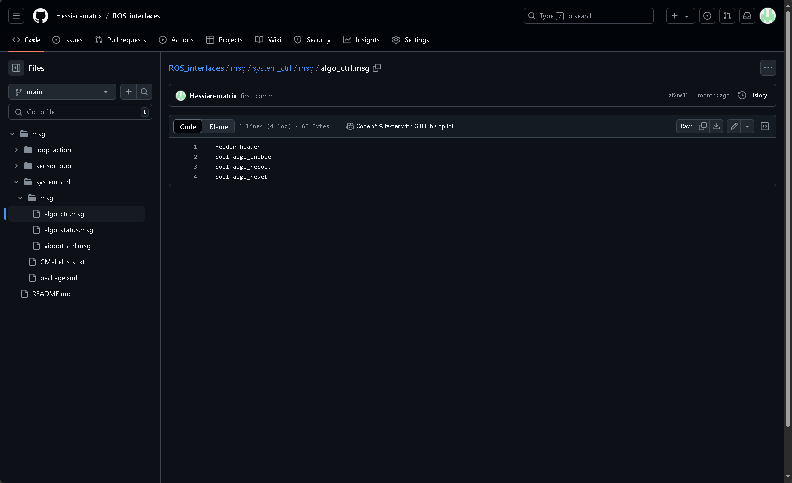
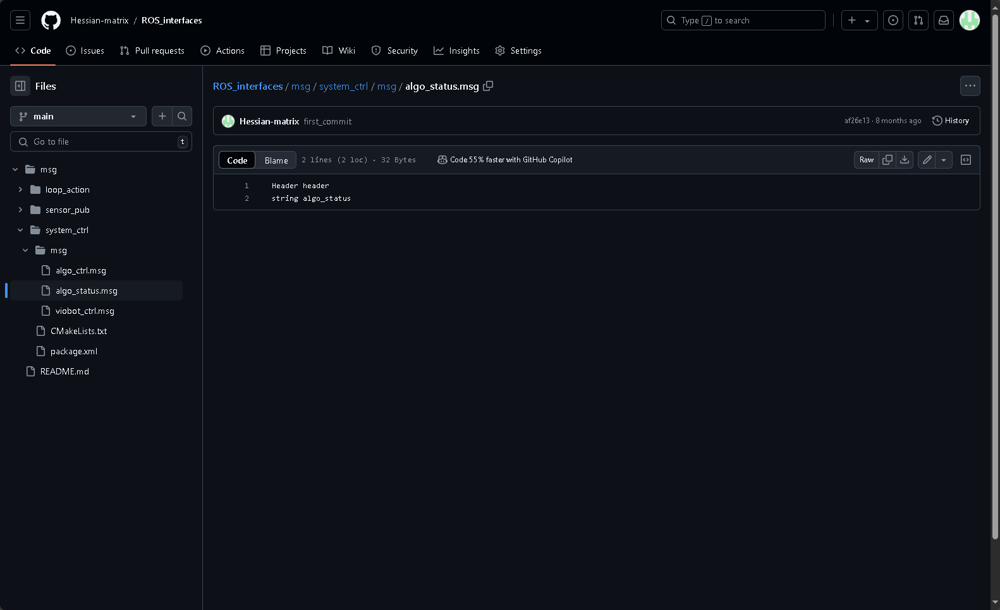

# Algorithm Control

## 1. Control via Client UI



Status feedback is shown in the system status area.

Controls are in the operation panel and include three buttons: **start/stop**, **reboot**, and **reset**.

## 2. Control via ROS

Algorithm control is unified into a ROS message. See `system_ctrl/algo_ctrl.msg` in:

- ROS1: [ROS_interfaces](https://github.com/Hessian-matrix/ROS_interfaces)
- ROS2: [ROS2_interfaces](https://github.com/Hessian-matrix/ROS2_interfaces)



These fields correspond to start/stop, reboot, and reset respectively.

Topic:

```c++
Type: system_ctrl::algo_ctrl
Topic: /baton/stereo3_ctrl
```

Command-line examples:

Start stereo3:

```bash
rostopic pub -1 /baton/stereo3_ctrl system_ctrl/algo_ctrl "{header: {seq: 0, stamp: {secs: 0, nsecs: 0}, frame_id: ''}, algo_enable: true, algo_reboot: false, algo_reset: false}"
```

Stop stereo3:

```bash
rostopic pub -1 /baton/stereo3_ctrl system_ctrl/algo_ctrl "{header: {seq: 0, stamp: {secs: 0, nsecs: 0}, frame_id: ''}, algo_enable: false, algo_reboot: false, algo_reset: false}"
```

Reboot stereo3:

```bash
rostopic pub -1 /baton/stereo3_ctrl system_ctrl/algo_ctrl "{header: {seq: 0, stamp: {secs: 0, nsecs: 0}, frame_id: ''}, algo_enable: true, algo_reboot: true, algo_reset: false}"
```

Reset stereo3:

```bash
rostopic pub -1 /baton/stereo3_ctrl system_ctrl/algo_ctrl "{header: {seq: 0, stamp: {secs: 0, nsecs: 0}, frame_id: ''}, algo_enable: true, algo_reboot: false, algo_reset: true}"
```

Example in ROS demo:

```c++
ros::Publisher pub_stereo3_ctrl = nh.advertise<system_ctrl::algo_ctrl>("/baton/stereo3_ctrl", 2);
system_ctrl::algo_ctrl algo_set;
algo_set.algo_enable = false;
algo_set.algo_reboot = false;
algo_set.algo_reset = false;

ros::Rate r(10);
int v;

while(ros::ok()){
    std::cin >> v;
    if(v == 1){// setting requires keeping other state bits correct
        ROS_INFO("algo_enable");
        algo_set.algo_enable = true;
        pub_stereo3_ctrl.publish(algo_set);
    }
    else if(v == 2){
        ROS_INFO("algo_disable");
        algo_set.algo_enable = false;
        pub_stereo3_ctrl.publish(algo_set);
    }
    else if(v == 3){
        ROS_INFO("algo_reboot");
        algo_set.algo_reboot= true;
        algo_set.algo_reset= false;
        pub_stereo3_ctrl.publish(algo_set);
    }
    else if(v == 4){
        ROS_INFO("algo_reset");
        algo_set.algo_reboot= false;
        algo_set.algo_reset= true;
        pub_stereo3_ctrl.publish(algo_set);
    }
    
    r.sleep();
    ros::spinOnce(); 
}
```

ROS2:

Start stereo3:

```bash
ros2 topic pub --once /baton/stereo3_ctrl system_ctrl/AlgoCtrl "{header: {stamp: {sec: 0, nanosec: 0}, frame_id: ''}, algo_enable: true, algo_reboot: false, algo_reset: false}"
```

Stop stereo3:

```bash
ros2 topic pub --once /baton/stereo3_ctrl system_ctrl/AlgoCtrl "{header: {stamp: {sec: 0, nanosec: 0}, frame_id: ''}, algo_enable: false, algo_reboot: false, algo_reset: false}"
```

Reboot stereo3:

```bash
ros2 topic pub --once /baton/stereo3_ctrl system_ctrl/AlgoCtrl "{header: {stamp: {sec: 0, nanosec: 0}, frame_id: ''}, algo_enable: true, algo_reboot: true, algo_reset: false}"
```

Reset stereo3:

```bash
ros2 topic pub --once /baton/stereo3_ctrl system_ctrl/AlgoCtrl "{header: {stamp: {sec: 0, nanosec: 0}, frame_id: ''}, algo_enable: true, algo_reboot: false, algo_reset: true}"
```

## 3. Status Feedback via ROS

Algorithm status is also a ROS message. See `system_ctrl/algo_status.msg` in [ROS_interfaces](https://github.com/Hessian-matrix/ROS_interfaces).



It directly contains the current algorithm status as a string.

Example in ROS demo:

```c++
ros::Subscriber sub_algo_status = nh.subscribe("/baton/algo_status", 2, algo_status_callback);
```

Callback:

```c++
void algo_status_callback(const system_ctrl::algo_status::ConstPtr &msg){
    std::cout << "algo_status: " << msg->algo_status << std::endl;
}
```

