# Basic Features

After receiving the device, you typically want to verify the results first. You can refer to [Getting Started](../getting_started.md).

Next, let's get familiar with the product starting from the UI.

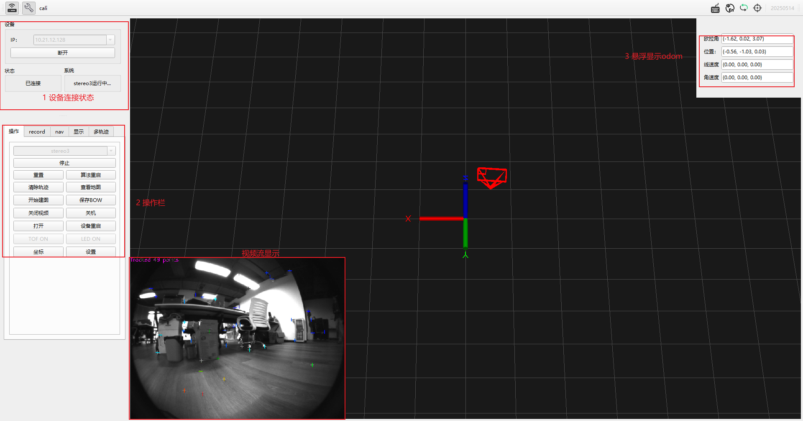

## 1. Device Connection and Status

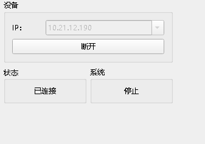

Enter the device IP (or use the built-in LAN discovery feature to obtain the correct IP), then click **Connect**. After a successful connection, the Connect button becomes **Disconnect**. The status area shows **Connected**; otherwise it shows **Disconnected**.

The system area shows the current algorithm status. There are three states:

1) Stopped  
2) stereo3 initializing  
3) stereo3 running

## 2. Operation Panel

### 2.1 Common Operations

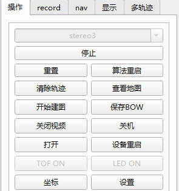

The operation page includes: start/stop/reboot/reset for the stereo3 algorithm (note: reset will not clear the already loaded BoW map in memory).

- Clear Trajectory: clear the trajectory and point cloud shown in the UI.
- View Map: view poses of saved BoW keyframes.
- Start Mapping: rebuild the map used for relocalization after saving BoW.
- Save BoW: save the BoW map generated in this run to a specified path.
- Disable Video: stop showing the video stream in UI.
- Reboot Device: reboot the whole system, typically used to apply configuration changes.
- Pose: display the current device pose.
- Settings: open the settings page.

### 2.2 Record Page

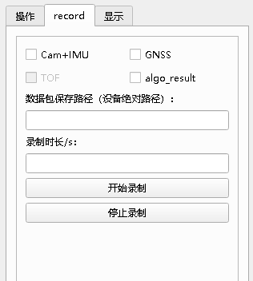

Used to record ROS bags on the device. If **Cam+IMU** is checked, it records sensor data. After the algorithm starts, if **algo_result** is checked, it records algorithm outputs during runtime.

- Bag save path: absolute path on the device, e.g. `/root/baton_bag/` (make sure the path exists, and keep the trailing slash).
- Duration: recording duration in seconds. Note the bag size: with sensor data only, ~30s is about 280MB.

### 2.3 ~~Display Settings~~

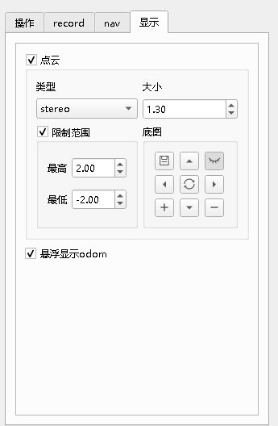

~~Point cloud display toggle (on by default). In most cases it is recommended to turn it off.~~

~~Includes type selection and view range settings; currently not very useful for users.~~

## 3. Odometry Display

Odometry data is shown as an overlay on the top-right, including Euler angles and position delta relative to the first pose when the algorithm starts (0,0,0,0,0,0,0), as well as current linear and angular velocity.

## 4. Video Stream

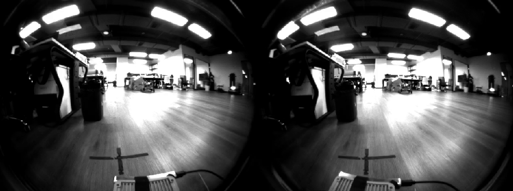

Shows the current stereo images; continuous streaming forms a video stream.

## 5. Camera Pose in 3D

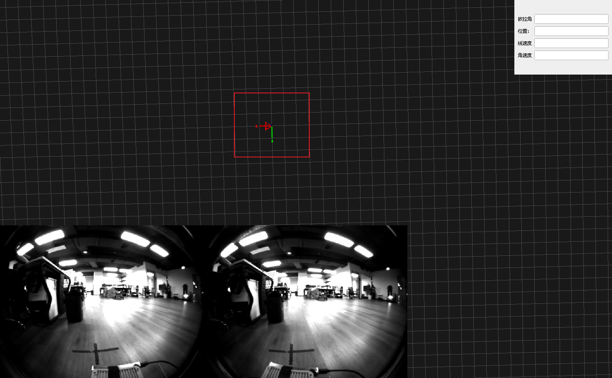

The red frustum indicates the current camera pose in 3D space. This view is interactive: drag to change viewpoint, and use the mouse wheel to zoom.

## 6. Settings Page

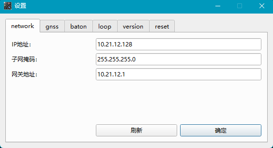

The settings page contains the following tabs.

### 6.1 Network

On opening the settings page, the current IP address is fetched automatically. To change the IP, enter the IP/subnet mask/gateway and click **OK**. A reboot is required for network settings to take effect.

### 6.2 Loop

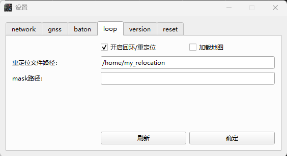

Loop / relocalization settings:

- Enable loop/relocalization: when using a historical BoW map, checking this will automatically load the BoW map from the path below, and automatically add keyframes during algorithm runtime. (This is also used for data collection for relocalization.)
- Relocalization file path: where to save/load the BoW map. Note: the path is on the device.

### 6.3 Baton

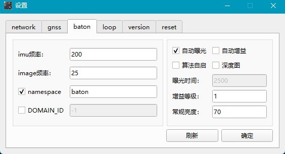

Basic camera settings:

- IMU frequency: default 200Hz, currently up to 400Hz. Do not change unless necessary.
- Image frequency: camera frame rate. PRO version is 25fps, up to 40fps.
- Auto exposure: enable/disable auto exposure. When enabled, the camera adjusts brightness based on the target brightness below. When disabled, set exposure time manually.
- Depth image: for HM_INSIDE. When enabled, depth is computed from stereo images. See the HM_INSIDE section for details.
- Auto gain: useful in very dark scenes. In typical scenes, enabling auto gain may impact accuracy.
- Exposure time: configurable when auto exposure is disabled. Range: 1~65535.
- Gain level: configurable when auto gain is disabled. Recommended 1; use 2 if the image is too dark.
- Target brightness: indoor 80~95; outdoor 120~135; adjust based on image brightness.
- Namespace: topic prefix, default `baton`.
- DOMAIN_ID: used for ROS2 multi-machine communication domain_id. Default -1 (disabled). (Not applicable to ROS1.)

### 6.4 Version

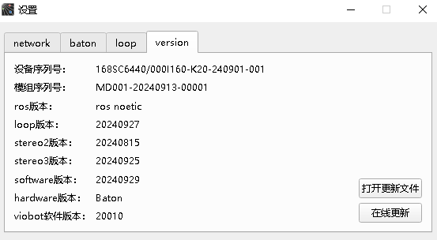

Shows the device SN and software/hardware versions, and integrates the update function.
