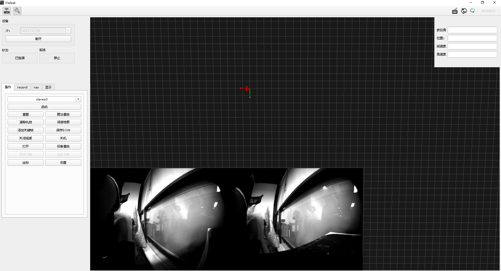
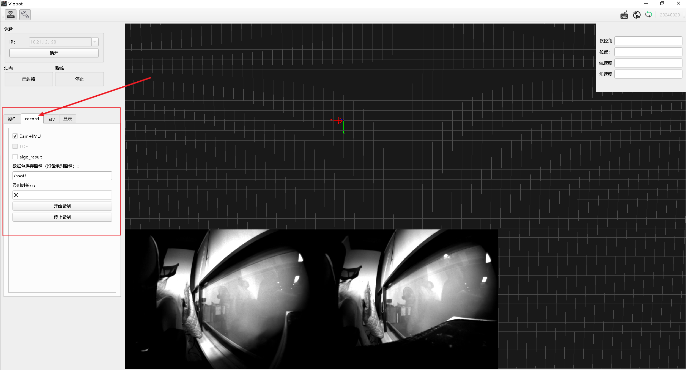
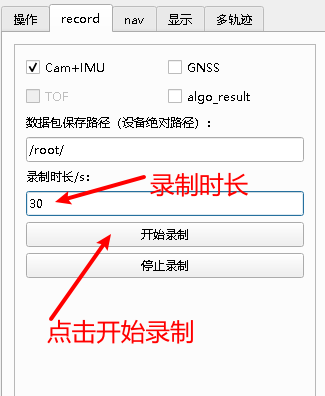
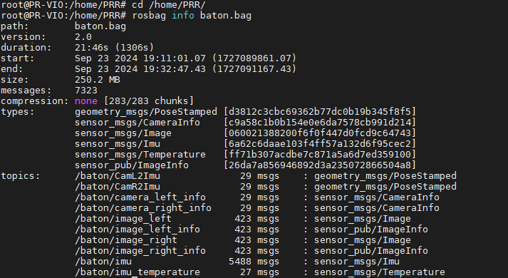

# Bag Recording

Currently, recording only supports **ROS bag**.

Note that bag files can be very large and the device storage is limited. For long-duration recording, use an external high-speed TF card. The write speed should be at least **25MB/s**. Bag size reference: at 25fps, recording only sensor data for 60s is about 600MB. Recording point clouds will be larger.

## 1. Record with the Client UI

### 1.1 Connect to the Device

Enter the IP and click **Connect**. After a successful connection, the video stream is displayed.



### 1.2 Start Recording



Click **record** in the operation panel.

#### I. Select data to record

1) **Cam+IMU**  
Records left/right raw images, camera intrinsics/extrinsics, exposure parameters, and raw IMU data.

2) **GNSS**  
Records raw GNSS data.

3) **algo_result**  
Records algorithm results during runtime, including per-frame odometry, feature_img, and point cloud.

4) **TOF**  
Records TOF intrinsics, depth image, and point cloud. If it cannot be checked, the data is not available.

#### II. Bag save path

Enter the save path on the device.

If saving to internal storage, enter a path in the **Bag save path** field, e.g. `/home/PRR/` (keep the trailing slash). Make sure there is enough free space.

Since the on-board eMMC is limited and raw data consumes a lot of space, we recommend using a high-speed TF card. Mount it and set the path to the mount point. For TF mounting, see the TF card mount section in **Hardware Interfaces**.

After mounting, set the save path to `/mnt/tfcard/` (keep the trailing slash).

By default the system concatenates strings and uses the input path plus `baton.bag` as the bag name. To record multiple bags, append an additional prefix, e.g. `/mnt/tfcard/20241001_`, and the output bag becomes `/mnt/tfcard/20241001_baton.bag`.

#### III. Set duration and start

Duration is in seconds. After clicking **Start**, the button becomes a gray countdown showing remaining time. Click **Stop** to end recording early.



#### IV. Inspect after recording

SSH into the device: user `PRR`, password `PRR`.

```bash
cd /home/PRR/
rosbag info baton.bag
```



You can see the topic list, message counts, and bag size.

## 2. Record Manually

### 2.1 Record runtime behavior/results

You only need to record outputs after stereo3 is started.

The main topics are `/baton/stereo3/feature_img` and `/baton/stereo3/odometry`. The former visualizes extracted/tracked features and corresponds to the client video stream; the latter is the pose change relative to the initial position and corresponds to the camera frustum motion in the UI.

Command:

```bash
rosbag record /baton/stereo3/feature_img /baton/stereo3/odometry -o /home/PRR/run_record.bag
```

Here `/home/PRR/run_record.bag` is the output path and name. If you omit the path, it is recorded to the current working directory. `-o` prepends a timestamp to your chosen name.

### 2.2 Record raw sensor data for offline replay/tuning

When raw sensor data is recorded, you can set the SDK `for_bag` flag to disable on-device sensor reading and instead use bag data as the algorithm input, which is useful for parameter tuning.

Main topics include: `/baton/image_left`, `/baton/image_right`, `/baton/camera_left_info`, `/baton/camera_right_info`, `/baton/imu`, `/baton/CamL2Imu`, `/baton/CamR2Imu`.

Command:

```bash
rosbag record /baton/image_left /baton/image_right /baton/camera_left_info /baton/camera_right_info /baton/imu  /baton/CamL2Imu /baton/CamR2Imu -o /mnt/tfcard/raw_record.bag
```

Here `/mnt/tfcard/raw_record.bag` is the output path and name. If you omit the path, it is recorded to the current working directory. `-o` prepends a timestamp to your chosen name.

