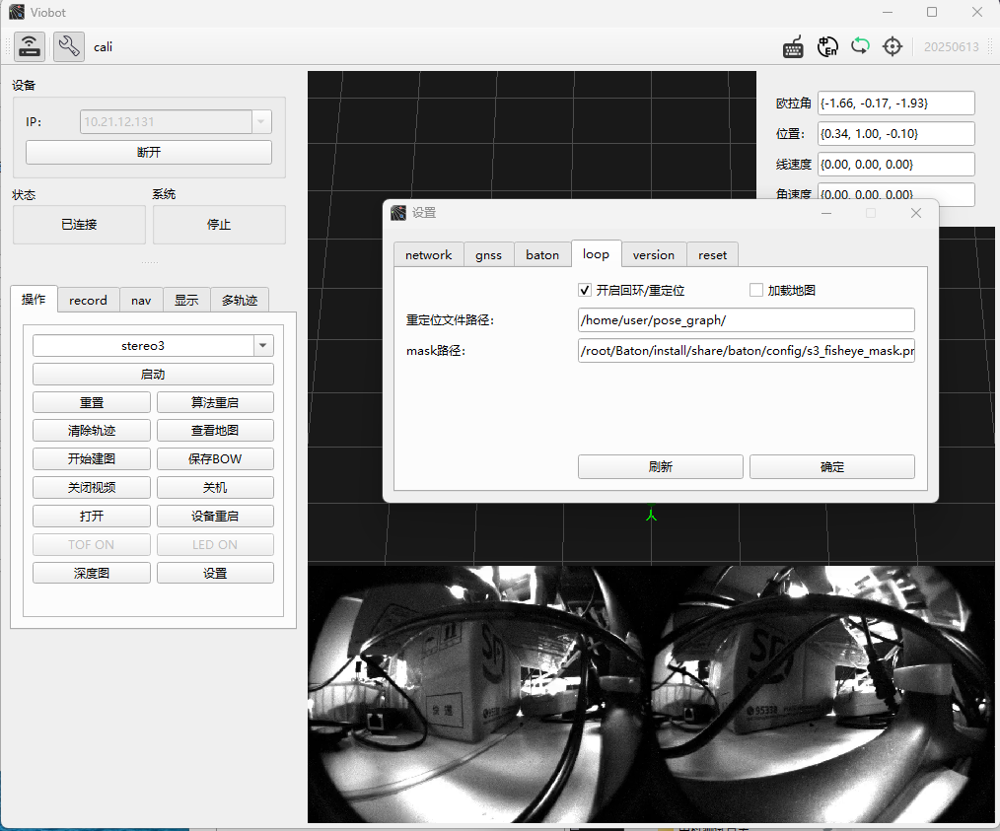

# Engineering Configuration Notes

## Mask for Occlusions

When installing Viobot2 on different platforms, parts of the robot may appear in the camera view and disturb the algorithm. In this case, configure a **lens mask** to block those regions.

Use Photoshop (or similar tools) to create a black/white mask image based on the occlusion in the camera view:

- White area: valid image region (not occluded)
- Black area: ignored region (occluded / not processed)

Example (fisheye mask):


After creating the mask image, upload it to Viobot2 via SSH. There are two ways to apply the mask:

1) Configure via UI: `Settings -> Loop -> Mask path`, fill in the correct path, then restart the camera.  
2) Configure via config file: edit `/root/Baton/install/baton/share/baton/config/sys.yaml` and set `mask_path`.



```yaml
print_queue: false
use_imu: 2
gnss_select: 1
load_previous_pose_graph: false
add_keyframe_mode: 1
pose_graph_save_path: /home/user/pose_graph/
gnss_T_imu:
  data:
    - 0
    - 0
    - 0
relocalization: false
mask_path: /root/Baton/install/share/baton/config/s3_fisheye_mask.png
```

