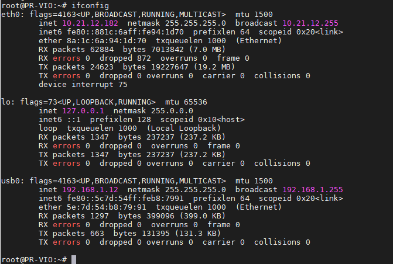
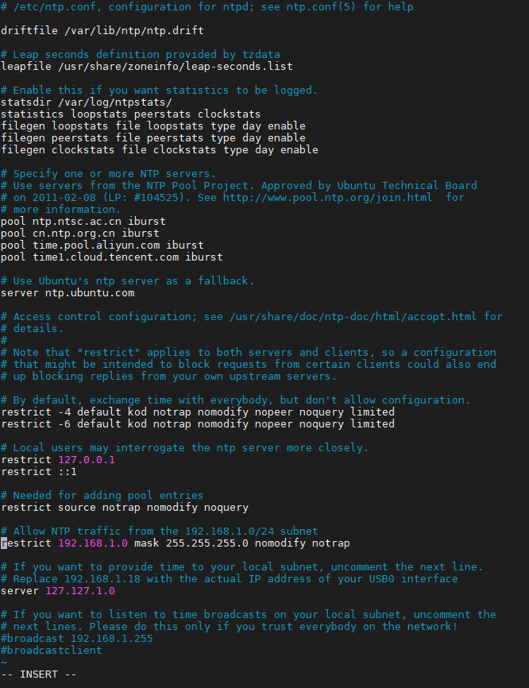
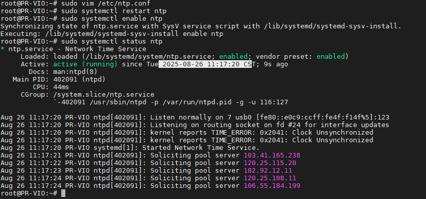
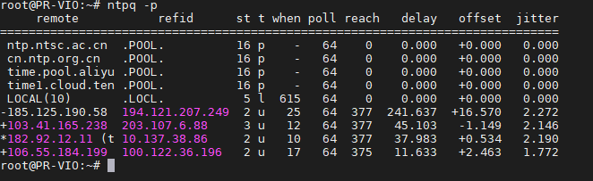
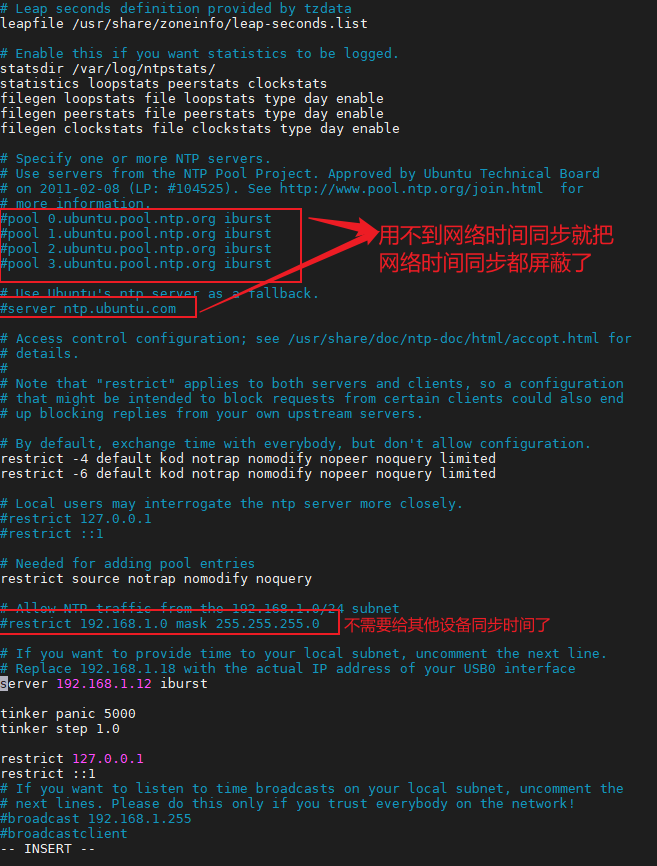
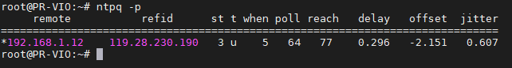

# NTP Time Synchronization Between Devices

This section explains how to synchronize time between two Linux devices via LAN or the Internet.

It is suitable for:

- Synchronizing multiple LAN devices when Internet access is unavailable.
- When a device cannot access the Internet directly, but there is another LAN device that can access the Internet; configure that device as an NTP server to provide time sync to others.

We will follow these steps:

- Connect an NTP client to the NTP server via a USB NIC and set a static IP (single cable between client and server; simulates the client having no Internet).
- Install and configure an NTP server on Ubuntu (assume the NTP server can access the Internet to get network time).
- Configure NTP time sync between client and server.

## Network Setup

In this example, an Ubuntu NTP client (baton mini) connects to Viobot2 via USB. The client already uses static IP `192.168.1.10`. We configure the USB NIC on the server (Viobot2) so that Viobot2 can reach the client via the USB network.

1. Check NIC name: `ip link show`. Here it is `usb0`:


2. Edit netplan config:

```
sudo vim /etc/netplan/01-network-manager-all.yaml
```

Fill in the config below. If you have multiple NICs, add another entry under `ethernets`:

```yaml
network:
  version: 2
  renderer: NetworkManager
  ethernets:
    usb0:  # replace with your USB NIC name; here it is usb0
      dhcp4: no
      addresses: [192.168.1.12/24]    # server IP
      gateway4: 192.168.1.1
      nameservers:
        addresses: [8.8.8.8, 1.1.1.1]
```

3. Apply:

```
sudo netplan apply
```

4. Verify:

```
ifconfig
```

You should see the USB NIC on Viobot2 using the configured IP.



## Install and Configure NTP Server

```
sudo apt update
sudo apt install ntp

sntp --version    # verify installation
```

Edit NTP config:

```
sudo vim /etc/ntp.conf
```

Since the server can sync time from the Internet, you may keep the default pools. Here is an example using CN NTP pools:

```
pool ntp.ntsc.ac.cn iburst
pool cn.ntp.org.cn iburst
pool time.pool.aliyun.com iburst
pool time1.cloud.tencent.com iburst
```

Or use an internal NTP server address:

```
server 192.168.100.100 iburst # assume your NTP server is 192.168.100.100
```

Allow client access:

Add a `restrict` rule to allow your LAN subnet to query time:

```
restrict 192.168.1.0 mask 255.255.255.0 nomodify notrap
```

Also configure a local clock source so that when external servers are unreachable, it uses the local hardware clock:

```
server 127.127.1.0
```

Full example:



Restart NTP and enable auto-start:

```
sudo systemctl restart ntp
sudo systemctl enable ntp
sudo systemctl status ntp
```



Verify server status:

```
ntpq -p
```

For example, `*` indicates the current sync source, `+` indicates a valid candidate, and `-` indicates a rejected source.



## Install NTP Client

```
sudo apt update
sudo apt install ntp

sntp --version    # verify installation
```

Edit NTP config:

```
sudo vim /etc/ntp.conf
```

Since the client is a device without Internet, the key is to change pools/servers: comment out all default pool/server lines and add your own server. Here `192.168.1.12` is the server USB NIC IP; client IP is `192.168.1.10`.

```
server 192.168.1.12 iburst
```

Depending on your situation, you may also add the following. If the time difference between server and client is too large, NTP may fail to sync.

```shell
# Allow NTP to correct any size of time offset
tinker panic 0
# Set the step threshold to 3 seconds. For offsets > 3s, step to within 3s first, then slew.
tinker step 3.0
```



Save and restart:

```
sudo systemctl restart ntp
```

Verify sync:

```
ntpq -p
```

If you see `*` on your configured server, it means the client is using your NTP server. You can also compare time roughly with `date`. If it still does not use your server, manually set the client time to a recent value (e.g. within one day), or restart NTP on the server: `sudo systemctl restart ntp`.



This example demonstrates using Viobot2 as an NTP server to synchronize time for a baton mini device in a LAN without Internet. Time synchronization can reduce many issues (e.g. ROS multi-machine topic communication anomalies, multi-sensor timestamp mismatches). NTP is a traditional solution; you can also use a more modern solution such as chrony.

