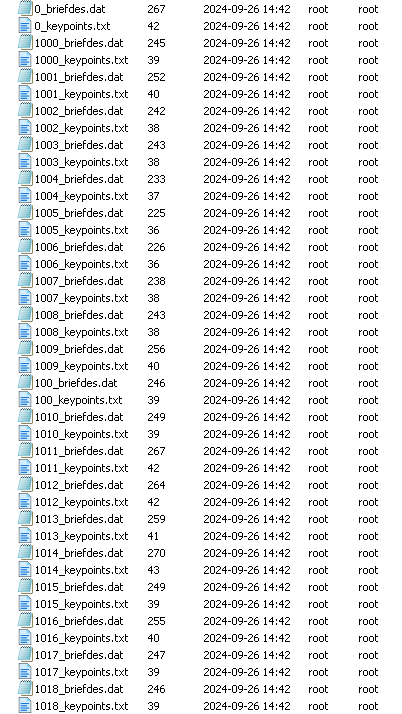
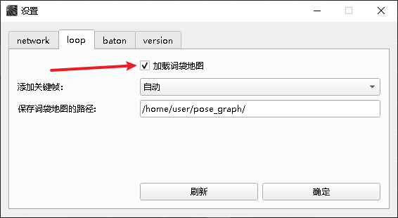
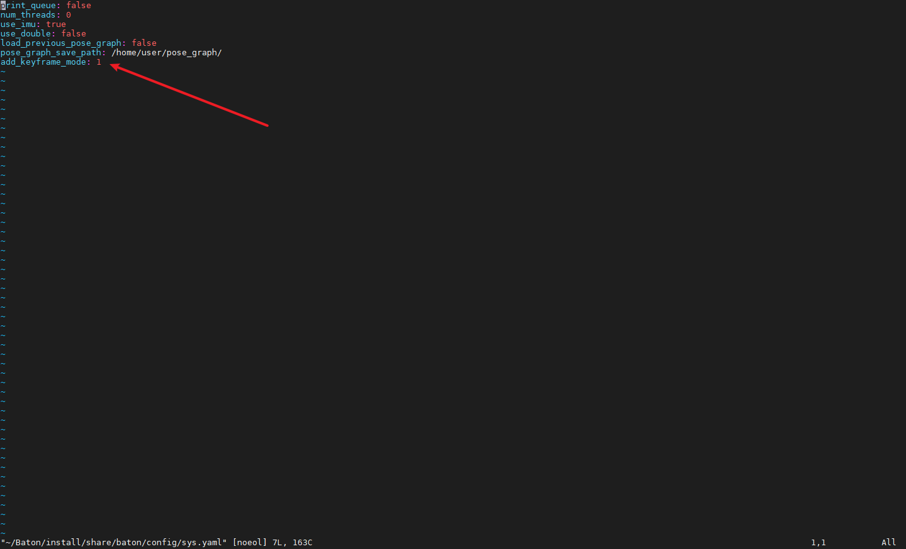
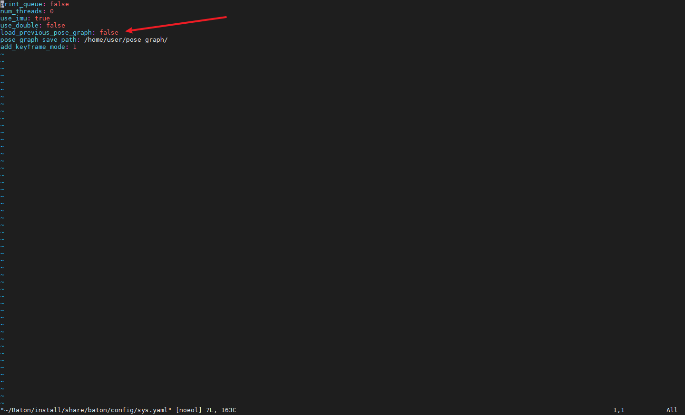

# 回环使用

Baton回环是使用词袋匹配的方式，，当新的关键帧能够匹配词袋里面记录过的关键帧时，触发回环，将设备的当前位姿拉到历史位姿。

## 一.上位机操作

### 1.词袋使用方法

连接上设备，先停止算法。

UI上点 设置 选到 loop 选项卡


### 2.记录词袋

注意加载词袋地图的勾不要勾上，勾上表示加载之前的词袋地图。

注意将 保存词袋地图的路径 设置为自己想要保存的路径（设备上，不是用户电脑）

因为需要识别关键帧，所以词袋记录是自动的。选择添加关键帧的方式为自动，点击确定，再启动算法，就会在算法运行的过程中自动记录关键帧。


当做完了需要录制词袋地图的环境后，点击UI的 保存BOW 就可以把词袋地图保存再指定的路径下了。



### 3.加载词袋信息

关闭算法



将配置 `项加载词袋地图` 的勾勾上。

将 `添加关键帧 `设置为自动，点击确定。

启动算法，会自动加载保存在 `保存词袋地图的路径` 的词袋地图，当新的关键帧能够匹配上词袋里面的关键帧时，则会触发回环。

## 二.ROS操作

### 1.修改配置文件

修改设备里面的"`/root/Baton/install/share/baton/config/sys.yaml`"这个文件：

```bash
sudo vim /root/Baton/install/share/baton/config/sys.yaml
```



add\_keyframe\_mode为1则是自动添加关键帧，0则为手动添加关键帧。修改文件并保存即可。

### 2.记录词袋

开启算法，记录词袋地图。自动添加关键帧模式下也能够手动继续添加关键帧。

当记录的词袋足够了之后,开启我们的pr\_loop\_action\_demo的程序，输入数字2即可保存。

当你没有停止算法或者重启算法的时候，再次添加关键帧或者保存词袋都是再原有的词袋地图上面继续添加的。

### 3.加载词袋

停止算法。

修改设备里面的"`/root/Baton/install/share/baton/config/sys.yaml`"这个文件：



将load\_previous\_pose\_graph改为true，保存文件。

启动算法会自动加载保存在`pose_graph_save_path`的词袋地图，当新的关键帧能够匹配上词袋里面的关键帧时，则会触发回环。

ROS2通过命令行发送action

```c++
ros2 action send_goal /baton/loop/keyframe_cation loop_action/KeyFrameHandle "{function: 2}"
```

## 三.回环触发

保存了BOW后，勾选了加载词袋地图的选项，启动算法，会自动加载保存在 `保存词袋地图的路径` 的词袋地图，当新的关键帧能够匹配上词袋里面的关键帧时，则会触发回环，将当前位姿拉到回环记录的位姿去，要注意的是，这个过程不是一次拉到位的，就是它有可能是多次回环之后才会被拉到回环的历史位姿。
