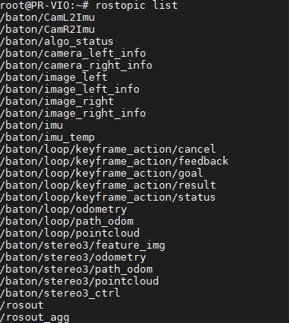

# 数据说明

## 目录

- [一.输出话题](#一输出话题)
  - [1.传感器数据输出](#1传感器数据输出)
    - [（1）左目图像](#1左目图像)
    - [（2）右目图像](#2右目图像)
    - [（3）右目图像曝光信息](#3右目图像曝光信息)
    - [（4）右目图像曝光信息](#4右目图像曝光信息)
    - [（5）imu原始数据](#5imu原始数据)
    - [（6）imu温度数据](#6imu温度数据)
    - [（7）左目到IMU外参](#7左目到IMU外参)
    - [（8）右目到IMU外参](#8右目到IMU外参)
    - [（9）右目到IMU外参](#9右目到IMU外参)
    - [（10）右目到IMU外参](#10右目到IMU外参)
  - [2.算法输出](#2算法输出)
    - [（1）算法状态](#1算法状态)
    - [（2）特征点图](#2特征点图)
    - [（3）stereo3输出里程计](#3stereo3输出里程计)
    - [（4）stereo3输出点云](#4stereo3输出点云)
    - [（5）stereo3运行轨迹](#5stereo3运行轨迹)
    - [（6）回环位姿](#6回环位姿)
- [二.控制话题](#二控制话题)
  - [1.算法控制](#1算法控制)
    - [（1）stereo3控制](#1stereo3控制)
    - [（2）回环控制](#2回环控制)



## 一.输出话题

输出话题分为传感器数据和算法数据两类。

### 1.传感器数据输出

#### （1）左目图像

话题名：`/baton/image_left `
Type: `sensor_msgs/Image`

#### （2）右目图像

话题名：`/baton/image_right `
Type: `sensor_msgs/Image`

#### （3）右目图像曝光信息

话题名：`/baton/image_left_info`  &#x20;
Type: `sensor_pub/ImageInfo`&#x20;

该消息类型为自定义类型，在自定义消息类型可以找到，具体定义如下。

```python
exposure: 4976 #曝光时间
analog_gain: 1.0 #模拟增益
digital_gain: 1.0 #数字增益
```

#### （4）右目图像曝光信息

话题名：`/baton/image_right_info`  &#x20;
Type: `sensor_pub/ImageInfo`

该消息类型为自定义类型，定义如上。

#### （5）imu原始数据

话题名：`/baton/imu`
Type: `sensor_msgs/Imu`

#### （6）imu温度数据

话题名：`/baton/imu_temp`  &#x20;
Type: `sensor_msgs/Temperature`

#### （7）左目到IMU外参

话题名：`/baton/CamL2Imu` &#x20;
Type: `geometry_msgs/PoseStamped`

#### （8）右目到IMU外参

话题名：`/baton/CamR2Imu`
Type: `geometry_msgs/PoseStamped`

#### （9）右目到IMU外参

话题名：`/baton/camera_left_info`
Type: `sensor_msgs/CameraInfo`

```python
height: 480 #图像高
width: 640 #图像宽
distortion_model: "ds" #畸变模型
D: [-0.25824591334560476, 0.5672715939661027, 0.0, 0.0, 0.0] #畸变系数
K: [164.15676583809704, 0.0, 318.5936994457823, 
    0.0, 164.0741011283019, 239.66298170413694,
    0.0, 0.0, 1.0]#相机内参
R: [1.0, 0.0, 0.0, 0.0, 1.0, 0.0, 0.0, 0.0, 1.0]
P: [1.0, 0.0, 0.0, 0.0, 0.0, 1.0, 0.0, 0.0, 0.0, 0.0, 1.0, 0.0]
binning_x: 0
binning_y: 0
roi:
  x_offset: 0
  y_offset: 0
  height: 0
  width: 0
  do_rectify: False

```

#### （10）右目到IMU外参

话题名：`/baton/camera_right_info` &#x20;
Type: `sensor_msgs/CameraInfo`

```python
height: 480 #图像高
width: 640  #图像宽
distortion_model: "ds" #畸变模型
D: [-0.2615917683666564, 0.5679955819508452, 0.0, 0.0, 0.0] #畸变系数
K: [163.79787865873183, 0.0, 323.4330173880752, 
    0.0, 163.62052609635333, 243.67927518142795, 
    0.0, 0.0, 1.0]#相机内参
R: [1.0, 0.0, 0.0, 0.0, 1.0, 0.0, 0.0, 0.0, 1.0]
P: [0.9999730625093293, 0.0031151927461599226, 0.006646038659791247, 0.061327748008980894,
   -0.0031351685298500703, 0.9999905932027023, 0.002997369579618926, -0.0004044248281003861, 
   -0.006636638757880752, -0.003018125289258183, 0.9999734226196892, -0.00033629396372312104] #右目到左目外参矩阵
binning_x: 0
binning_y: 0
roi:
  x_offset: 0
  y_offset: 0
  height: 0
  width: 0
  do_rectify: False

```

### 2.算法输出

#### （1）算法状态

话题名：`/baton/algo_status`

Type:`system_ctrl/algo_status`

该话题为自定义话题消息类型，在自定义消息里面能找到，具体定义如下

```yaml
algo_status: "ready" #或者是“stereo3_inilizing”或"stereo3_running"
```

#### （2）特征点图

话题名：`/baton/stereo3/feature_img`

Type:`sensor_msgs/Image`

算法正常启动后，通过左右目提取特征点并跟踪，合成在同一张图片上显示出跟踪到的特征点。

#### （3）stereo3输出里程计

话题名：`/baton/stereo3/odometry`

Type:`nav_msgs/Odometry`

算法正常启动后，通过VIO计算出来的当前位姿与开始第一帧位姿（0，0，0，0，0，0，0）之间的相对位姿。

#### （4）stereo3输出点云

话题名：`/baton/stereo3/pointcloud`

Type:`sensor_msgs/PointCloud2`

算法正常启动后，通过VIO计算特征点投影到三维空间中生成的点云。相对来说会比较稀疏，而且呈散射状。

#### （5）stereo3运行轨迹

话题名：`/baton/stereo3/path_odom`

Type:`nav_msgs/Path`

算法正常启动后，通过stereo3运行过程中的历史位姿连成的轨迹。

#### （6）回环位姿

话题名：`/baton/loop/odometry`

Type:`nav_msgs/``Odometry`

算法正常启动后，通过回环修正后的位姿，如果没有触发过回环，它的数据应该是与`/baton/stereo3/odometry`一致的。

（7）回环点云

话题名：`/baton/loop/pointcloud`

Type:`sensor_msgs/PointCloud2`

算法正常启动后，通过修正过后的点云。

（8）回环轨迹

话题名：`/baton/loop/path_odom`

Type:`nav_msgs``/``Path`

算法正常启动后，通过修正过后的轨迹。

## 二.控制话题

### 1.算法控制

#### （1）stereo3控制

话题名：`/baton/stereo3_ctrl`

Type:`system_ctrl/algo_ctrl`

用于控制stereo3算法的启停、重启。该话题为自定义话题，在自定义消息类型可以找到，具体定义如下：

```c
Header header
bool algo_enable
bool algo_reboot
bool algo_reset
```

#### （2）回环控制

主要是控制关键帧的保存的，action服务器为`/baton/loop/keyframe_action/`

对应ROS的action使用即可。
