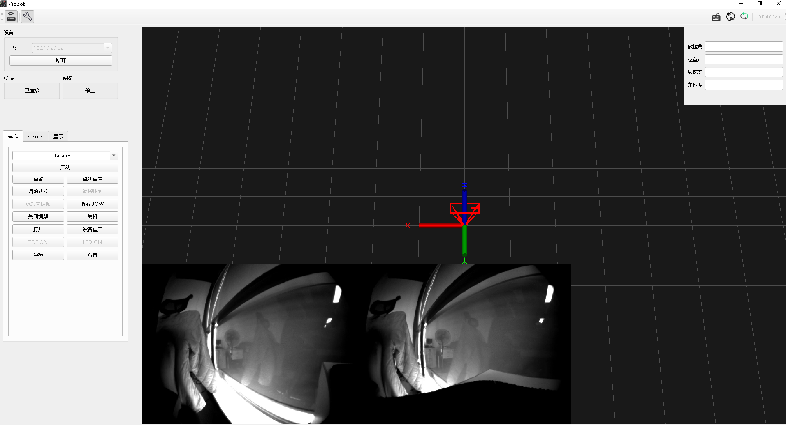
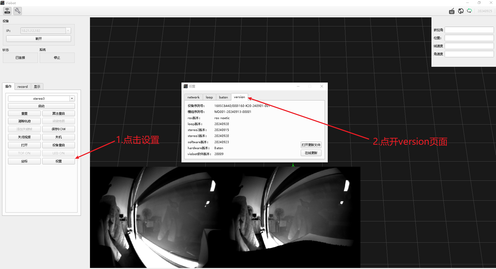
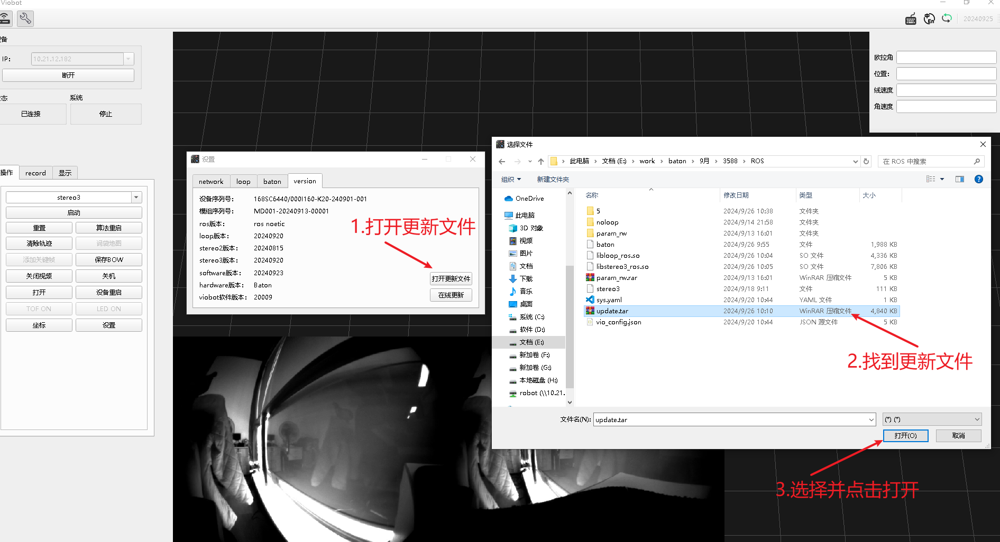
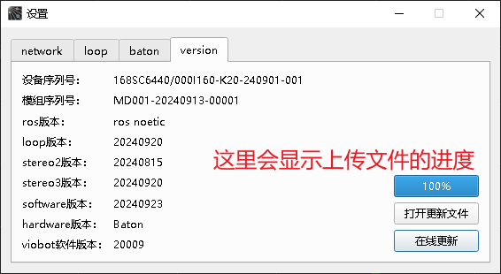
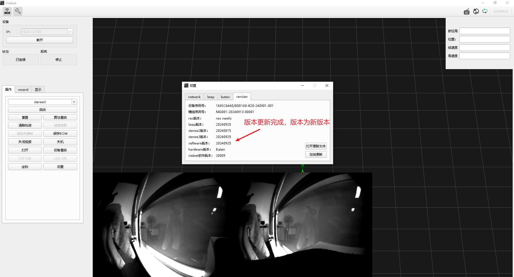

# 版本更新

使用UI连接设备

## 1.查看当前设备软件版本

点击设置键，再打开version选项卡。

## 2.更新

点击version页面的“打开更新文件”，选择更新文件上传到设备里面，上传文件的进度会有显示，如果上传失败或者进度被卡住，有可能是网络不太好，点击“停止上传”，重新再上传就行。

显示完成就可以了。

再点击“在线更新”会开启更新进程，等待更新完成设备会自动重启。

重启后再查看当前的版本，版本变为新版本就完成了更新。

