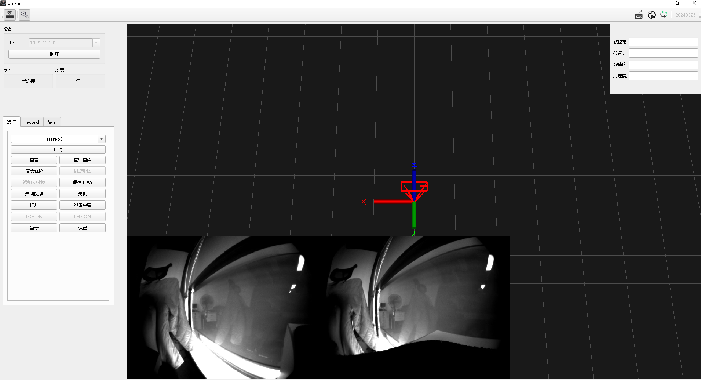
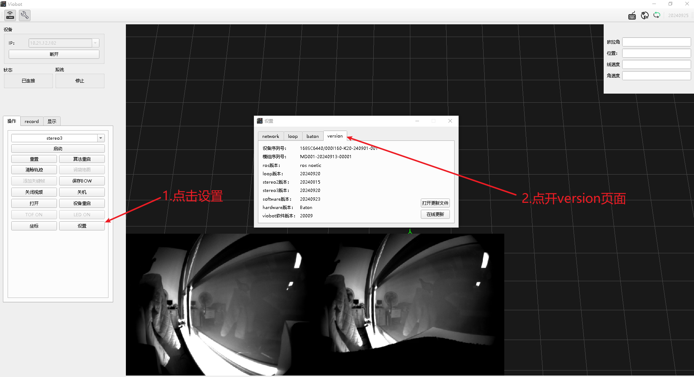
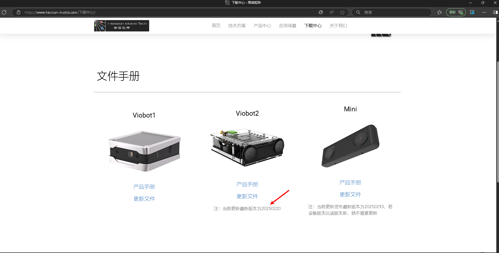
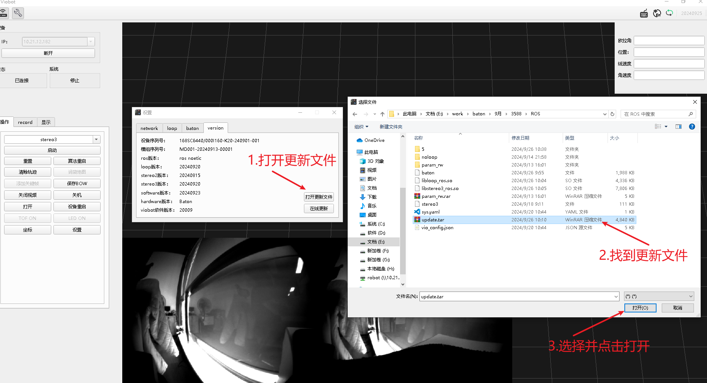
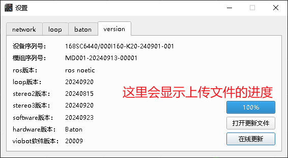
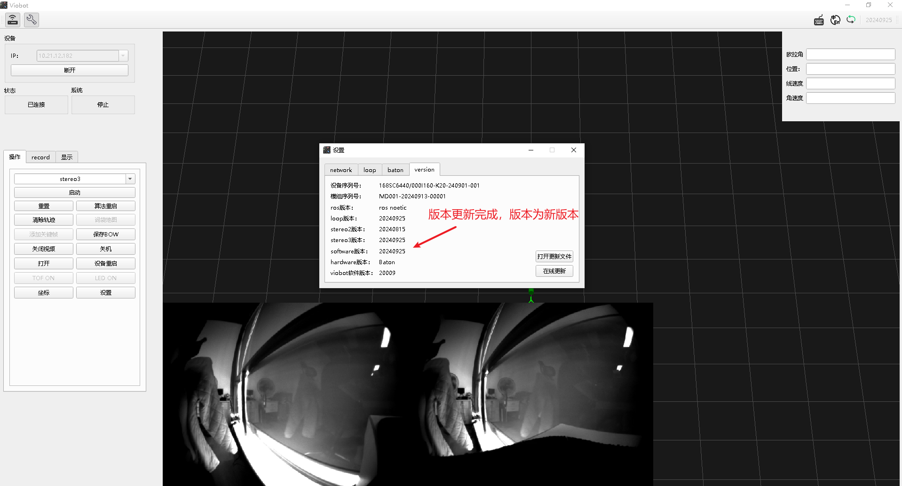

# 版本更新

使用UI连接设备

## 1.查看当前设备软件版本

点击设置键，再打开version选项卡。

## 2.查看官网最新版本

进入[下载中心 – 黑森矩阵](https://www.hessian-matrix.com/下载中心/)，拉到最底下，查看当前最新的固件版本

如果官网上面的版本比你手上的设备版本更新，点击更新文件下载即可。下载下来的文件需要先解压拿到`update.tar`文件,保存到本地。

## 3.更新

点击version页面的“打开更新文件”，选择更新文件`update.tar`上传到设备里面，上传文件的进度会有显示，如果上传失败或者进度被卡住，有可能是网络不太好，点击“停止上传”，重新再上传就行。

显示完成就可以了。

再点击“在线更新”会开启更新进程，等待更新完成设备会自动重启。

重启后再查看当前的版本，版本变为新版本就完成了更新。

