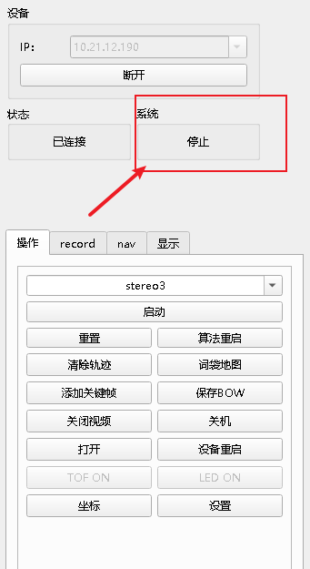
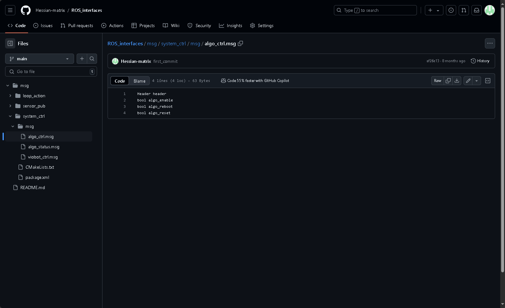
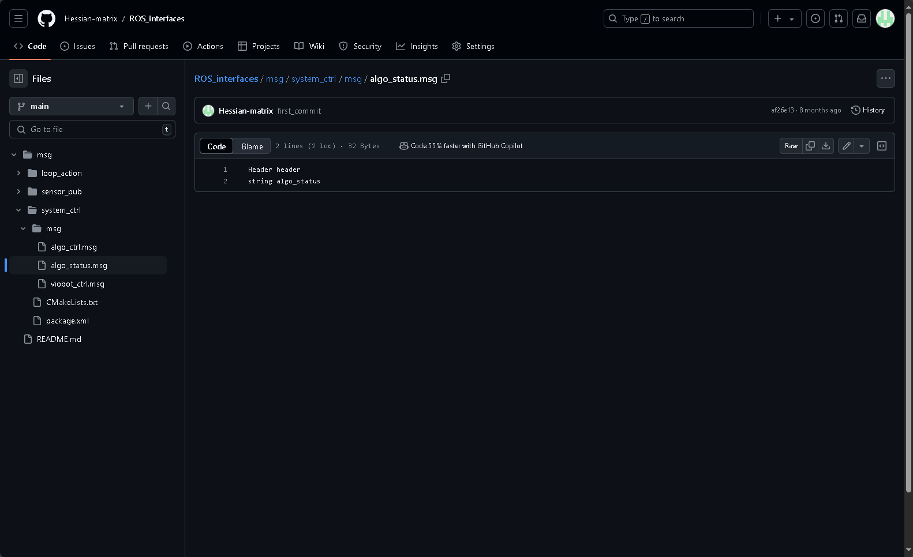

# 算法控制

### 一.上位机控制



&#x20;  状态反馈在系统反馈出会根据当前系统状态显示。

控制是在操作栏里面的一个选项三个按键。包括启动/停止、重启和重置。

### 二.ROS控制

算法的控制我们整合成了一个ROS msg，具体的msg信息可以查看[ros\_interface](https://github.com/Hessian-matrix/ROS_interfaces "ros_interface")（相应的ROS2是[ros2_interfaces](https://github.com/Hessian-matrix/ROS2_interfaces)）里面的system\_ctrl包的algo\_ctrl.msg



分别对应着算法启动/停止，算法重启以及算法重置。

话题名如下：

```c++
Type: system_ctrl::algo_ctrl
Topic: /baton/stereo3_ctrl 
```

命令行发送话题命令如下：

启动stereo3算法

```bash
rostopic pub -1 /baton/stereo3_ctrl system_ctrl/algo_ctrl "{header: {seq: 0, stamp: {secs: 0, nsecs: 0}, frame_id: ''}, algo_enable: true, algo_reboot: false, algo_reset: false}"

```

停止stereo3算法

```bash
rostopic pub -1 /baton/stereo3_ctrl system_ctrl/algo_ctrl "{header: {seq: 0, stamp: {secs: 0, nsecs: 0}, frame_id: ''}, algo_enable: false, algo_reboot: false, algo_reset: false}"

```

重启stereo3算法

```bash
rostopic pub -1 /baton/stereo3_ctrl system_ctrl/algo_ctrl "{header: {seq: 0, stamp: {secs: 0, nsecs: 0}, frame_id: ''}, algo_enable: true, algo_reboot: true, algo_reset: false}"

```

重置stereo3算法

```bash
rostopic pub -1 /baton/stereo3_ctrl system_ctrl/algo_ctrl "{header: {seq: 0, stamp: {secs: 0, nsecs: 0}, frame_id: ''}, algo_enable: true, algo_reboot: false, algo_reset: true}"

```

ROSdemo里面的例子

```c++
ros::Publisher pub_stereo3_ctrl = nh.advertise<system_ctrl::algo_ctrl>("/baton/stereo3_ctrl", 2);
system_ctrl::algo_ctrl algo_set;
algo_set.algo_enable = false;
algo_set.algo_reboot = false;
algo_set.algo_reset = false;

ros::Rate r(10);
int v;

while(ros::ok()){
    std::cin >> v;
    if(v == 1){//设置时需要注意其他的状态位的情况
        ROS_INFO("algo_enable");
        algo_set.algo_enable = true;
        pub_stereo3_ctrl.publish(algo_set);
    }
    else if(v == 2){
        ROS_INFO("algo_disable");
        algo_set.algo_enable = false;
        pub_stereo3_ctrl.publish(algo_set);
    }
    else if(v == 3){
        ROS_INFO("algo_reboot");
        algo_set.algo_reboot= true;
        algo_set.algo_reset= false;
        pub_stereo3_ctrl.publish(algo_set);
    }
    else if(v == 4){
        ROS_INFO("algo_reset");
        algo_set.algo_reboot= false;
        algo_set.algo_reset= true;
        pub_stereo3_ctrl.publish(algo_set);
    }
    
    r.sleep();
    ros::spinOnce(); 
}

```

ROS2

启动stereo3算法

```bash
ros2 topic pub --once /baton/stereo3_ctrl system_ctrl/AlgoCtrl "{header: {stamp: {sec: 0, nanosec: 0}, frame_id: ''}, algo_enable: true, algo_reboot: false, algo_reset: false}"

```

停止stereo3算法

```bash
ros2 topic pub --once /baton/stereo3_ctrl system_ctrl/AlgoCtrl "{header: {stamp: {sec: 0, nanosec: 0}, frame_id: ''}, algo_enable: false, algo_reboot: false, algo_reset: false}"

```

重启stereo3算法

```bash
ros2 topic pub --once /baton/stereo3_ctrl system_ctrl/AlgoCtrl "{header: {stamp: {sec: 0, nanosec: 0}, frame_id: ''}, algo_enable: true, algo_reboot: true, algo_reset: false}"

```

重置stereo3算法

```bash
ros2 topic pub --once /baton/stereo3_ctrl system_ctrl/AlgoCtrl "{header: {stamp: {sec: 0, nanosec: 0}, frame_id: ''}, algo_enable: true, algo_reboot: false, algo_reset: true}"
```

### 三.ROS状态反馈

算法的状态也是一个ROS msg，具体的msg信息可以查看[ros\_interface](https://github.com/Hessian-matrix/ROS_interfaces "ros_interface")里面的system\_ctrl包的algo\_status.msg



直接字符串打印系统当前算法的状态。

ROSdemo里面的例子

```c++
ros::Subscriber sub_algo_status = nh.subscribe("/baton/algo_status", 2, algo_status_callback);//定义订阅者并注册回调函数
```

回调函数

```c++
void algo_status_callback(const system_ctrl::algo_status::ConstPtr &msg){
    std::cout << "algo_status: " << msg->algo_status << std::endl;
}
```
