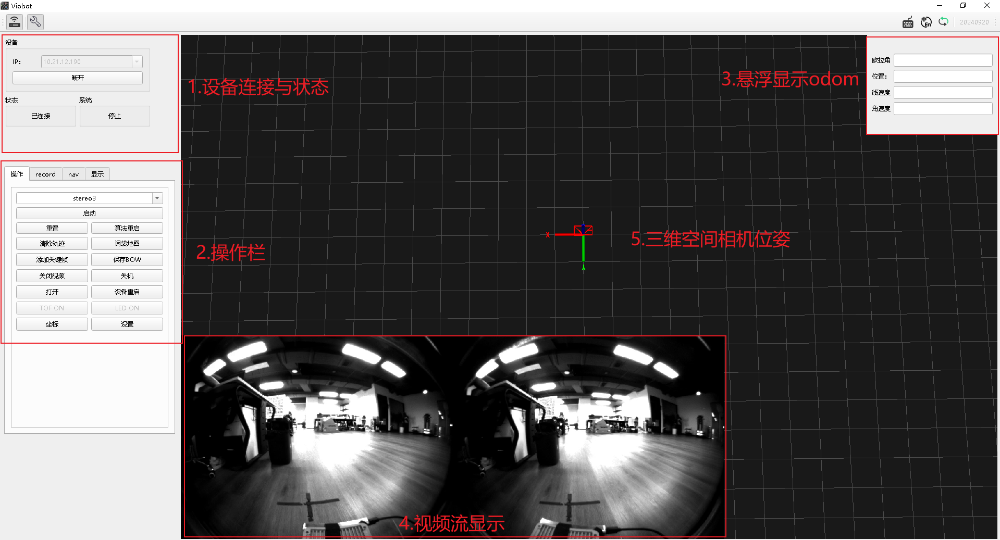
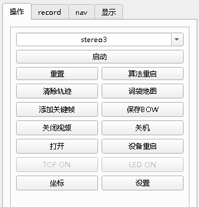
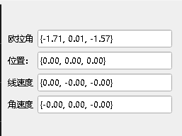
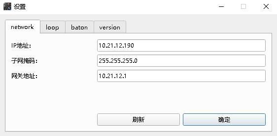
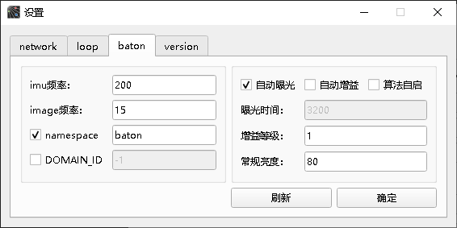

# 基本功能使用及介绍

设备拿到手当然是要先试一下效果的，这部分可以参考<开机指南>

接下来我们就从UI开始熟悉这个产品吧！

## 一.设备连接与状态

输入设备IP或者是通过自带的局域网设备搜索功能给到正确的IP之后，点击连接，连接成功后连接按键会变成断开键。同时状态框显示为已连接状态，无连接则会显示已断开。

系统框显示的是设备当前算法状态，

此时它的系统的算法状态是停止状态的，这个系统状态有三个状态：

&#x20;1）停止&#x20;

&#x20;2）stereo3初始化中

&#x20;3）stereo3运行中

## 二.操作栏

### 1.常规操作

首先是操作页面，包含了stereo3算法的启动、停止、重启和重置(注：重置不会清掉已加载到内存的词袋地图)

清除轨迹：清除UI当前显示的轨迹和点云。

保存BOW ：将本次运行生成的词袋地图保存到指定路径。

关闭视频 ：关闭UI视频流显示。

设备重启：点击按钮后，整个设备系统会直接重启，用于一些配置向修改生效。

坐标 ：设备当前位姿显示。

设置：调出设置页面

## 三.odom数据显示

odom数据悬浮显示在右上角，显示的数据包括当前设备对于算法开启时第一个位姿（0，0，0，0，0，0，0）的欧拉角，位置差，以及设备当前的线速度和角速度。

## 四.视频流显示

显示当前双目图像，连续推流就成了视频流。

## 五.三维空间相机位姿

红色框的锥形框框就是当前相机在三维空间的位姿，这个界面是三维的，可以拖拽切换视角，使用鼠标滚轮放大和缩小。

## 六.设置页面

设置页面包含了四个选项卡。

### 1.network

网络设置页面，点开设置页面，会自动获取当前设置的IP地址，需要修改IP则直接输入对应的IP、子网掩码和网关，点击确定即可。设置网络需要重启设备才能生效。

### 2.baton

相机的基本设置

imu频率：默认200Hz，现最高支持400Hz，没有特殊需求一般不建议修改。

image频率：相机帧率，mini默认20fps，可设置为15/20fps。

自动曝光：前面的勾勾上则开启自动曝光，根据下面设置的常规亮度来调节相机成像亮度，如果不需要自动曝光，则将勾去掉，单独设置下面的曝光时间。

自动增益：前面的勾勾上则开启自动增益，该功能在场景特别暗的时候好用，但在一般场景下，开启自动增益可能会影响算法精度。

曝光时间：曝光时间在去掉上面的自动曝光的勾时可设置，如果要用到这个设置，可能需要用户自行根据不同设置值下的成像表现来设置，属于经验值。调大图片 会变量，调小会变暗，取值范围：1\~65535。

增益等级：自动增益勾去掉时可设置，推荐值1，如果画面太暗，效果不佳可设置为2。

常规亮度：白天推荐室内：70\~85;室外：110\~120；根据画面亮度手动调节。

namespace: 设置当前相机的话题前缀，默认为baton。

DOMAIN\_ID: 用于设置ROS2多机通信里面的domain\_id，默认显示为-1，不做单独设置，保持系统默认值0.    &#x20;

算法自启：勾选则会在开机时自动开启算法。

### 3.version

记录了当前设备的SN号以及软硬件版本。集成了更新功能。
