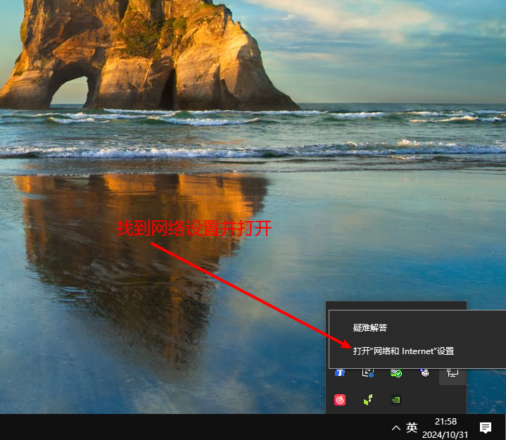
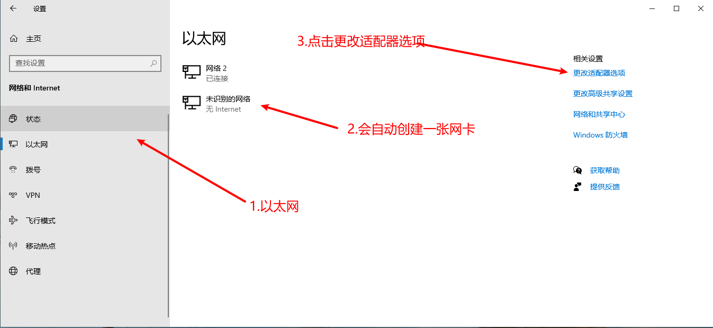
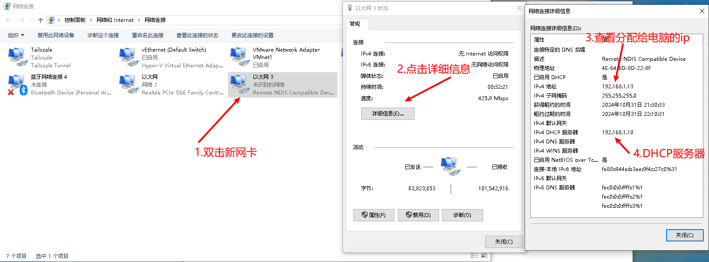
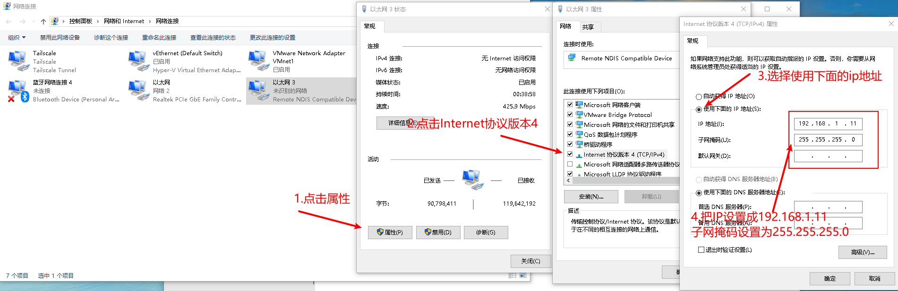
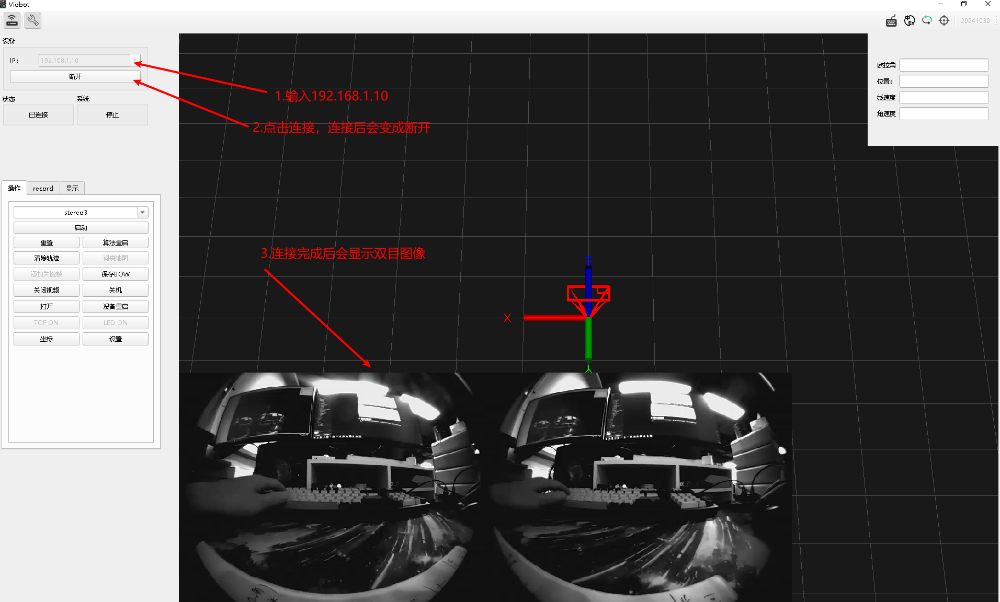
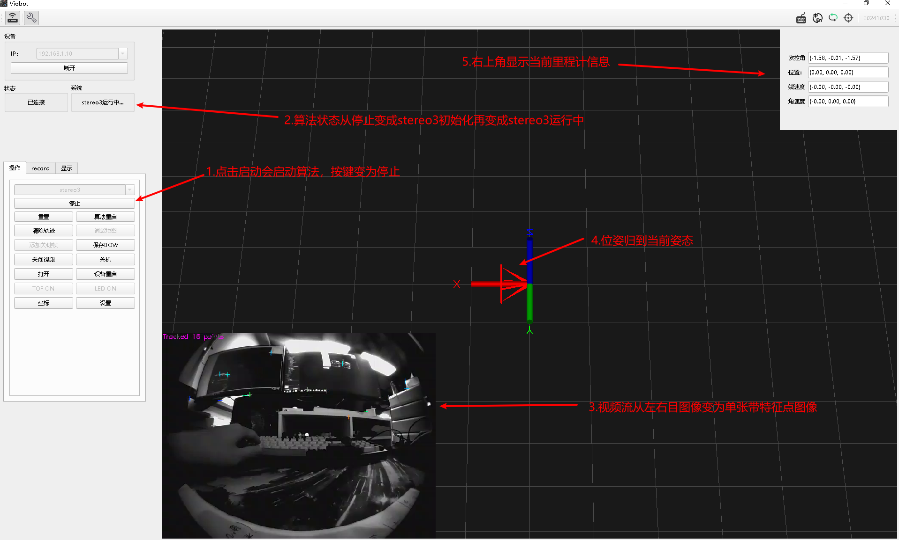
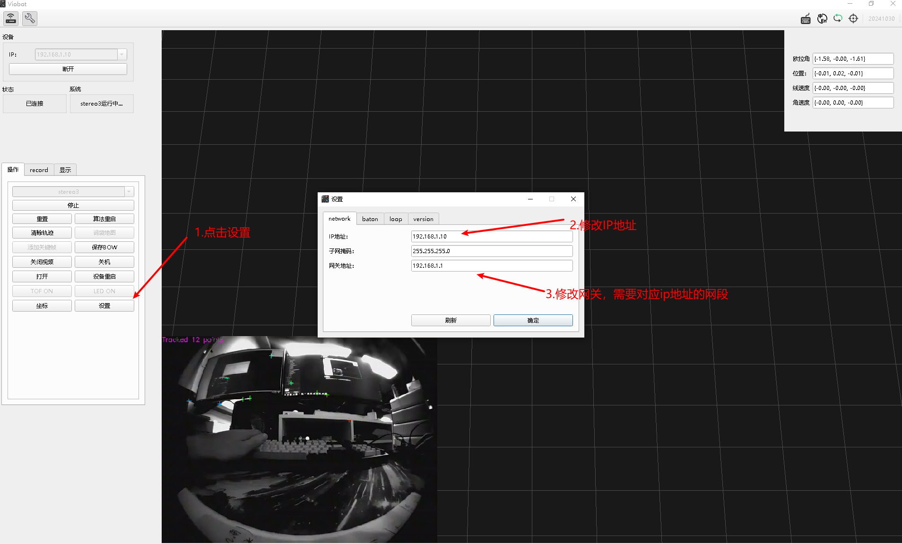

# 开机指南

直接使用配套的USB线接到电脑端，设备会给电脑创建一张网卡并自动分配一个192.168.1.X的IP地址。

## 1.查看网络

首先，在电脑右下角找到网络图标，右键再点打开“网络和Internet”设置

然后进到网络设置页面

查看新网卡分配的ip地址，如果是192.168.1.X（X在11\~20之间），则是正常的，可以看到DHCP服务器（也就是设备的ip为192.168.1.10）

如果分配到的ip不是192.168.1段的，则需要按以下步骤手动设置一下网络（这个在windows上面有一定的概率出现）。如果你的电脑本来就有192.168.1段的网络，也需要手动设置一下网络，避开设备的ip：192.168.1.10

## 2.通过上位机连接

上位机下载链接：https://www.hessian-matrix.com/wp-content/uploads/viobot/Viobot_customer_Setup.exe

在 下载了上位机安装包并且安装到电脑之后，输入设备ip地址并点击连接，正常显示双目图像即连接成功。

## 3.启动测试

点击启动，等待算法启动成功。启动成功后就可以测试算法效果了。

## 4.修改ip

如果使用的时候网段有所冲突，可以通过修改ip段来规避网络冲突。

