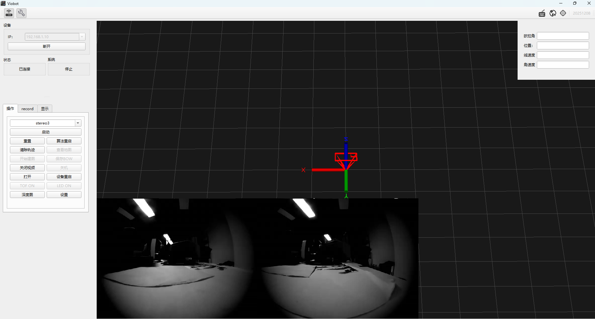
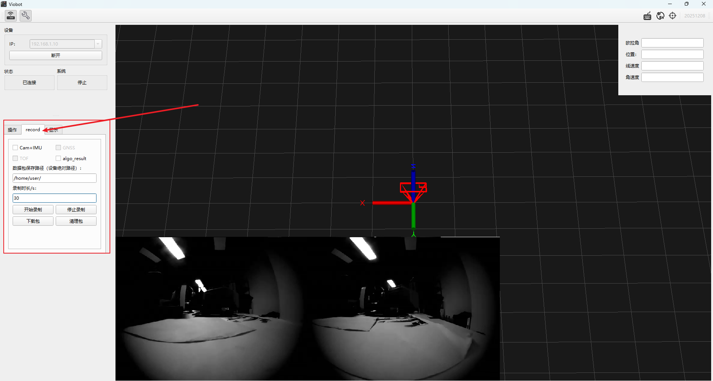

# 数据包录制

录包暂时只支持录制ROS数据包。

需要注意的是，数据包可能会很大，数据包大小参考：图像帧率在20fps时，单录传感器数据60S大概是450M左右。

## 一.使用UI录制数据包

### 1.连接设备

IP框输入IP，点击连接，连接成功后会直接显示视频流。

### 2.录包

操作栏点击record。

#### I.勾选需要录制的数据：

（1）Cam+IMU

添加录制左右目相机raw数据、相机内外参、相机曝光参数以及imu原始数据。

（2）GNSS

添加录制GNSS原始数据。无法勾选则是mini没有该数据。

（3）algo\_result

添加录制算法运行过程的结果数据，包括每帧的odometry、feature\_img 以及点云数据。

（4）TOF

添加录制tof内参数据、深度图以及点云数据。无法勾选则是没有该数据。

#### II.数据包保存路径

输入数据包保存的路径，该路径是在设备上的。

录制到设备本机上面的话可以直接在`数据包保存路径`的输入框内输入保存路径，如：`/home/user/`（这里前后斜杠一定要有）。录制功能会监控系统存储空间大小，一旦录制的数据包把系统储存空间挤占剩余小于2G机会自动停止录制。

#### III.输入录制时长，点击开始录制

录制时长单位为秒。点击开始录制的按键，该按键会变成灰色的倒计时，表示录制剩余时间。点击停止录制可提前结束数据包的录制。

#### IIII.录制完成后查看数据包

录制完成后可以使用`下载包`功能将数据包从设备上面下载到本地，下载完成之后记得使用`清理包`功能将设备里面的数据包清理掉，释放储存空间。

