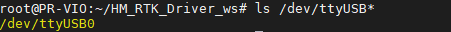
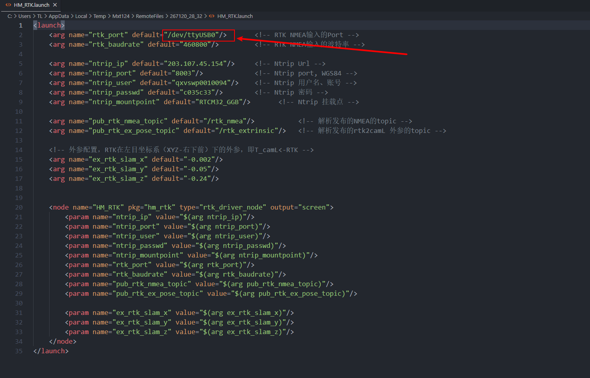
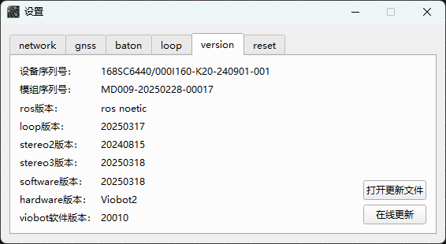
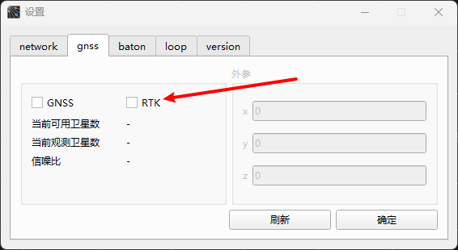
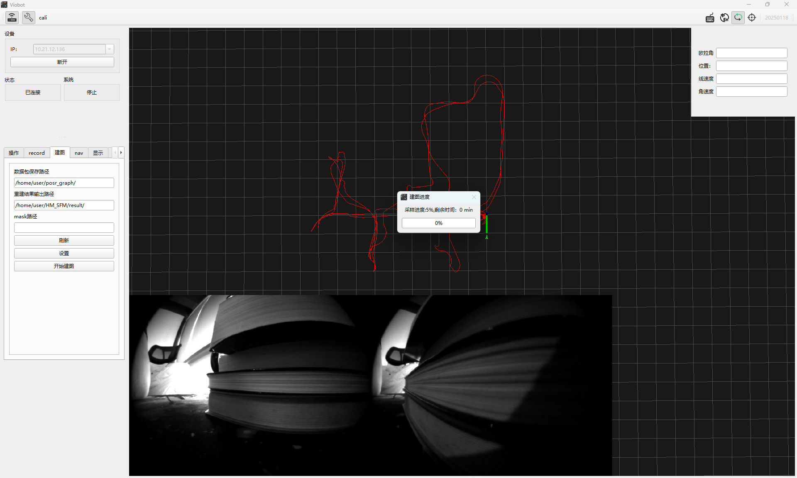

# RTK模块接入

Viobot2默认标配GNSS模块， 算法默认为GVIO，在没有接入GNSS数据时会退化为VIO模式。支持外部接入RTK模块，RTK数据接入时，GNSS数据会自动摒弃掉，算法融合RTK数据输出更精准位置结果。

## 一.模块选型

Viobot2不配备RTK模块，需要用到的用户可以自行去选购RTK模块。RTK要求：能输出10Hz+ 的NMEA（GGA）固定解结果。如有额外的时间同步需求，需要支持PPS（1Hz）信号输出。

## 二.模块驱动

黑森开源了一个RTK驱动仓库，可以直接使用：[Hessian-matrix/HM\_RTK\_driver](https://github.com/Hessian-matrix/HM_RTK_driver "Hessian-matrix/HM_RTK_driver")

其中依赖ceres\_solver库，需要自己下载一下，可以使用我们gitee上面打包好的压缩包，直接编译安装。

```bash 
git clone https://gitee.com/hessian_matrix/ceres_slver-2.1.0.git
cd ceres_slver-2.1.0
unzip ceres-solver-2.1.0.zip
cd ceres_solver-2.1.0
mkdir build && cd build
cmake ..
sudo make install -j4
```


编译驱动

```bash 
    mkdir -p HM_RTK_Driver_ws/src
    cd HM_RTK_Driver_ws/src
    git clone https://github.com/Hessian-matrix/HM_RTK_driver
    cd HM_RTK_driver
    git submodule init
    git submodule update
    cd ../../
    catkin_make
```


### 1.硬件连接

RTK模块通过串口连接到Viobot2，如果是接的是USB转串口，需要自己去查一下接进来的串口号`ls /dev/ttyUSB*`



如果是接到后面的串口接口，串口号为ttyS0


然后将对应的串口号写到hm\_rtk.launch文件里面



关于硬件PPS：我们用户版本都是带GNSS板的，上面已经有硬件PPS天线接收了卫星时间，就已经完成了时间同步了。

### 2.测试驱动

```bash 
cd HM_RTK_Driver_ws
source ./devel/setup.bash
roslaunch hm_rtk hm_rtk.launch

```


正常启动并且通过rostopic echo 查看到`/rtk_nmea`消息正常即可。


```bash 
rostopic echo /rtk_nmea
```


## 三.模块数据接入和外参标定

### 1.确认设备当前软件版本

RTK功能需要上位机更新到20250314版本，同步更新设备软件版本至20250318。




### 2.Viobot2开启RTK启用接口

在上位机连接Viobot2后点击设置，弹出的页面选到gnss页面，其中的两个勾选GNSS和RTK是单选的，默认出厂勾选了GNSS，勾选RTK后，会取消勾选GNSS，点击确定。



&#x20;   关闭设置页面，然后点击设备重启按键，重启Viobot2。

### 3.开启RTK驱动程序并把数据接入Viobot2

编译好RTK驱动并且确认好模块的连接之后,启动RTK驱动

```bash 
roslaunch hm_rtk hm_rtk.launch
```


RTK驱动会把RTK的数据发送到Viobot2的程序里去解析出来，rostopic echo 可以看到`/baton/rtk`消息正常即可。


### 4.标定RTK与左目外参

上面几步确认数据正常后，启动stereo3算法，并且开启RTK驱动里面的标定程序

```bash 
roslaunch hm_rtk calib_rtk_slam.launch
```

确认stereo3正常启动，标定程序正常启动后，移动Viobot2和RTK天线的组合体，随机多方向快速运动，避免静止或直线运动，推荐绕8运动，算法会截取最新的10s数据进行标定。标定完成的结果会输出在终端上。



## 四.RTK融合

把标定结果重新写到HM\_RTK.launch。

```xml 
<arg name="ex_rtk_slam_x" default="-0.026357"/>  
<arg name="ex_rtk_slam_y" default="-0.05"/>
<arg name="ex_rtk_slam_z" default="-0.283098"/>
```


然后重新把RTK驱动开起来，开启stereo3算法，运动过后等到RTK有固定解后，就会有RTK的融合结果了。

算法接收到RTK数据解析，然后可以给出以下新的RTK相关话题数据。

```bash 
/baton/stereo3/fusion_odom #融合后的odometry，在SLAM局部坐标系下
/baton/stereo3/fusion_path #融合后的历史轨迹，在SLAM局部坐标系下
/baton/stereo3/rtk_path  #RTK历史轨迹，在SLAM局部坐标系下
 
```
