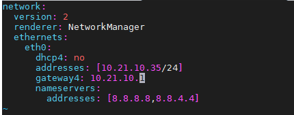

# Device ADB

Connect Viobot2 via the USB Type-C port. This port is **ADB-only** and does not support OTG.

Open a command prompt.

Change to the directory containing `adb.exe`.

```bash
adb.exe devices
```

ADB will discover devices and print their unique IDs.

For example: `ed22c951f81d1e23`.

```bash
adb.exe -s ed22c951f81d1e23   shell
```

After connecting, you will get a shell as `root`.

To modify the IP:

```bash
vim /etc/netplan/01-netcfg.yaml
```


