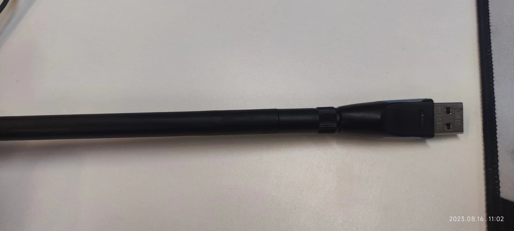
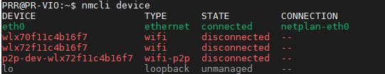
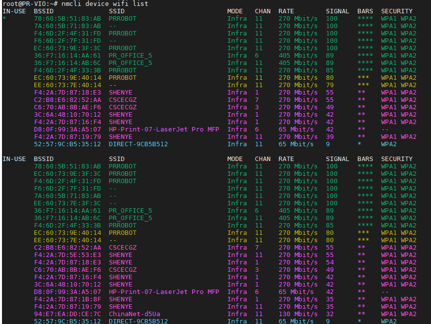
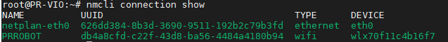
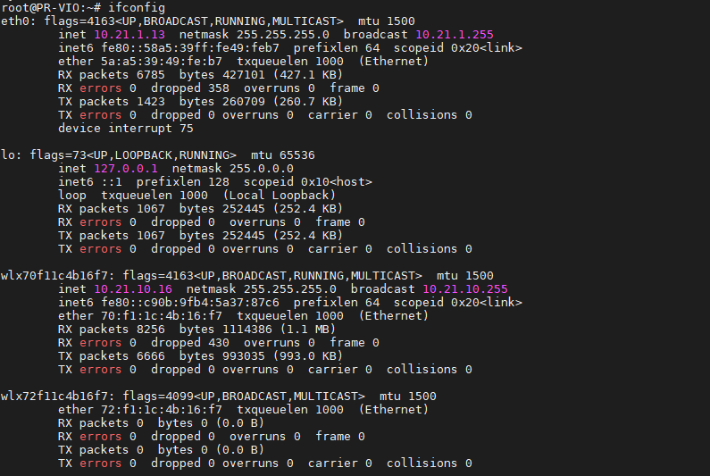
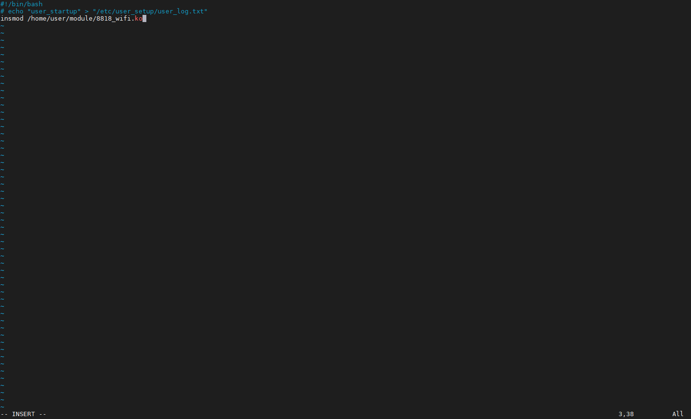

# USB Wi-Fi Dongle Setup (Wi-Fi Connection)

Viobot2 does not include built-in Wi-Fi. We recommend using wired Ethernet for better stability. If you still want to test with Wi-Fi, we provide driver and installation instructions for supported USB Wi-Fi dongles.

The Wi-Fi driver is an external kernel module and must match the running kernel, so currently only a limited set of dongles are supported. This tutorial uses an **8818eu** Wi-Fi dongle as an example.



## 1. Copy Driver Module to the Device

Normally the device already includes the driver module, so you do not need to copy it manually.

If the driver is missing, download the latest update package from the official website and update the device.

## 2. Load the Driver Module

SSH into the device (user: `PRR`, password: `PRR`) and load the module:

```bash
sudo insmod /home/user/module/8818_wifi.ko
```

## 3. Connect to Wi-Fi

### 3.1 Check Device Status

```bash
nmcli device
```



In this example, the Wi-Fi interface name is `wlx70f11c4b16f7`.

### 3.2 Scan for Wi-Fi Networks

```bash
nmcli device wifi list #会出来可见的WIFI列表
```



### 3.3 Connect to an AP

```bash
 sudo nmcli device wifi connect "PRROBOT" password "12345678" #PRROBOT对应你的SSID,12345678对应你的密码
```

### 3.4 Check Connection Status

```bash
nmcli connection show
```



### 3.5 Check Current IP Address

Run `ifconfig` to view the current IP:



From your PC, `ping` the Wi-Fi IP to verify connectivity (make sure the subnets match).

### 3.6 Static IP (Optional)

By default, Wi-Fi IP is assigned via DHCP. To set a static IP:

```bash
sudo nmcli connection modify PRROBOT ipv4.addresses '10.21.10.16/24' ipv4.gateway '10.21.10.1' ipv4.dns '8.8.8.8' ipv4.method manual

```

`PRROBOT` should match the `name` shown by `nmcli connection show`. Here: IP `10.21.10.16`, netmask `255.255.255.0` -> `/24`, gateway `10.21.10.1`, DNS `8.8.8.8`. Make sure the static IP does not conflict with other devices.

To switch back to DHCP:

```bash
sudo nmcli connection modify PRROBOT  ipv4.method auto 
```

After changing settings, bring the connection up again:

```bash
sudo nmcli connection up PRROBOT  
```

Then use `ifconfig` again to confirm the IP.

## 4. Auto-Connect on Boot

```bash
sudo vim /etc/user_setup/user_startup.sh
```

Add the driver load command, save, and reboot.



## 5. Other Commands

```bash
nmcli connection delete my-wifi #删除已经创建的网络连接配置my-wifi
```

Rename a connection:

```bash
nmcli connection modify "Wired connection 1" connection.id "wired1"

```
